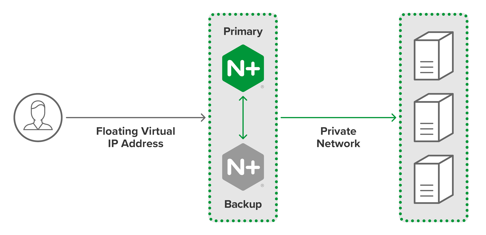
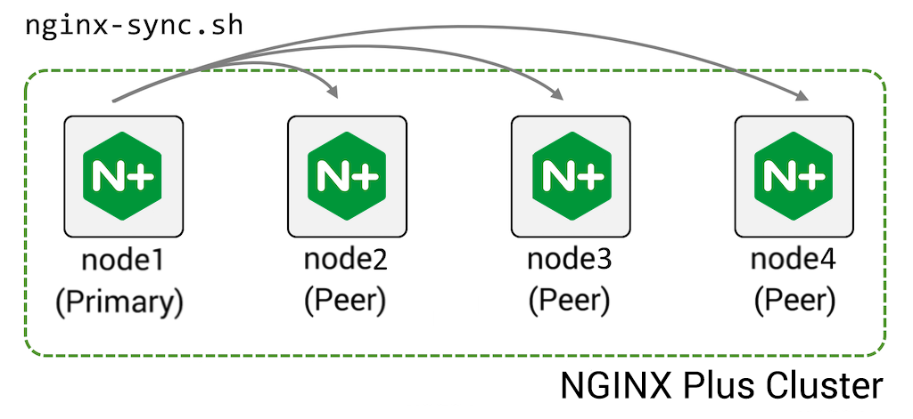
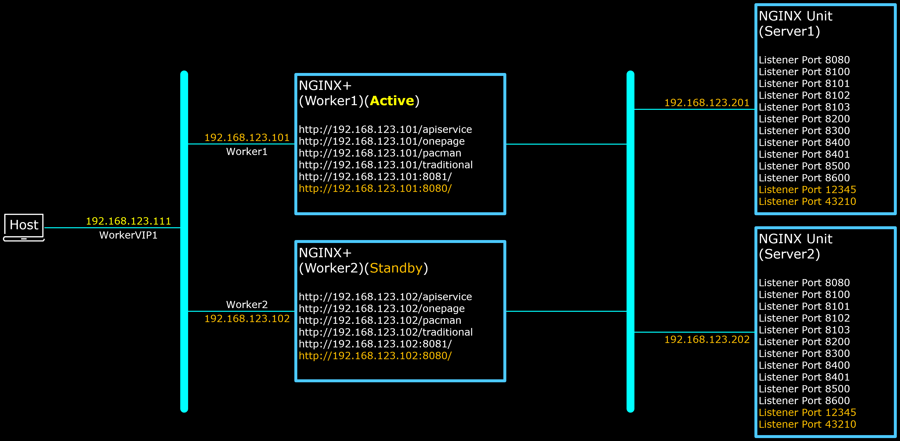

# NGINX-Plus High Availability

NGINX+ supports clustering for High-Availability, as well as Synchronization of Configuration between members of the cluster.
However the two functions (i.e. clustering and config-sync) are still two separate and independent processes/functions.



Clustering which is done by `keepalived`, at high-level view manage only Virtual IP; which node holds the Virtual IP at any time (based on the configured priority).
Once `keepalived` configured properly, it runs automatically on the background, detects nodes readiness and moves the Virtual IP once the active node is down.



However config-sync which is managed by `nginx-sync`, is more of a manual function.
The NGINX+ configuration can be compared or synchronized between the nodes, however it must be invoked manually to perform either the comparison or the synchronization between the nodes.
Further, the comparison and synchronization process requires `root` access to all Standby nodes, through the SSH channel.
Which is why `BADPrivateKey`, `BADPublicKey` and `tServer.sh` files are needed to enable automate the configuration with a bash script.

References on clustering, config-sync and how to use the features in configuration file:
- [ ] [NGINX Plus High Availability, Short Description](https://www.nginx.com/products/nginx/high-availability/)
- [ ] [NGINX Plus High Availability, Administrator Guide](https://docs.nginx.com/nginx/admin-guide/high-availability)
- [ ] [High Availability Support for NGINX Plus](https://docs.nginx.com/nginx/admin-guide/high-availability/ha-keepalived/)
- [ ] [Keepalived Configuration Manual Page](https://www.keepalived.org/manpage.html)
- [ ] [Synchronizing NGINX Configuration in a Cluster](https://docs.nginx.com/nginx/admin-guide/high-availability/configuration-sharing/)
- [ ] [How NGINX Plus Performs Zone Synchronization](https://docs.nginx.com/nginx/admin-guide/high-availability/zone_sync_details/)
- [ ] [`zone_sync` directive](https://nginx.org/en/docs/stream/ngx_stream_zone_sync_module.html#zone_sync)
- [ ] [Runtime State Sharing in a Cluster](https://docs.nginx.com/nginx/admin-guide/high-availability/zone_sync/)


<br><br><br>

***

Following diagram depicts the arrangement made for the prepared bash scripts on this section:




Following are list of files and what they're used for, for the NGINX+ High Availability.

- [ ] `NPActiveLB.sh` and `NPStandByLB.sh` files are the "wrapper" scripts which prepare the nodes (i.e. install and configure the local NGINX+) before the configuration of `keepalived` and `nginx-sync`.

- [ ] `NPActiveHA.sh` and `NPStandByHA.sh` files are the prepared bash scripts to install and configure the `keepalived` and `nginx-sync` on both Active node and StandBy node.

- [ ] `ActiveKeepAlived.conf` and `StandByKeepAlived.conf` files are the configuration of `keepalived` on Active and StandBy nodes repectively.
The configuration defines, amongst other aspects of networking:
  - [ ] which Network Interface you want to configure joining the VRRP,
  - [ ] the priority for each Network Interface across member nodes,
  - [ ] own source IP Address and the peer IP Addresses,
  - [ ] and the Virtual IP Address which will be "floating" and moved into other Network Interface in case the Active node is down.

  Refer to [High Availability Support for NGINX Plus](https://docs.nginx.com/nginx/admin-guide/high-availability/ha-keepalived/) for more details on how to configure `keepalived`.

- [ ] `nginx-sync.conf` file is the configuration of `nginx-sync`. This configuration file is implemented only on the Active node.
It contains the list of StandBy nodes as well as the paths and files which are the object of comparison and synchronization.
Refer to [Synchronizing NGINX Configuration in a Cluster](https://docs.nginx.com/nginx/admin-guide/high-availability/configuration-sharing/) for more details on how to configure `nginx-sync`.

- [ ] `BADPrivateKey` and `BADPublicKey` files are SSH Private Key and SSH Public Key for accessing StandBy node(s) using the `root` account.
For scenario like this repository, whereby the environment is isolated within Virtualization Environment, separated from external world, it may be OK to store the SSH Private and Public Keys in a place where public can access.
However in general this is a bad practice. Do NOT host the SSH Private and Public Keys in a place where public can access.
The SSH Private and Public Keys must be produced, stored/hosted and supplied through a ***secure*** channel. For example; on AWS CloudFormation, the SSH Private and Public Keys must be supplied through CloudFormation's masked parameter input fields.
Anyone who has the keys, especially the Private Key can have access to your nodes, and in this case a `root` access.

- [ ] `tServer.sh` file. Since the StandBy node needs to be prepared up to certain extend before the Active node can try to access into the StandBy node to do configuration comparison or synchronization;
`tServer.sh` is a simple script which responds to Active node when queried.
The communication is done through open socket, and the communication is designed to be done exactly once.
Once the Active node has forwarded the query and got a respond, the socket is closed and the `tServer.sh` terminates.

- [ ] `LBnginx.conf` and `LBdefault.conf` files are the NGINX+ configuration files.
Note that in this configuration we have only one NGINX Unit node, so the NGINX+ configuration differs from the other sections of this repository.
These `LBnginx.conf` and `LBdefault.conf` files are applied only on Active NGINX+ node.
You should see the same configuration content on the StandBy node once the bash scripts on both Active and StandBy nodes finished, as the result of config-sync between the Active and StandBy nodes invoked by the bash script.


<br><br><br>

For practical reason, you can copy paste below command to the StandBy node (in this case `$Worker2` node). However there are important notes you need to pay attention before you do that:
1. Because the `BADPrivateKey` and `BADPublicKey` have been exposed to public Internet, do ***NOT*** run the prepared bash script on nodes which are reachable by untrusted public or user.
2. Remember to prepare the pre-requisites first before executing the below command. Pre-Requisites : `nginx-repo.crt` and `nginx-repo.key` files exist and are located at `$HOME` directory/folder.

`cd $HOME;sudo curl -k -L -O --retry 333 https://raw.githubusercontent.com/gjwdyk/NGINX-Notes/main/NMS-Instance-Manager/N%2BHA/NPStandByLB.sh;sudo chmod 777 $HOME/NPStandByLB.sh;/bin/bash $HOME/NPStandByLB.sh`

<br><br><br>

For the same practical reason, you can copy paste below command to the Active node (in this case `$Worker1` node). However there are important notes you need to pay attention before you do that:
1. Because the `BADPrivateKey` and `BADPublicKey` have been exposed to public Internet, do ***NOT*** run the prepared bash script on nodes which are reachable by untrusted public or user.
2. Remember to prepare the pre-requisites first before executing the below command. Pre-Requisites : `nginx-repo.crt` and `nginx-repo.key` files exist and are located at `$HOME` directory/folder.

`cd $HOME;sudo curl -k -L -O --retry 333 https://raw.githubusercontent.com/gjwdyk/NGINX-Notes/main/NMS-Instance-Manager/N%2BHA/NPActiveLB.sh;sudo chmod 777 $HOME/NPActiveLB.sh;/bin/bash $HOME/NPActiveLB.sh`


<br><br><br>

***

<br><br><br>
```
╔═╦═════════════════╦═╗
╠═╬═════════════════╬═╣
║ ║ End of Document ║ ║
╠═╬═════════════════╬═╣
╚═╩═════════════════╩═╝
```
<br><br><br>


