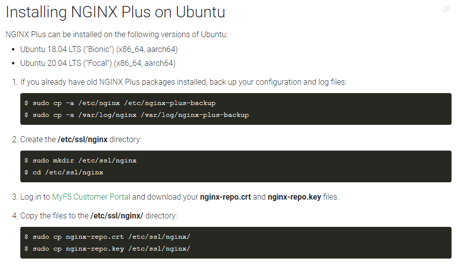
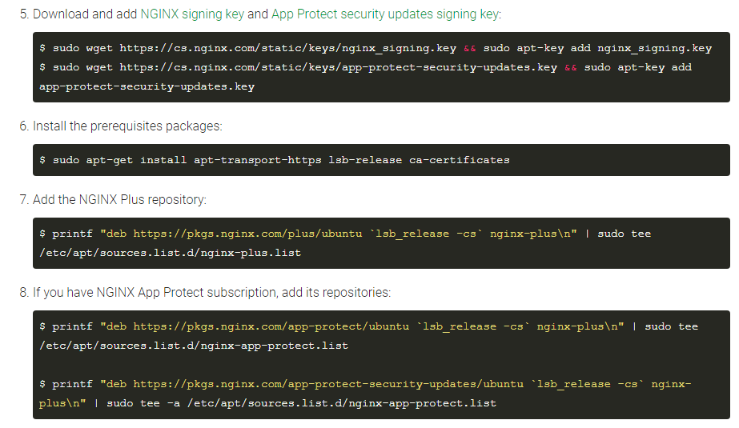
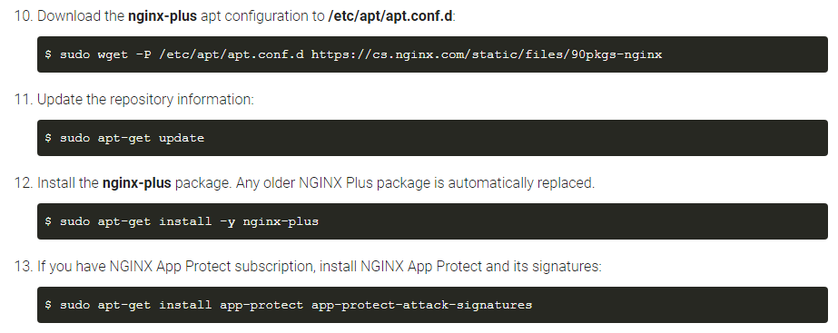
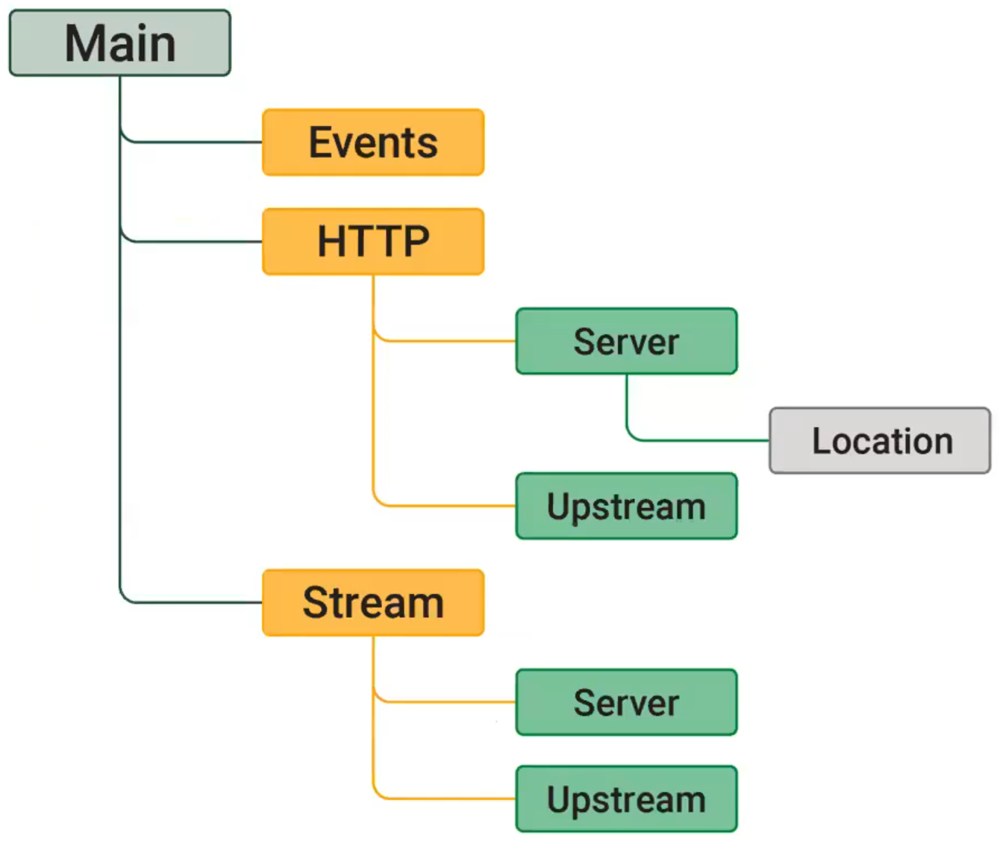

# NGINX-Plus Installation

NGINX+ is a commercial product from NGINX, and therefore there is "licensing" requirement/pre-requisite to install NGINX+.
To execute the below prepared bash script, you need to fulfil the pre-requisite : the `nginx-repo.crt` and `nginx-repo.key` files must already exist and are located at `$HOME` directory/folder.

You probably need to define the version of nginx-plus you want to install, due to compatibility between NGINX Plus and the NMS Instance Manager.
Find out the compatible version on the [NGINX Instance Manager Technical Specifications](https://docs.nginx.com/nginx-management-suite/tech-specs/) and also the available versions from `apt-cache madison` command.

```
ubuntu@Client:~$ apt-cache madison nginx-plus
nginx-plus | 25-1~focal | https://pkgs.nginx.com/plus/ubuntu focal/nginx-plus amd64 Packages
nginx-plus | 24-2~focal | https://pkgs.nginx.com/plus/ubuntu focal/nginx-plus amd64 Packages
nginx-plus | 24-1~focal | https://pkgs.nginx.com/plus/ubuntu focal/nginx-plus amd64 Packages
nginx-plus | 23-2~focal | https://pkgs.nginx.com/plus/ubuntu focal/nginx-plus amd64 Packages
nginx-plus | 23-1~focal | https://pkgs.nginx.com/plus/ubuntu focal/nginx-plus amd64 Packages
nginx-plus | 22-1~focal | https://pkgs.nginx.com/plus/ubuntu focal/nginx-plus amd64 Packages
nginx-plus | 21-1~focal | https://pkgs.nginx.com/plus/ubuntu focal/nginx-plus amd64 Packages
ubuntu@Client:~$
```

Once you found the version you need to install, define it at the `apt-get install` command.

```
sudo apt-get install -y nginx-plus=23-2~focal
```


<br><br><br>

Refer to [Installing NGINX Plus](https://docs.nginx.com/nginx/admin-guide/installing-nginx/installing-nginx-plus/) for official guidance to install NGINX+ on your chosen OS.
Below are screen capture for installation guidance for Ubuntu.





[NPInstall.sh](NPInstall.sh) summarize the commands into one bash script file to install the NGINX+, with prerequisite: the `nginx-repo.crt` and `nginx-repo.key` files must already exist and are located at `$HOME` directory/folder.
You can copy paste below commands to download and execute the [NPInstall.sh](NPInstall.sh) script on your local Ubuntu 20.04 machine.

`cd $HOME;sudo curl -k -L -O --retry 333 https://raw.githubusercontent.com/gjwdyk/NGINX-Notes/main/NMS-Instance-Manager/N%2BInstall/NPInstall.sh;sudo chmod 777 $HOME/NPInstall.sh;/bin/bash $HOME/NPInstall.sh`


<br><br><br>

To configure the NGINX+, refer to either of the following references: [Load Balancer](https://docs.nginx.com/nginx/admin-guide/load-balancer/), [Content Cache](https://docs.nginx.com/nginx/admin-guide/content-cache/), [Web Server](https://docs.nginx.com/nginx/admin-guide/web-server/), [Mail Proxy](https://docs.nginx.com/nginx/admin-guide/mail-proxy/).
Below diagram depicts NGINX's Configuration File Structure, which by default divided into multiple files:
- [ ] `/etc/nginx/nginx.conf` as "root" or "main" configuration file
- [ ] (by default) all `*.conf` files under `/etc/nginx/conf.d/` directory/folder




Section [N+LB](../N%2BLB) gives an example of configuring NGINX+ as HTTP Load Balancer.
The pool members of the HTTP Load Balancer is using the NGINX Unit (refer to [Unit-Install](../Unit-Install) and [Unit-Sample](../Unit-Sample)).
[NpLb.sh](NpLb.sh) combines both [NPInstall.sh](NPInstall.sh) NGINX+ installation script and configuration as HTTP Load Balancer on section [N+LB](../N%2BLB) into one bash script.
Again, the pre-requisite for NGINX+ installation is still required : the `nginx-repo.crt` and `nginx-repo.key` files must already exist and are located at `$HOME` directory/folder.

You can copy paste below commands to download and execute the [NpLb.sh](NpLb.sh) script on your local Ubuntu 20.04 machine.

`cd $HOME;sudo curl -k -L -O --retry 333 https://raw.githubusercontent.com/gjwdyk/NGINX-Notes/main/NMS-Instance-Manager/N%2BInstall/NpLb.sh;sudo chmod 777 $HOME/NpLb.sh;/bin/bash $HOME/NpLb.sh`


Accesses (assuming 192.168.123.101 is the IP Address of the NGINX+):
- [ ] http://192.168.123.101/apiservice/
- [ ] http://192.168.123.101/onepage/
- [ ] http://192.168.123.101/pacman/
- [ ] http://192.168.123.101/traditional/
- [ ] http://192.168.123.101:8081/
- [ ] http://192.168.123.101:8080/


<br><br><br>

***

<br><br><br>
```
╔═╦═════════════════╦═╗
╠═╬═════════════════╬═╣
║ ║ End of Document ║ ║
╠═╬═════════════════╬═╣
╚═╩═════════════════╩═╝
```
<br><br><br>


