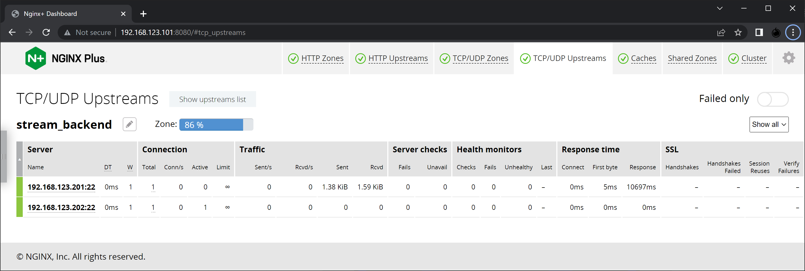

# NGINX-Plus Configuration as Reverse Proxy and/or HTTP Load Balancer

Below are some references used to understand how to configure NGINX+ as a Reverse Proxy and/or HTTP Load Balancer.
These references are only examples and in no way complete. There are other references you can use to get understanding of how the configuration works.
Along with time, the below list may be added or modified according to the development of this repositories.

- [ ] [High-Performance Load Balancing](https://www.nginx.com/products/nginx/load-balancing/)
- [ ] [HTTP Load Balancing](https://docs.nginx.com/nginx/admin-guide/load-balancer/http-load-balancer/)
- [ ] [HTTP Health Checks](https://docs.nginx.com/nginx/admin-guide/load-balancer/http-health-check/)
- [ ] [Load Balancing with NGINX and NGINX Plus, Part 1](https://www.nginx.com/blog/load-balancing-with-nginx-plus)
- [ ] [Load Balancing with NGINX and NGINX Plus, Part 2](https://www.nginx.com/blog/load-balancing-with-nginx-plus-part-2/)
- [ ] [NGINX Content Caching](https://docs.nginx.com/nginx/admin-guide/content-cache/content-caching/)
- [ ] [ngx_http_proxy_module](https://nginx.org/en/docs/http/ngx_http_proxy_module.html)
- [ ] [ngx_http_upstream_module](https://nginx.org/en/docs/http/ngx_http_upstream_module.html)
- [ ] [ngx_http_headers_module](https://nginx.org/en/docs/http/ngx_http_headers_module.html)


## NGINX-Plus as Load Balancer of NGINX Unit Sample Services

[LBdefault.conf](LBdefault.conf) is the `default.conf` for NGINX+ configured as LB for the NGINX Unit Example Services, as described on [Unit-Sample](../Unit-Sample).
It contains simple configuration of NGINX+ as Reverse Proxy and/or HTTP Load Balancer. The configuration has not incorporated more sophisticated NGINX+ features such as SSL/TLS Certificates, Authentication, etc.

Below diagram depicts the expected arrangement of Network Diagram to make the example configuration works:


And below diagram depicts the Logical Diagram of the example configuration:


Refer to below official guides in configuring the NGINX+ as HTTP Load Balancer:
- [ ] [HTTP Load Balancing](https://docs.nginx.com/nginx/admin-guide/load-balancer/http-load-balancer/)
- [ ] [HTTP Health Checks](https://docs.nginx.com/nginx/admin-guide/load-balancer/http-health-check/)

Configuring NGINX+ Dashboard:
- [ ] [Live Activity Monitoring](https://docs.nginx.com/nginx/admin-guide/monitoring/live-activity-monitoring/)


Some of the NGINX Unit Example Services are behaving like/similar to API; others accomodate every component of the page in one HTTP Request - Response.
For these two types of service behavior, there is no need for persistency, as the whole context of the service can be fulfilled in one HTTP Request - Response.

Pacman service downloads every components of the service at the very beginning, then the whole game is executed locally on the user's browsers.
In this sense, there is no "session" context between browser and server. The files downloaded are also static, as the progress of the game is developed locally on the user's browser.
Only highscore needs to be kept on the server with one HTTP Post, and unfortunately the version installed/tested with NGINX Unit does not support keeping the highscore yet.
With the above condition, there is also no need for persistence when Load-Balancing the pacman service sample.

Two Java example services behave more like traditional service, where the whole service context has multiple URLs.
The two Java example services, one listening on port 8102 (we name it "SnoopServlet"), and the other listening on port 8101 (we name it "Apache").

These two example services are completely different services. In real life scenario you would NEVER put two separate services as pool member of the same VIP to be accessed by users.
However, since these two example services are demos and they require persistence, it will be an interesting showcase for the Load Balancing demo with persistence.
From [LBdefault.conf](LBdefault.conf) we can see that persistence is set up for 22 second only.

```
upstream traditionalserver {
  zone   traditionalserver 40k;
  server 192.168.123.201:8101;
  server 192.168.123.201:8102;
  server 192.168.123.202:8101;
  server 192.168.123.202:8102;
  sticky cookie serverid expires=22s;
}
```

Which means, user needs to click on follow-up links within 22 seconds, otherwise the persistence expires and when the user click a link after 22 seconds that new request may be forwarded to a listener which does NOT support the requested URL; which means there may be error happens when user clicks follow up links after 22 seconds.
The 22 seconds persistence (`sticky cookie serverid expires=22s;`) is intended for demo only, so expiry of persistence can be shown.
Of course in real commercial service, you'd want to set the persistency longer or even use other type of persistence provided by NGINX+.


<br><br><br>

***

An important feature of a Load Balancer or a Reverse Proxy is Active Health Check of the UpStream Servers or Pool Members, so users' traffic are not forwarded to unhealthy server, therefore improving the users' experience with your service.
Below are some references of NGINX+ Active Health Check features:
- [ ] [HTTP Health Checks](https://docs.nginx.com/nginx/admin-guide/load-balancer/http-health-check/)
- [ ] [TCP Health Checks](https://docs.nginx.com/nginx/admin-guide/load-balancer/tcp-health-check/)
- [ ] [UDP Health Checks](https://docs.nginx.com/nginx/admin-guide/load-balancer/udp-health-check/)
- [ ] [gRPC Health Checks](https://docs.nginx.com/nginx/admin-guide/load-balancer/grpc-health-check/)
- [ ] [ngx_http_upstream_hc_module](https://nginx.org/en/docs/http/ngx_http_upstream_hc_module.html)
- [ ] [ngx_stream_upstream_hc_module](https://nginx.org/en/docs/stream/ngx_stream_upstream_hc_module.html)

This demo/example environment uses HTTP Health Check as well as TCP Health Check features.
Below is an example of directive of HTTP Health Check.

```
  location /apiservice/ {
    proxy_pass http://apiserver/;
    .
    .
    .
    health_check interval=9 fails=3 passes=3;
  }
```

Below is an example of directive of TCP Health Check.

```
  server {
    listen 8022;
    proxy_pass stream_backend;
    .
    .
    .
    health_check;
    health_check_timeout 9s;
  }
```


<br><br><br>

***

Below are some references for configuring NGINX's Content Caching feature:
- [ ] [NGINX Content Caching](https://docs.nginx.com/nginx/admin-guide/content-cache/content-caching/)
- [ ] [NGINX Plus feature: caching](https://nginx.com/products/nginx/caching/)
- [ ] [proxy_cache](https://nginx.org/en/docs/http/ngx_http_proxy_module.html#proxy_cache)
- [ ] [proxy_cache_key](https://nginx.org/en/docs/http/ngx_http_proxy_module.html#proxy_cache_key)
- [ ] [proxy_cache_path](https://nginx.org/en/docs/http/ngx_http_proxy_module.html#proxy_cache_path)
- [ ] [proxy_cache_valid](https://nginx.org/en/docs/http/ngx_http_proxy_module.html#proxy_cache_valid)
- [ ] [Embedded Variables](https://nginx.org/en/docs/http/ngx_http_upstream_module.html#variables)

Based on the references above, below is a sample directive to "build" cache in this demo/example environment:

```
proxy_cache_path /etc/nginx/cache
  keys_zone=proxycache:32k
  levels=1:2
  inactive=3m
  max_size=2m;
```

Within this demo/example environment, there are two services which uses the above Caching feature, which are the pacman service/location as well as "static content" on port 8081.
Below is the example directive when the above Caching feature is used by pacman service/location.

```
  location /pacman/ {
    proxy_pass http://pacmanserver/;
    .
    .
    .
    proxy_cache_key "$scheme$host$request_uri";
    add_header X-Cache-Status $upstream_cache_status;
    proxy_cache proxycache;
    proxy_cache_valid any 3m;
  }
```

And below is the example directive when the above Caching feature is used by "static content" on port 8081.

```
server {
  listen 8081;
  proxy_cache proxycache;
  location / {
    .
    .
    .
    proxy_cache_key "$scheme$proxy_host$request_uri";
    add_header X-Cache-Status $upstream_cache_status;
    proxy_cache_valid any 3m;
  }
}
```


<br><br><br>

***

This demo/example environment also use NGINX's Request Limit feature. Some example references in regards to Rate Limiting Access can be found on below list:
- [ ] [Limiting Access to Proxied HTTP Resources](https://docs.nginx.com/nginx/admin-guide/security-controls/controlling-access-proxied-http/)
- [ ] [Rate Limiting](https://docs.nginx.com/nginxaas/azure/management/rate-limiting/)
- [ ] [Rate Limiting with NGINX and NGINX Plus](https://www.nginx.com/blog/rate-limiting-nginx/)
- [ ] [limit_req_zone](https://nginx.org/en/docs/http/ngx_http_limit_req_module.html#limit_req_zone)
- [ ] [limit_req](https://nginx.org/en/docs/http/ngx_http_limit_req_module.html#limit_req)

Below is example directive declaring/building the request limiter. Note that this example allows only 1 (one) http/https request per second.

```
limit_req_zone $binary_remote_addr zone=requestlimit:32k rate=1r/s;
```

The request limiter is then used by `apiservice` location.

```
  location /apiservice/ {
    proxy_pass http://apiserver/;
    .
    .
    .
    limit_req zone=requestlimit;
  }
```

You can test this feature by pressing refresh button more than 1 time per second, and an error message will appear. Below is an example of such error message.
The default HTTP Response Status should be 503 and the error message should be correspond to a 503 HTTP Response message (which by default located at `/usr/share/nginx/html/50x.html`).


If you refresh the `apiservice` page slower than 1 time per second, you will not hit/get the error message.


<br><br><br>

***

This demo/example environment does not utilize SSL/TLS feature, due to time limited characteristic of SSL/TLS Key and Certificate.
However, in case you'd like to configure the NGINX+ with SSL/TLS layer, below are some guides to configure NGINX for that purpose:
- [ ] [Security Controls](https://docs.nginx.com/nginx/admin-guide/security-controls/)
- [ ] [NGINX SSL/TLS Termination](https://docs.nginx.com/nginx/admin-guide/security-controls/terminating-ssl-http/)
- [ ] [NGINX SSL/TLS Certificates with Let’s Encrypt](https://www.nginx.com/blog/using-free-ssltls-certificates-from-lets-encrypt-with-nginx/)

And an example configuration excerpt:
```
server {
 listen 443 ssl;

 ssl_certificate /etc/ssl/nginx/fullchain.pem;
 ssl_certificate_key /etc/ssl/nginx/privkey.pem;

 ssl_protocols TLSv1.2 TLSv1.3;
 ssl_ciphers "AES256+EECDH:AES256+EDH:!aNULL";
 ssl_prefer_server_ciphers on;

 ssl_session_cache shared:SSL:10m;
 ssl_session_timeout 10m;
 ssl_session_tickets off;

 add_header Strict-Transport-Security "max-age=63072000; includeSubdomains";
 add_header X-Frame-Options DENY;
 add_header X-Content-Type-Options nosniff;

 server_name sub.domain.tld;
}

server {
 listen 80;
 return 301 https://$host$request_uri;
}
```

Additional reference to CertBot's Private Key and Certificates: [`privkey.pem` `fullchain.pem` `cert.pem` `chain.pem`](https://eff-certbot.readthedocs.io/en/stable/using.html#where-are-my-certificates).


<br><br><br>

***

NGINX+ provides a built-in Dashboard feature, with which you can monitor the performances of your NGINX+ instance.
In this demo/example environment, the NGINX+ Dashboard is configured on port 8080.
Below are some screen capture of the NGINX+ Dashboard.





<br><br><br>

***

Below are some learning points in regard to `Last-Modified` and `If-Modified-Since` HTTP Header fields which originally confusing and lead to unexpected behavior.

- [ ] Request-Response from service on port 8102 (SnoopServlet), between Client/Browser and Proxy/Load-Balancer:
  ```
  GET /traditional/ HTTP/1.1
  Host: 192.168.123.101
  User-Agent: Mozilla/5.0 (Windows NT 10.0; Win64; x64; rv:94.0) Gecko/20100101 Firefox/94.0
  Accept: text/html,application/xhtml+xml,application/xml;q=0.9,image/avif,image/webp,*/*;q=0.8
  Accept-Language: en-US,en;q=0.5
  Accept-Encoding: gzip, deflate
  DNT: 1
  Connection: keep-alive
  Cookie: JSESSIONID=2c2e7cf0-6a11-43f3-a96d-edaa2a0d8b69
  Upgrade-Insecure-Requests: 1
  If-Modified-Since: Sun, 17 Feb 2019 21:18:46 GMT
  Cache-Control: max-age=0
  
  HTTP/1.1 200 OK
  Server: nginx/1.21.3
  Date: Fri, 03 Dec 2021 02:47:59 GMT
  Content-Type: text/html;charset=iso-8859-1
  Transfer-Encoding: chunked
  Connection: keep-alive
  Set-Cookie: serverid=6ab8833a517e80f73f5840d7dc2aa6b8; expires=Fri, 03-Dec-21 02:48:21 GMT; max-age=22
  Last-Modified: Sun, 17 Feb 2019 21:18:46 GMT
  
  <!DOCTYPE html>
  <!--
  To change this license header, choose License Headers in Project Properties.
  To change this template file, choose Tools | Templates
  and open the template in the editor.
  -->
  <html>
      <head>
          <title>SampleWebApp</title>
          <meta charset="UTF-8">
          <meta name="viewport" content="width=device-width, initial-scale=1.0">
      </head>
      <body>
          <h2>Sample Web Application To Deploy and Test</h2>
          <br>
      <div> click <a href="SnoopServlet">Click to Invoke a SnoopServlet</a></div>
      <br>
      <br>
      </body>
  </html>
  ```

- [ ] Request-Response from service on port 8102 (SnoopServlet), between Proxy/Load-Balancer and Server:
  ```
  GET / HTTP/1.0
  Host: traditionalserver
  Connection: close
  User-Agent: Mozilla/5.0 (Windows NT 10.0; Win64; x64; rv:94.0) Gecko/20100101 Firefox/94.0
  Accept: text/html,application/xhtml+xml,application/xml;q=0.9,image/avif,image/webp,*/*;q=0.8
  Accept-Language: en-US,en;q=0.5
  Accept-Encoding: gzip, deflate
  DNT: 1
  Cookie: JSESSIONID=2c2e7cf0-6a11-43f3-a96d-edaa2a0d8b69
  Upgrade-Insecure-Requests: 1
  If-Modified-Since: Sun, 17 Feb 2019 21:18:46 GMT
  Cache-Control: max-age=0
  
  HTTP/1.1 200 OK
  Last-Modified: Sun, 17 Feb 2019 21:18:46 GMT
  Content-Type: text/html;charset=iso-8859-1
  Server: Unit/1.26.0
  Date: Fri, 03 Dec 2021 02:47:59 GMT
  
  <!DOCTYPE html>
  <!--
  To change this license header, choose License Headers in Project Properties.
  To change this template file, choose Tools | Templates
  and open the template in the editor.
  -->
  <html>
      <head>
          <title>SampleWebApp</title>
          <meta charset="UTF-8">
          <meta name="viewport" content="width=device-width, initial-scale=1.0">
      </head>
      <body>
          <h2>Sample Web Application To Deploy and Test</h2>
          <br>
      <div> click <a href="SnoopServlet">Click to Invoke a SnoopServlet</a></div>
      <br>
      <br>
      </body>
  </html>
  ```


- [ ] Request-Response from service on port 8101 (Apache), between Client/Browser and Proxy/Load-Balancer:
  ```
  GET /traditional/ HTTP/1.1
  Host: 192.168.123.101
  User-Agent: Mozilla/5.0 (Windows NT 10.0; Win64; x64; rv:94.0) Gecko/20100101 Firefox/94.0
  Accept: text/html,application/xhtml+xml,application/xml;q=0.9,image/avif,image/webp,*/*;q=0.8
  Accept-Language: en-US,en;q=0.5
  Accept-Encoding: gzip, deflate
  DNT: 1
  Connection: keep-alive
  Cookie: JSESSIONID=2c2e7cf0-6a11-43f3-a96d-edaa2a0d8b69
  Upgrade-Insecure-Requests: 1
  If-Modified-Since: Sun, 17 Feb 2019 21:18:46 GMT
  Cache-Control: max-age=0
  
  HTTP/1.1 304 Not Modified
  Server: nginx/1.21.3
  Date: Fri, 03 Dec 2021 02:47:11 GMT
  Connection: keep-alive
  Set-Cookie: serverid=6d1160fbb71522c7d0335b2a7144b1ca; expires=Fri, 03-Dec-21 02:47:33 GMT; max-age=22
  ```

- [ ] Request-Response from service on port 8101 (Apache), between Proxy/Load-Balancer and Server:
  ```
  GET / HTTP/1.0
  Host: traditionalserver
  Connection: close
  User-Agent: Mozilla/5.0 (Windows NT 10.0; Win64; x64; rv:94.0) Gecko/20100101 Firefox/94.0
  Accept: text/html,application/xhtml+xml,application/xml;q=0.9,image/avif,image/webp,*/*;q=0.8
  Accept-Language: en-US,en;q=0.5
  Accept-Encoding: gzip, deflate
  DNT: 1
  Cookie: JSESSIONID=2c2e7cf0-6a11-43f3-a96d-edaa2a0d8b69
  Upgrade-Insecure-Requests: 1
  If-Modified-Since: Sun, 17 Feb 2019 21:18:46 GMT
  Cache-Control: max-age=0
  
  HTTP/1.1 304 Not Modified
  Server: Unit/1.26.0
  Date: Fri, 03 Dec 2021 02:48:30 GMT
  ```


End Result of the above traffic pattern or service behavior:

What is displayed on Client Browser will eventually stuck at service on port 8102 (SnoopServlet), since the service always respond with actual page; while service on port 8101 (Apache) responded with `HTTP/1.1 304 Not Modified` (no changes of content to be rendered on the Client Browser).

To change the above service behavior, the following configuration directives need to be added to the related service (in this case `location /traditional/`):

```
proxy_set_header If-Modified-Since "";
add_header Last-Modified "";
```

Which removes the corresponding `Last-Modified` and `If-Modified-Since` HTTP Header fields.
The traffic pattern or service behavior after the above configuration directives added are as follow.

- [ ] Request-Response from service on port 8102 (SnoopServlet), between Client/Browser and Proxy/Load-Balancer:
  ```
  GET /traditional/ HTTP/1.1
  Host: 192.168.123.101
  User-Agent: Mozilla/5.0 (Windows NT 10.0; Win64; x64; rv:94.0) Gecko/20100101 Firefox/94.0
  Accept: text/html,application/xhtml+xml,application/xml;q=0.9,image/avif,image/webp,*/*;q=0.8
  Accept-Language: en-US,en;q=0.5
  Accept-Encoding: gzip, deflate
  DNT: 1
  Connection: keep-alive
  Upgrade-Insecure-Requests: 1
  Cache-Control: max-age=0
  
  HTTP/1.1 200 OK
  Server: nginx/1.21.3
  Date: Fri, 03 Dec 2021 06:14:00 GMT
  Content-Type: text/html;charset=iso-8859-1
  Transfer-Encoding: chunked
  Connection: keep-alive
  Set-Cookie: serverid=6ab8833a517e80f73f5840d7dc2aa6b8; expires=Fri, 03-Dec-21 06:14:22 GMT; max-age=22
  
  <!DOCTYPE html>
  <!--
  To change this license header, choose License Headers in Project Properties.
  To change this template file, choose Tools | Templates
  and open the template in the editor.
  -->
  <html>
      <head>
          <title>SampleWebApp</title>
          <meta charset="UTF-8">
          <meta name="viewport" content="width=device-width, initial-scale=1.0">
      </head>
      <body>
          <h2>Sample Web Application To Deploy and Test</h2>
          <br>
      <div> click <a href="SnoopServlet">Click to Invoke a SnoopServlet</a></div>
      <br>
      <br>
      </body>
  </html>
  ```

- [ ] Request-Response from service on port 8102 (SnoopServlet), between Proxy/Load-Balancer and Server:
  ```
  GET / HTTP/1.1
  Connection: keep-alive
  Host: traditionalserver
  User-Agent: Mozilla/5.0 (Windows NT 10.0; Win64; x64; rv:94.0) Gecko/20100101 Firefox/94.0
  Accept: text/html,application/xhtml+xml,application/xml;q=0.9,image/avif,image/webp,*/*;q=0.8
  Accept-Language: en-US,en;q=0.5
  Accept-Encoding: gzip, deflate
  DNT: 1
  Upgrade-Insecure-Requests: 1
  Cache-Control: max-age=0
  
  HTTP/1.1 200 OK
  Last-Modified: Sun, 17 Feb 2019 21:18:46 GMT
  Content-Type: text/html;charset=iso-8859-1
  Server: Unit/1.26.0
  Date: Fri, 03 Dec 2021 06:14:00 GMT
  Transfer-Encoding: chunked
  
  <!DOCTYPE html>
  <!--
  To change this license header, choose License Headers in Project Properties.
  To change this template file, choose Tools | Templates
  and open the template in the editor.
  -->
  <html>
      <head>
          <title>SampleWebApp</title>
          <meta charset="UTF-8">
          <meta name="viewport" content="width=device-width, initial-scale=1.0">
      </head>
      <body>
          <h2>Sample Web Application To Deploy and Test</h2>
          <br>
      <div> click <a href="SnoopServlet">Click to Invoke a SnoopServlet</a></div>
      <br>
      <br>
      </body>
  </html>
  ```


- [ ] Request-Response from service on port 8101 (Apache), between Client/Browser and Proxy/Load-Balancer:
  ```
  GET /traditional/ HTTP/1.1
  Host: 192.168.123.101
  User-Agent: Mozilla/5.0 (Windows NT 10.0; Win64; x64; rv:94.0) Gecko/20100101 Firefox/94.0
  Accept: text/html,application/xhtml+xml,application/xml;q=0.9,image/avif,image/webp,*/*;q=0.8
  Accept-Language: en-US,en;q=0.5
  Accept-Encoding: gzip, deflate
  DNT: 1
  Connection: keep-alive
  Upgrade-Insecure-Requests: 1
  Cache-Control: max-age=0
  
  HTTP/1.1 200 OK
  Server: nginx/1.21.3
  Date: Fri, 03 Dec 2021 06:12:30 GMT
  Content-Type: text/html;charset=iso-8859-1
  Transfer-Encoding: chunked
  Connection: keep-alive
  Set-Cookie: serverid=6d1160fbb71522c7d0335b2a7144b1ca; expires=Fri, 03-Dec-21 06:12:52 GMT; max-age=22
  
  <html>
  <head>
  <title>Sample "Hello, World" Application</title>
  </head>
  <body bgcolor=white>
  <table border="0">
  <tr>
  <td>
  
  </td>
  <td>
  <h1>Sample "Hello, World" Application</h1>
  <p>This is the home page for a sample application used to illustrate the
  source directory organization of a web application utilizing the principles
  outlined in the Application Developer's Guide.
  </td>
  </tr>
  </table>
  <p>To prove that they work, you can execute either of the following links:
  <ul>
  <li>To a <a href="hello.jsp">JSP page</a>.
  <li>To a <a href="hello">servlet</a>.
  </ul>
  </body>
  </html>
  ```

- [ ] Request-Response from service on port 8101 (Apache), between Proxy/Load-Balancer and Server:
  ```
  GET / HTTP/1.1
  Connection: keep-alive
  Host: traditionalserver
  User-Agent: Mozilla/5.0 (Windows NT 10.0; Win64; x64; rv:94.0) Gecko/20100101 Firefox/94.0
  Accept: text/html,application/xhtml+xml,application/xml;q=0.9,image/avif,image/webp,*/*;q=0.8
  Accept-Language: en-US,en;q=0.5
  Accept-Encoding: gzip, deflate
  DNT: 1
  Upgrade-Insecure-Requests: 1
  Cache-Control: max-age=0
  
  HTTP/1.1 200 OK
  Last-Modified: Mon, 30 Jul 2007 16:26:28 GMT
  Content-Type: text/html;charset=iso-8859-1
  Server: Unit/1.26.0
  Date: Fri, 03 Dec 2021 06:12:30 GMT
  Transfer-Encoding: chunked
  
  <html>
  <head>
  <title>Sample "Hello, World" Application</title>
  </head>
  <body bgcolor=white>
  <table border="0">
  <tr>
  <td>
  
  </td>
  <td>
  <h1>Sample "Hello, World" Application</h1>
  <p>This is the home page for a sample application used to illustrate the
  source directory organization of a web application utilizing the principles
  outlined in the Application Developer's Guide.
  </td>
  </tr>
  </table>
  <p>To prove that they work, you can execute either of the following links:
  <ul>
  <li>To a <a href="hello.jsp">JSP page</a>.
  <li>To a <a href="hello">servlet</a>.
  </ul>
  </body>
  </html>
  ```

The complete configuration for the "traditional" sample services being Load Balanced with Persistence:

```
location /traditional/ {
  proxy_pass http://traditionalserver/;
  proxy_http_version 1.1;
  proxy_set_header Connection "keep-alive";
  proxy_set_header If-Modified-Since "";
  add_header Last-Modified "";
  health_check interval=9 fails=3 passes=3;
  status_zone location_traditional;
}
```


<br><br><br>

***

<br><br><br>
```
╔═╦═════════════════╦═╗
╠═╬═════════════════╬═╣
║ ║ End of Document ║ ║
╠═╬═════════════════╬═╣
╚═╩═════════════════╩═╝
```
<br><br><br>


