# LEG (`L`ogStash - `E`lasticSearch - `G`rafana)  Installation for NAP WAF Dashboard

Reference [https://github.com/skenderidis/nap-dashboard](https://github.com/skenderidis/nap-dashboard) .

Forked and Modified into [https://github.com/gjwdyk/nap-dashboard](https://github.com/gjwdyk/nap-dashboard) .

- [ ] Modification of [docker-compose.yaml](https://github.com/gjwdyk/nap-dashboard/blob/main/docker-compose.yaml)
  - [ ] Add `restart: always` to enable containers to restarted after host OS reboot
  - [ ] Change modules' versions to a more later/updated versions
    - [ ] Tested with LogStash and ElasticSearch version 7.17.8 : works
    - [ ] Tested with LogStash and ElasticSearch version 8.5.3 : does NOT work with the configuration method as referenced by [https://github.com/skenderidis/nap-dashboard](https://github.com/skenderidis/nap-dashboard)
    - [ ] Tested with Grafana version 9.2.8 : works with LogStash and ElasticSearch version 7.17.8, as well as with the configuration method described below. Information extraction described below (for dashboard deployment automation) is done on Grafana version 9.2.8
    - [ ] Tested with Grafana version 9.3.2 : works with LogStash and ElasticSearch version 7.17.8, as well as with the configuration method described below

<br><br><br>

Based on reference [https://github.com/skenderidis/nap-dashboard](https://github.com/skenderidis/nap-dashboard), once LogStash ElasticSearch and Grafana modules have been installed on Docker, you need to perform further configurations of ElasticSearch and Grafana.
Kindly review the required step by step procedure at [https://github.com/skenderidis/nap-dashboard](https://github.com/skenderidis/nap-dashboard).

Configuration of ElasticSearch can be transformed straight forward into bash script for automation (refer also to [dLEGConfiguration.sh](dLEGConfiguration.sh) file):
- [ ] `sudo -u root curl -k -L --retry 333 -X PUT 'http://localhost:9200/signatures/'`
- [ ] `sudo -u root curl -k -L --retry 333 -d "@elastic/signature-mapping.json" -H 'Content-Type: application/json' -X PUT 'http://localhost:9200/signatures/_mapping/'`
- [ ] `sudo python3 signatures/upload-signatures.py signatures/signatures-report.json localhost`
- [ ] `sudo -u root curl -k -L --retry 333 -d "@elastic/template-mapping.json" -H 'Content-Type: application/json' -X PUT 'http://localhost:9200/_template/waf_template?include_type_name'`
- [ ] `sudo -u root curl -k -L --retry 333 -d "@elastic/enrich-policy.json" -H 'Content-Type: application/json' -X PUT 'http://localhost:9200/_enrich/policy/signatures-policy'`
- [ ] `sudo -u root curl -k -L --retry 333 -X POST 'http://localhost:9200/_enrich/policy/signatures-policy/_execute'`
- [ ] `sudo -u root curl -k -L --retry 333 -d "@elastic/sig-lookup.json" -H 'Content-Type: application/json' -X PUT 'http://localhost:9200/_ingest/pipeline/sig_lookup'`

<br>

Since the installed modules on docker do NOT necessarily ready immediately, we need to "probe" the readiness of the respective module with a loop to call the API endpoint.
```
Loop="Yes"
while ( [ $Loop == "Yes" ] ) ; do
 if ( sudo -u root curl -k -L --retry 333 -X PUT 'http://localhost:9200/signatures/' ) ; then
  echo "`date +%Y%m%d%H%M%S` ElasticSearch is Ready ."
  Loop="No"
 else
  echo "`date +%Y%m%d%H%M%S` ElasticSearch is NOT Ready. Wait for $Loop_Period ."
  sleep $Loop_Period
 fi
done
```


<br><br><br>

Automation of Grafana's dashboard configurations require much more effort and preparations.
As per reference [https://github.com/skenderidis/nap-dashboard](https://github.com/skenderidis/nap-dashboard), which stated that the ***templated*** Grafana Dashboard for NAP WAF can be deployed manually (using human interactions with the Grafana's Web-based User Interface).
The manual deployment of Grafana's templated NAP WAF dashboard can be done using the template's Dashboard-ID, or using the template's JSON file which is preferable when preparing JSON files used for full automation.

<br>

As per below excerpt table from [https://github.com/skenderidis/nap-dashboard](https://github.com/skenderidis/nap-dashboard), you can click the link and visit the templated dashboard page.

| Dashboard Name                        | Dashboard ID | Grafana Source         | Grafana Website                                                   |
| ---------                             | :---:        | ---------              | :---:                                                             |
| NGINX NAP Main Dashboard              | 15675        | WAF-Logs               | <a href="https://grafana.com/grafana/dashboards/15675"> Link </a> |
| NGINX NAP Support-ID Dashboard        | 15676        | WAF-Logs , WAF-Decoded | <a href="https://grafana.com/grafana/dashboards/15676"> Link </a> |
| NGINX NAP Attack Signatures Dashboard | 15677        | WAF-Decoded            | <a href="https://grafana.com/grafana/dashboards/15677"> Link </a> |
| NGINX NAP BOT Dashboard               | 15678        | WAF-Logs               | <a href="https://grafana.com/grafana/dashboards/15678"> Link </a> |

<br>

On each page of the templated dashboard page, you can download a JSON file of the corresponding dashboard's template.

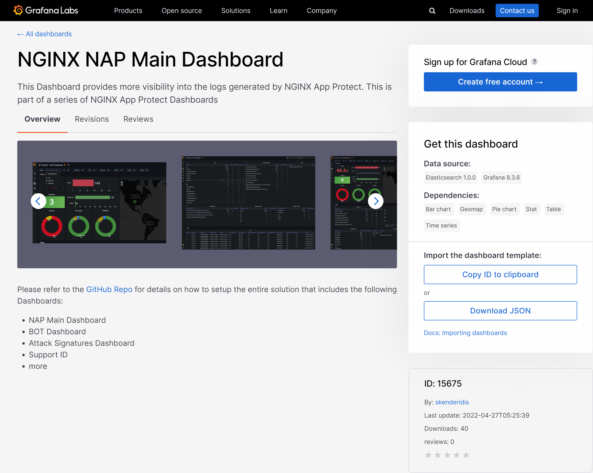

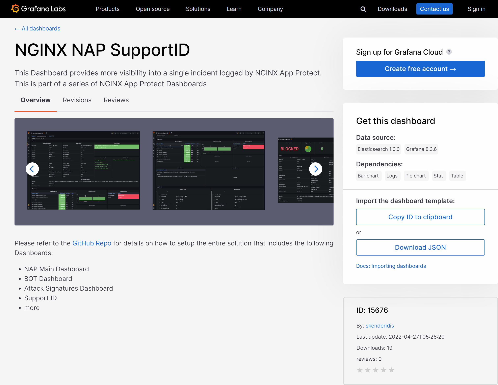

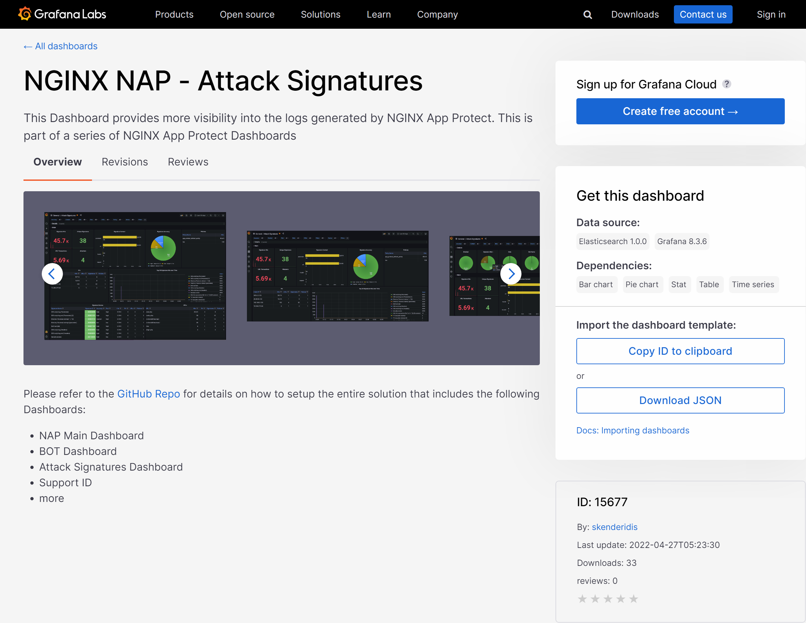

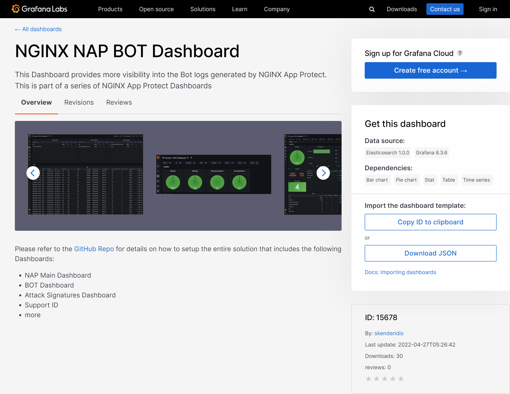

<br>

Below are the downloaded dashboard templates, at the time of composing this repository:
- [ ] [Downloaded-Grafana-NAP-Main-Dashboard-15675.json](Downloaded-Grafana-NAP-Main-Dashboard-15675.json)
- [ ] [Downloaded-Grafana-NAP-SupportID-15676.json](Downloaded-Grafana-NAP-SupportID-15676.json)
- [ ] [Downloaded-Grafana-NAP-Attack-Signatures-15677.json](Downloaded-Grafana-NAP-Attack-Signatures-15677.json)
- [ ] [Downloaded-Grafana-NAP-BOT-Dashboard-15678.json](Downloaded-Grafana-NAP-BOT-Dashboard-15678.json)

Unfortunately the downloaded dashboard template(s) can not be used to configure/deploy the dashboard using API call to Grafana's available API endpoint(s).
The downloaded JSON dashboard templates need to be ***processed*** through the intended manual deployment (i.e. human interactions with the Grafana's Web-based User Interface), and while doing so we monitor and extract the information exchange between the client-browser and Grafana's API endpoints.

As per guided on [https://github.com/skenderidis/nap-dashboard](https://github.com/skenderidis/nap-dashboard), deploy the templated dashboard through Grafana's Dashboard menu, and select "+ Import" sub-menu.

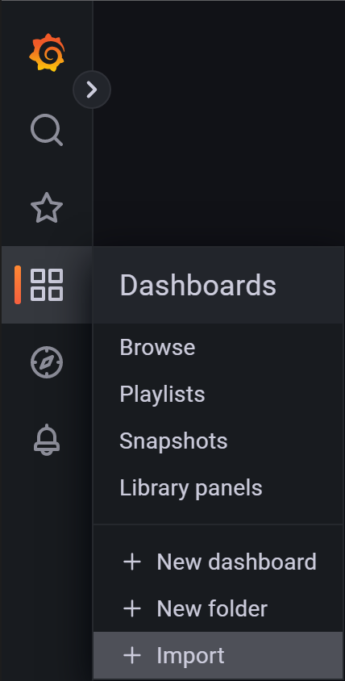

Copy paste the content of one of the templated dashboard JSON file into the text-input field labelled as "Import via panel json", and click the "Load" button below the text-input panel.

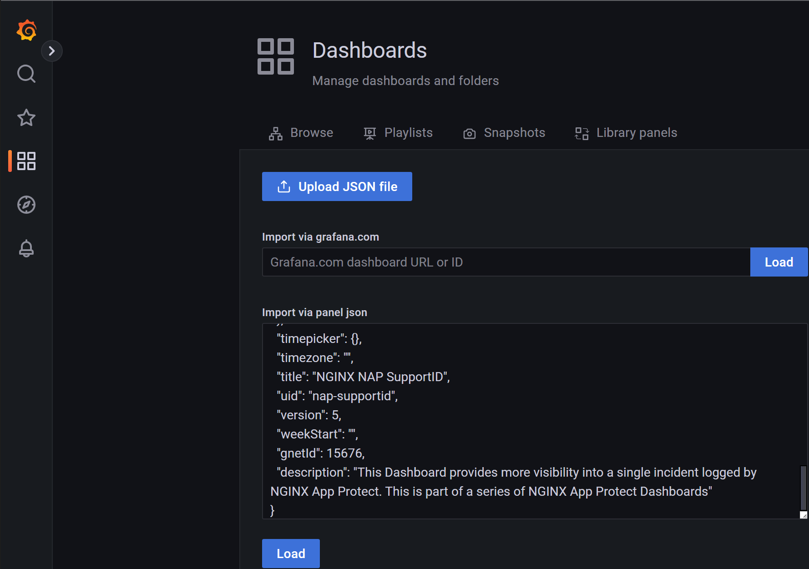

Select the DataSource for the corresponding dashboard. The DataSource names have been consistent throughout the implementation, therefore just match to the same name/label (i.e. if "WAF-Logs" input-selection field exists, choose "WAF-Logs"; and if "WAF-Decoded" input-selection field exists, choose "WAF-Decoded").
But do NOT click the "Import" button yet!
Instead, hit the keyboard `F12` (or right-click and select "Inspect" on Chrome and/or FireFox browsers). Below screen captures use Chrome browser.

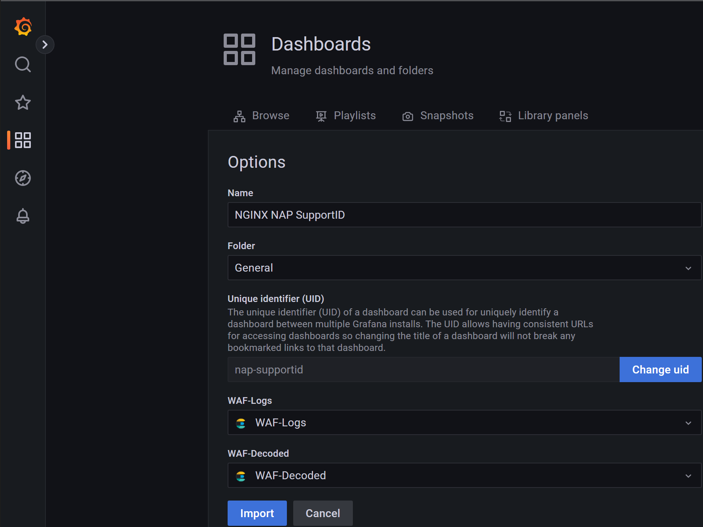

On the inspection's plane, ensure you have the "Network" tab selected.
Only then you can click the "Import" button on the Grafana's plane.

You can click the screen capture images to display a more readable and better resolution of the image; and right-click on the framed image and select "Open image in new tab" to display the screen capture image occupying the whole browser's window.

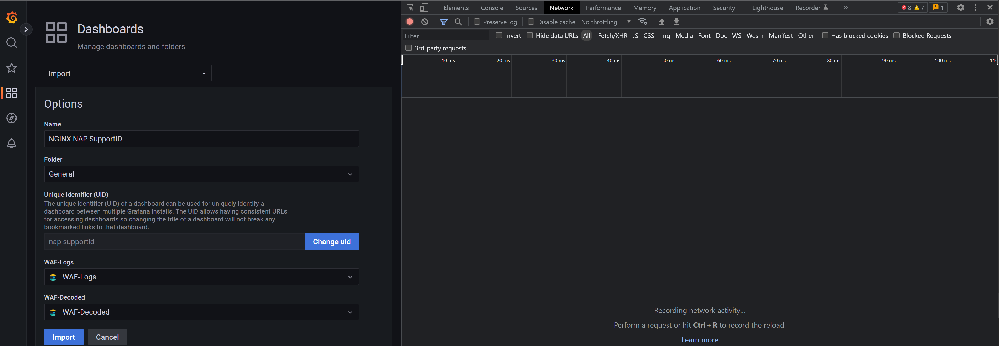

Once the "Import" button on the Grafana's plane has been clicked, the browser starts to communicate with Grafana to deploy the imported dashboard.
On the inspection's plane, you'll see HTTP Requests (or API calls) from browser to Grafana.
One particular HTTP Request labelled as "import" is important.
Select the row "import" and on the right panel, select "Headers".

From the "Headers" panel, we learn that:
- [ ] the URL for the HTTP Request is : `http://192.168.123.13:3000/api/dashboards/import`
- [ ] the HTTP method used is POST
- [ ] on the below "Request Headers" section, a couple of HTTP Headers are used. [https://grafana.com/docs/grafana/v8.5/http_api/dashboard/](https://grafana.com/docs/grafana/v8.5/http_api/dashboard/) suggests to use at least `Accept: application/json` and `Content-Type: application/json` HTTP Headers, which we also observe on the screen capture.

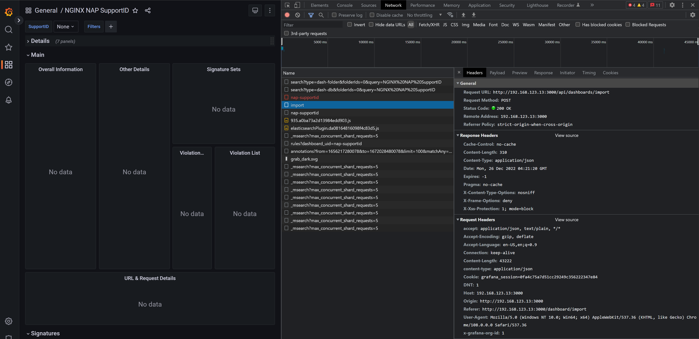

On the right panel, select "Payload" tab to see the actual data being "POST"-ed to Grafana from the browser.
The default display of the "Payload" data is beautified/structured. Unfortunately this display if copied and pasted won't carry the whole data.

Click the "view source" to view the "raw"/unstructured data.

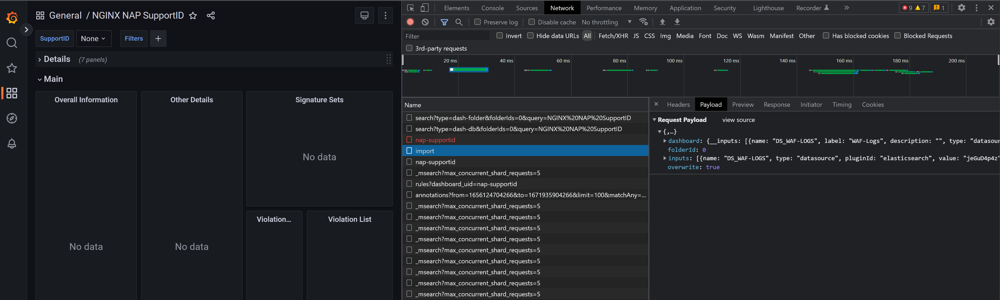

Click the "Show more" at the end of displayed "raw"/unstructured data, to display the whole data.

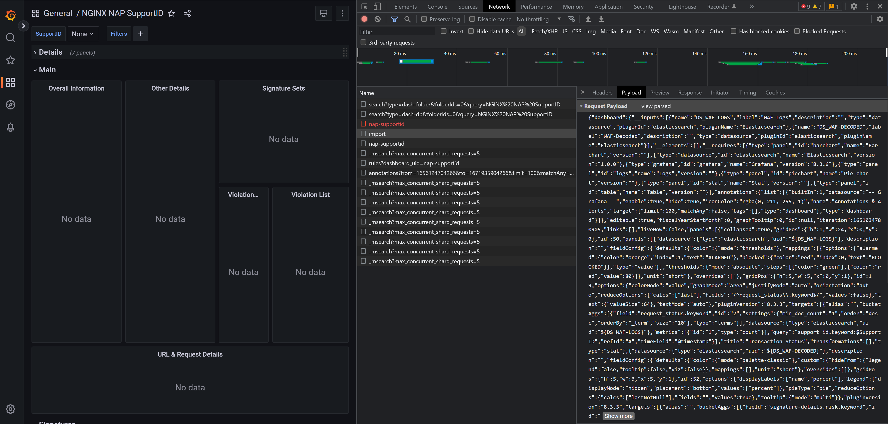

Copy the whole "raw"/unstructured data, and paste/save it to a file.
Do this steps to all four JSON dashboard templates downloaded from grafana.com's dashboard page.

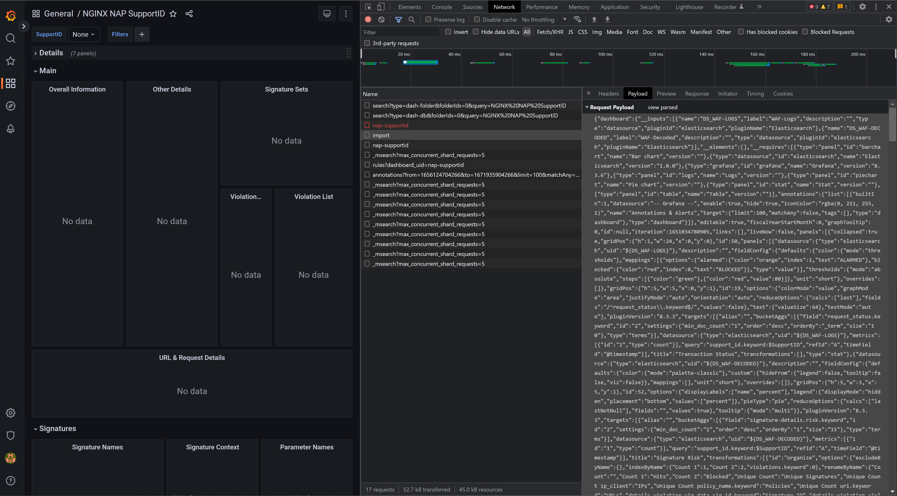

Once you have collected all four "raw"/unstructured data, post-process them to change the DataSource Unique ID into "variable" and to beautify/structure the data so they are more friendly to be read.

Example: if you save the "raw"/unstructured data into a file called "Grafana-NAP-SupportID-15676", you can use the `Sample2Template.sh` tool to do the post-processing `bash ./Sample2Template.sh Grafana-NAP-SupportID-15676` .

Below are the post-processed data/files which we can use as dashboard templates with automated/scripted deployment:
- [ ] [Grafana-NAP-Main-Dashboard-15675.json](Grafana-NAP-Main-Dashboard-15675.json)
- [ ] [Grafana-NAP-SupportID-15676.json](Grafana-NAP-SupportID-15676.json)
- [ ] [Grafana-NAP-Attack-Signatures-15677.json](Grafana-NAP-Attack-Signatures-15677.json)
- [ ] [Grafana-NAP-BOT-Dashboard-15678.json](Grafana-NAP-BOT-Dashboard-15678.json)

<br><br><br>

Automating Grafana's dashboard configurations therefore done as below (refer also to [dLEGConfiguration.sh](dLEGConfiguration.sh) file).

As per reference [https://github.com/skenderidis/nap-dashboard](https://github.com/skenderidis/nap-dashboard), configure the DataSources.
```
sudo -u root curl -k -L --retry 333 -d "@grafana/DS-waf-index.json" -H 'Content-Type: application/json' -u 'admin:admin' -X POST 'http://localhost:3000/api/datasources/'
sudo -u root curl -k -L --retry 333 -d "@grafana/DS-waf-decoded-index.json" -H 'Content-Type: application/json' -u 'admin:admin' -X POST 'http://localhost:3000/api/datasources/'
```

Similar to ElasticSearch configuration; since the installed modules on docker do NOT necessarily ready immediately, we need to "probe" the readiness of the respective module with a loop to call the API endpoint.
```
Loop="Yes"
while ( [ $Loop == "Yes" ] ) ; do
 if ( sudo -u root curl -k -L --retry 333 -d "@grafana/DS-waf-index.json" -H 'Content-Type: application/json' -u 'admin:admin' -X POST 'http://localhost:3000/api/datasources/' ) ; then
  echo "`date +%Y%m%d%H%M%S` Grafana is Ready ."
  Loop="No"
 else
  echo "`date +%Y%m%d%H%M%S` Grafana is NOT Ready. Wait for $Loop_Period ."
  sleep $Loop_Period
 fi
done
```

Then obtain the DataSources' UID, which we will need when configuring the dashboard.
```
sudo -u root curl -H "Accept: application/json" -H "Content-Type: application/json" -u 'admin:admin' http://localhost:3000/api/datasources/name/WAF-Logs | jq | grep uid | tr --delete " \"," | tr -t ":" "\n" | sed -n 2p > $HOME/WAFLogsUID
sudo -u root curl -H "Accept: application/json" -H "Content-Type: application/json" -u 'admin:admin' http://localhost:3000/api/datasources/name/WAF-Decoded | jq | grep uid | tr --delete " \"," | tr -t ":" "\n" | sed -n 2p > $HOME/WAFDecodedUID
echo "WAF-Logs DataSource UID : `cat $HOME/WAFLogsUID`"
echo "WAF-Decoded DataSource UID : `cat $HOME/WAFDecodedUID`"
```

Download the JSON dashboard templates from this repository, instead from grafana.com's dashboard page.
```
cd $HOME;sudo curl -k -L -O --retry 333 https://raw.githubusercontent.com/gjwdyk/NGINX-Notes/main/NMS-Instance-Manager/NAPWAFDashboard/Grafana-NAP-Main-Dashboard-15675.json;sudo chmod 666 $HOME/Grafana-NAP-Main-Dashboard-15675.json
cd $HOME;sudo curl -k -L -O --retry 333 https://raw.githubusercontent.com/gjwdyk/NGINX-Notes/main/NMS-Instance-Manager/NAPWAFDashboard/Grafana-NAP-SupportID-15676.json;sudo chmod 666 $HOME/Grafana-NAP-SupportID-15676.json
cd $HOME;sudo curl -k -L -O --retry 333 https://raw.githubusercontent.com/gjwdyk/NGINX-Notes/main/NMS-Instance-Manager/NAPWAFDashboard/Grafana-NAP-Attack-Signatures-15677.json;sudo chmod 666 $HOME/Grafana-NAP-Attack-Signatures-15677.json
cd $HOME;sudo curl -k -L -O --retry 333 https://raw.githubusercontent.com/gjwdyk/NGINX-Notes/main/NMS-Instance-Manager/NAPWAFDashboard/Grafana-NAP-BOT-Dashboard-15678.json;sudo chmod 666 $HOME/Grafana-NAP-BOT-Dashboard-15678.json
```

Insert the DataSources' UID into the JSON dashboard templates.
```
sudo sed -i 's/$WAFLogsUID/'"`cat $HOME/WAFLogsUID`"'/g' $HOME/Grafana-NAP-Main-Dashboard-15675.json
sudo sed -i 's/$WAFDecodedUID/'"`cat $HOME/WAFDecodedUID`"'/g' $HOME/Grafana-NAP-Main-Dashboard-15675.json
sudo sed -i 's/$WAFLogsUID/'"`cat $HOME/WAFLogsUID`"'/g' $HOME/Grafana-NAP-SupportID-15676.json
sudo sed -i 's/$WAFDecodedUID/'"`cat $HOME/WAFDecodedUID`"'/g' $HOME/Grafana-NAP-SupportID-15676.json
sudo sed -i 's/$WAFLogsUID/'"`cat $HOME/WAFLogsUID`"'/g' $HOME/Grafana-NAP-Attack-Signatures-15677.json
sudo sed -i 's/$WAFDecodedUID/'"`cat $HOME/WAFDecodedUID`"'/g' $HOME/Grafana-NAP-Attack-Signatures-15677.json
sudo sed -i 's/$WAFLogsUID/'"`cat $HOME/WAFLogsUID`"'/g' $HOME/Grafana-NAP-BOT-Dashboard-15678.json
sudo sed -i 's/$WAFDecodedUID/'"`cat $HOME/WAFDecodedUID`"'/g' $HOME/Grafana-NAP-BOT-Dashboard-15678.json
```

Submit the completed JSON dashboard templates to Grafana to be deployed as dashboard.
```
cd $HOME;sudo curl -H "Accept: application/json" -H "Content-Type: application/json" -u 'admin:admin' -d "@Grafana-NAP-Main-Dashboard-15675.json" -X POST http://localhost:3000/api/dashboards/import
cd $HOME;sudo curl -H "Accept: application/json" -H "Content-Type: application/json" -u 'admin:admin' -d "@Grafana-NAP-SupportID-15676.json" -X POST http://localhost:3000/api/dashboards/import
cd $HOME;sudo curl -H "Accept: application/json" -H "Content-Type: application/json" -u 'admin:admin' -d "@Grafana-NAP-Attack-Signatures-15677.json" -X POST http://localhost:3000/api/dashboards/import
cd $HOME;sudo curl -H "Accept: application/json" -H "Content-Type: application/json" -u 'admin:admin' -d "@Grafana-NAP-BOT-Dashboard-15678.json" -X POST http://localhost:3000/api/dashboards/import
```


<br><br><br>

***

Snippet for `L`ogStash `E`lasticSearch `G`rafana (LEG) Installation and Configuration (on top of Docker):

`cd $HOME;sudo curl -k -L -O --retry 333 https://raw.githubusercontent.com/gjwdyk/NGINX-Notes/main/NMS-Instance-Manager/NAPWAFDashboard/DockerLEGInstall.sh;sudo chmod 777 $HOME/DockerLEGInstall.sh;/bin/bash $HOME/DockerLEGInstall.sh`

<br><br><br>

Once the installation and configuration finished, browse to Grafana's IP Address on port 3000 (example: `http://192.168.123.13:3000`), and browse to the deployed/implemented dashboards.
Use UserName `admin` and Password `admin` to access Grafana.
Do not forget to generate some data/events from NAP WAF before you can actually see some graphs or tables.


<br><br><br>

***

<br><br><br>

# `L`ogStash `E`lasticSearch `G`rafana Installation for NAP WAF Dashboard directly on Ubuntu without Docker

Note: Ubuntu version used in this repository is 20.04 .

Main differences between installation of `L`ogStash `E`lasticSearch `G`rafana (LEG) on Docker compared to installation of `L`ogStash `E`lasticSearch `G`rafana (LEG) directly on Ubuntu are:
- [ ] Ubuntu does NOT allow LogStash to listen on Priviliged ports (i.e. ports less than 1024). So you may need to change LogStash listening port to higher port number. Docker uses PortForwarding at its base which allows usage of Priviliged port number, so if you really need to use Priviliged port number, PortForwarding is one way to go.
- [ ] Docker enables one containered service to call other containered service by container's name (domain name). While on Ubuntu this is not available. And since we are implementing all three modules on the same node, we can simply change domain name reference to ElasticSearch with `localhost`.

Kindly refer to [LEGInstall.sh](LEGInstall.sh) and [LEGConfiguration.sh](LEGConfiguration.sh) for further details of installation of LEG directly on Ubuntu.

Other restictions such as versioning of modules and access information are still the same as if we implement LEG on Docker.


<br><br><br>

***

Snippet for `L`ogStash `E`lasticSearch `G`rafana (LEG) Installation and Configuration (directly on Ubuntu without Docker):

`cd $HOME;sudo curl -k -L -O --retry 333 https://raw.githubusercontent.com/gjwdyk/NGINX-Notes/main/NMS-Instance-Manager/NAPWAFDashboard/LEGInstall.sh;sudo chmod 777 $HOME/LEGInstall.sh;/bin/bash $HOME/LEGInstall.sh`

<br><br><br>

Once the installation and configuration finished, browse to Grafana's IP Address on port 3000 (example: `http://192.168.123.13:3000`), and browse to the deployed/implemented dashboards.
Use UserName `admin` and Password `admin` to access Grafana.
Do not forget to generate some data/events from NAP WAF before you can actually see some graphs or tables.


<br><br><br>

***


<br><br><br>
```
╔═╦═════════════════╦═╗
╠═╬═════════════════╬═╣
║ ║ End of Document ║ ║
╠═╬═════════════════╬═╣
╚═╩═════════════════╩═╝
```
<br><br><br>


