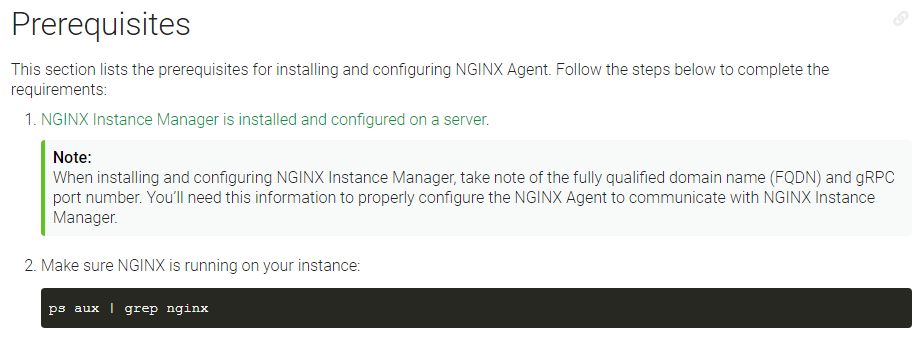
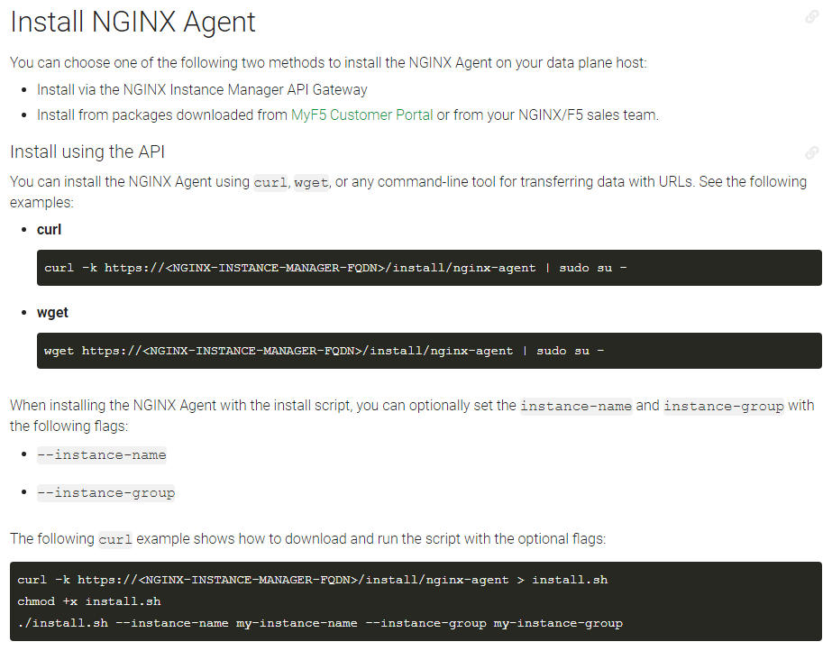
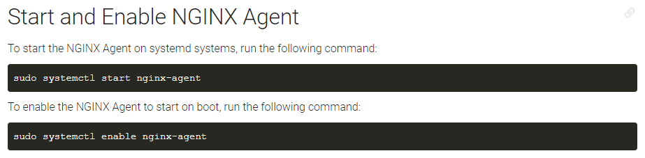

# NGINX Instance Agent version 2

NGINX Instance Agent version 2 differs in terms of installation if compared to the previous version 1.
The NGINX Instance Agent version 2 is no longer downloaded from public package repository (unlike the previous version 1), but the installation is done ***through*** the NMS Instance Manager.

Therefore the NGINX Instance Agent now has dependency towards the NMS Instance Manager node; before NGINX Instance Agent can be installed, NMS Instance Manager must be installed properly first.
The script/software to install NGINX Instance Agent is downloaded from the NMS Instance Manager node which will manage the NGINX Instance Agent node.
The downloaded script from NMS Instance Manager contains details of the NMS Instance Manager node itself (example: IP Address of the NMS Instance Manager, etc.).



The instruction command for downloading the installation script from NMS Instance Manager is also available within the NMS Instance Manager's User Interface.
At the time of writing this document, the instruction differs a bit if you compared between: instruction command from NGINX official site (using `sudo su -` to execute the downloaded script), and instruction command from NMS Instance Manager's User Interface (using `sudo sh` to execute the downloaded script).
Do use `sudo su -` to execute the downloaded script.




You may need to refresh the NMS Instance Manager's User Interface pages to see the updated status of managed nodes.

<br><br><br>

For practical reason, you can copy paste below code to install NGINX Instance Agent version 2 on NGINX node `$Worker1` or NGINX node `$Worker2`.
Remember to review the [EnvironmentVariable.sh](../EnvironmentVariable.sh) file, as well as the prerequisite that NMS Instance Manager must be installed properly first on node `$Master1`:

`cd $HOME;sudo curl -k -L -O --retry 333 https://raw.githubusercontent.com/gjwdyk/NGINX-Notes/main/NMS-Instance-Manager/NIM2-Agent/NIM2AgentInstall.sh;sudo chmod 777 $HOME/NIM2AgentInstall.sh;/bin/bash $HOME/NIM2AgentInstall.sh`


<br><br><br>

***

<br><br><br>
```
╔═╦═════════════════╦═╗
╠═╬═════════════════╬═╣
║ ║ End of Document ║ ║
╠═╬═════════════════╬═╣
╚═╩═════════════════╩═╝
```
<br><br><br>


