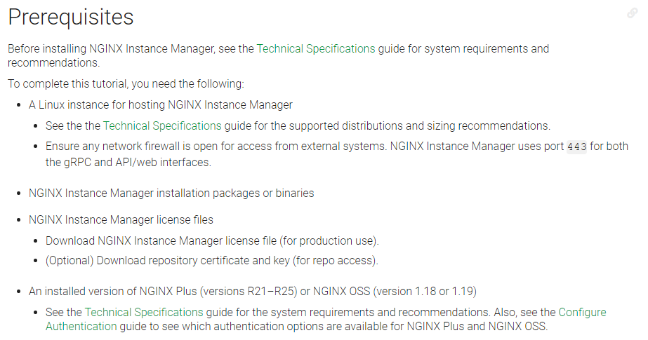
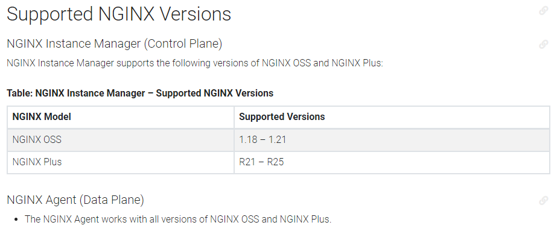
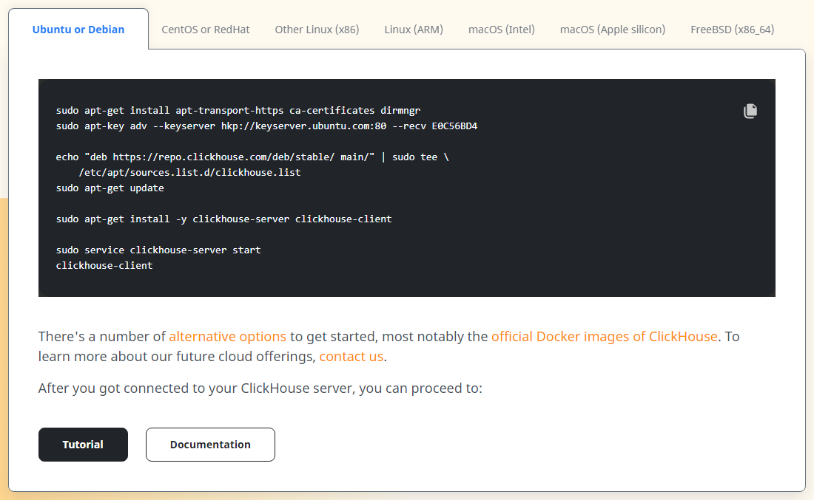
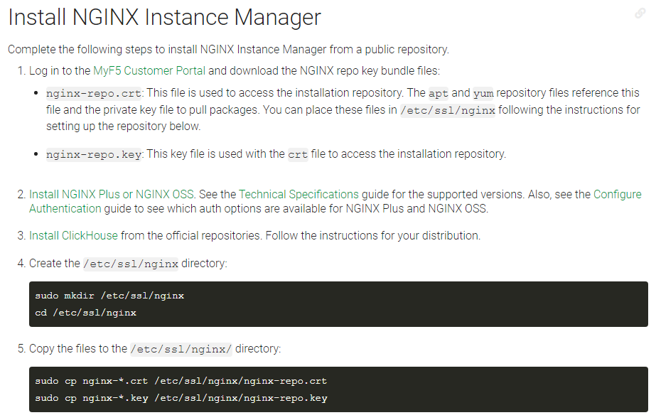
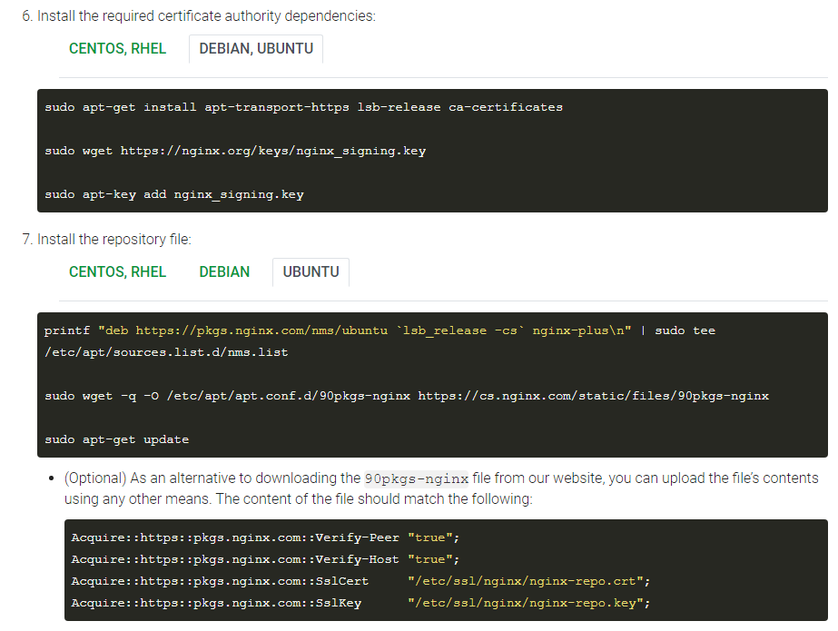
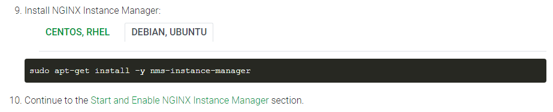
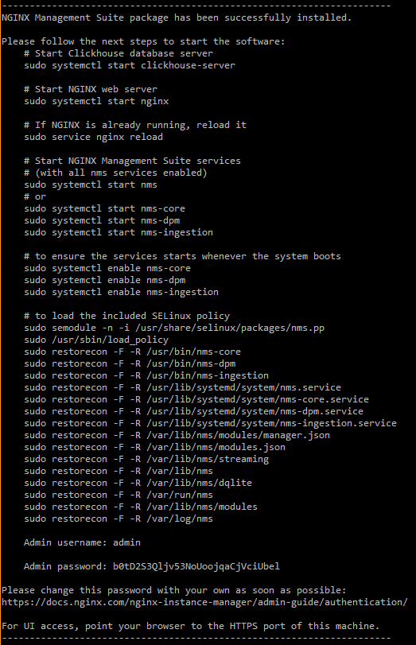
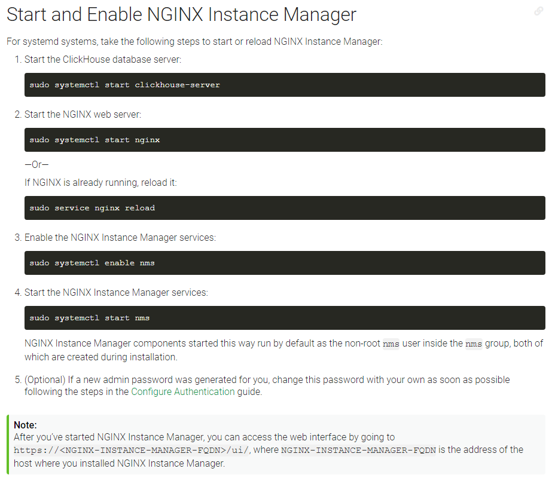
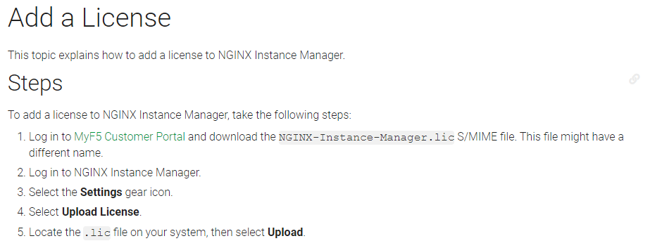

# NMS Instance Manager version 2

To install NMS Instance Manager, there is pre-requisite: `nginx-repo.crt`, `nginx-repo.key` and `nginx-manager.lic` files exist and are located at `$HOME` directory/folder.

Official installation procedure can be found on: [Install NMS Instance Manager](https://docs.nginx.com/nginx-management-suite/admin-guides/installation/install-guide/).
Note that links provided in this repository may frequently breaks, due to the fast moving development of NGINX products.
Therefore you may find some of the links are no longer valid, pages of the official document changes, as well as some codes or commands are also change.
To anticipate that, the below page captures were provided from NMS Instance Manager version 2.0.0.

NMS Instance Manager version 2 changes the repository name into `nms-instance-manager`.

```
ubuntu@K8sMaster:~$ apt-cache madison nms-instance-manager
nms-instance-manager | 2.0.0-433676695~focal | https://pkgs.nginx.com/nms/ubuntu focal/nginx-plus amd64 Packages
ubuntu@K8sMaster:~$
```



Compatibility between NMS Instance Manager version 2 and NGINX+ versions can be reviewed on [NMS Instance Manager Technical Specifications](https://docs.nginx.com/nginx-management-suite/tech-specs/) at section "Supported NGINX Versions".



Aside of the `nginx-repo.crt`, `nginx-repo.key` and `nginx-manager.lic` files prerequisite, NMS Instance Manager version 2 also requires NGINX+ and [ClickHouse](https://clickhouse.com/) to be installed first before the `nms-instance-manager` package installation.
Kindly refer to [NGINX+ Installation](../N%2BInstall) section on this repository for more details on NGINX+ Installation.



[ClickHouse Quick Start](https://clickhouse.com/docs/en/quick-start) as the captured page depicts installation procedure of ClickHouse, suggests to install all of ClickHouse components (i.e. both the Server (`clickhouse-server`) and Client (`clickhouse-client`)).
However NMS Instance Manager version 2 requires the ClickHouse's Server (`clickhouse-server`) only.

Installation of the `clickhouse-server` requires manual interactions, i.e. it asks for password for its default user. While NMS Instance Manager version 2 does not require the default user.
To automate the `clickhouse-server` installation procedure, we use the following command to silence the interaction : `DEBIAN_FRONTEND=noninteractive sudo -E apt-get install -y clickhouse-server`.
Kindly review the [ClickHouseInstall.sh](ClickHouseInstall.sh) script for the full set of commands to automate the `clickhouse-server` installation.





Upon installation, NMS Instance Manager version 2 provision one username `admin` with auto-created password.
You need to capture the password in order to access NMS Instance Manager's User Interface.





Licensing of NMS Instance Manager version 2, as pointed out on [NMS Instance Manager License](https://docs.nginx.com/nginx-management-suite/admin-guides/getting-started/add-license/), can be done manually as described.



However, licensing can also be done through the NMS Instance Manager's API.
Below example is excerpted from [NIM2ManagerInstall.sh](NIM2ManagerInstall.sh) script, which allows licensing through the API call, and can be automated into a script.

```sudo curl -k -L --retry 333 -u admin:`cat $HOME/initialPassword` -X PUT -H 'accept: application/json' -H 'Content-Type: application/json' --data "{ \"desiredState\": { \"content\": \"`cat $HOME/nginx-manager-base64.lic`\" }, \"metadata\": { \"name\": \"license\" } }" https://127.0.0.1:443/api/platform/v1/license | jq```

Aside of the above, [NIM2ManagerInstall.sh](NIM2ManagerInstall.sh) script also performs:
- [ ] capturing the password of `admin` username
- [ ] formatting the NMS Instance Manager's license file into appropriate format
- [ ] licensing the NMS Instance Manager through the API
- [ ] synchronizing the installation timing with NGINX Instance Agents' installation on the other nodes

<br><br><br>

You can copy paste below code to install NMS Instance Manager version 2 (Remember the prerequisites : `nginx-repo.crt`, `nginx-repo.key` and `nginx-manager.lic` files exist and are located at `$HOME` directory/folder) :

`cd $HOME;sudo curl -k -L -O --retry 333 https://raw.githubusercontent.com/gjwdyk/NGINX-Notes/main/NMS-Instance-Manager/NIM2-Manager/NIM2ManagerInstall.sh;sudo chmod 777 $HOME/NIM2ManagerInstall.sh;/bin/bash $HOME/NIM2ManagerInstall.sh`


<br><br><br>

***

<br><br><br>
```
╔═╦═════════════════╦═╗
╠═╬═════════════════╬═╣
║ ║ End of Document ║ ║
╠═╬═════════════════╬═╣
╚═╩═════════════════╩═╝
```
<br><br><br>


