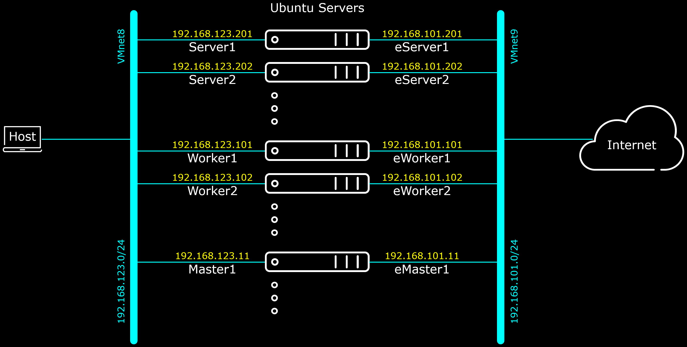
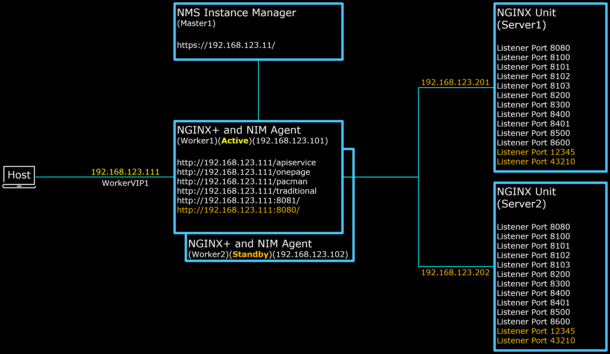
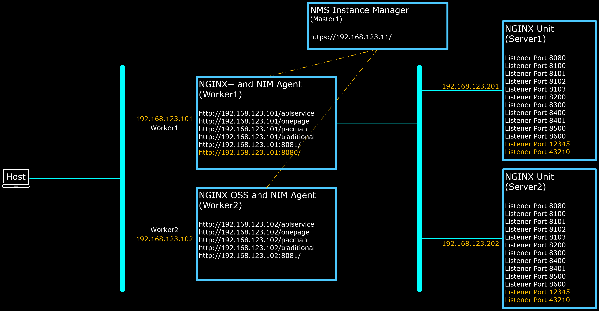

# NMS Instance Manager (version 2) with NGINX-Plus High Availability

This section of repository gathers and reuse large part of prepared scripts from other sections to create a complete environment for :
- [ ] NGINX Units as the Application Server,
- [ ] NGINX+ as HTTP Load Balancer in High Availability (Active - StandBy) mode,
- [ ] NMS Instance Manager to manage the NGINX+ nodes.

The nodes' Network Diagram for the above scenario is as follow :



And the Logical diagram of the above functions is a follow :




<br><br><br>

Execute the below command on the node which is intended to become NGINX Unit (in this case `$Server1` and `$Server2` nodes):

`cd $HOME;sudo curl -k -L -O --retry 333 https://raw.githubusercontent.com/gjwdyk/NGINX-Notes/main/NMS-Instance-Manager/Unit-Install/RemoteAll.sh;sudo chmod 777 $HOME/RemoteAll.sh;/bin/bash $HOME/RemoteAll.sh`

<br><br><br>

For NMS Instance Manager (in this case `$Master1` node); remember to prepare the pre-requisites first before executing the below command. Pre-Requisites : `nginx-repo.crt`, `nginx-repo.key` and `nginx-manager.lic` files exist and are located at `$HOME` directory/folder.

`cd $HOME;sudo curl -k -L -O --retry 333 https://raw.githubusercontent.com/gjwdyk/NGINX-Notes/main/NMS-Instance-Manager/NIM2-N%2BHA/NIM2ManagerInstall.sh;sudo chmod 777 $HOME/NIM2ManagerInstall.sh;/bin/bash $HOME/NIM2ManagerInstall.sh`

<br><br><br>

Important Notes for NGINX-Plus StandBy Node (in this case `$Worker2` node):
1. Because the `BADPrivateKey` and `BADPublicKey` have been exposed to public Internet, do ***NOT*** run the prepared bash script on nodes which are reachable by untrusted public or user.
2. Remember to prepare the pre-requisites first before executing the below command. Pre-Requisites : `nginx-repo.crt` and `nginx-repo.key` files exist and are located at `$HOME` directory/folder.

`cd $HOME;sudo curl -k -L -O --retry 333 https://raw.githubusercontent.com/gjwdyk/NGINX-Notes/main/NMS-Instance-Manager/NIM2-N%2BHA/NPStandByLB.sh;sudo chmod 777 $HOME/NPStandByLB.sh;/bin/bash $HOME/NPStandByLB.sh`

<br><br><br>

The same Important Notes for NGINX-Plus Active Node (in this case `$Worker1` node):
1. Because the `BADPrivateKey` and `BADPublicKey` have been exposed to public Internet, do ***NOT*** run the prepared bash script on nodes which are reachable by untrusted public or user.
2. Remember to prepare the pre-requisites first before executing the below command. Pre-Requisites : `nginx-repo.crt` and `nginx-repo.key` files exist and are located at `$HOME` directory/folder.

`cd $HOME;sudo curl -k -L -O --retry 333 https://raw.githubusercontent.com/gjwdyk/NGINX-Notes/main/NMS-Instance-Manager/NIM2-N%2BHA/NPActiveLB.sh;sudo chmod 777 $HOME/NPActiveLB.sh;/bin/bash $HOME/NPActiveLB.sh`

<br><br><br>

***

<br><br><br>

Sometimes it is useful to compare the output of working scripts and not-working scripts to know what seems to be the issue.
Also, in this fast moving development of NGINX modules, it is also important to know the versions which were working fine, so we can go back and install the versions which were OK.
These information can be found on the below "CLI dump of last known working versions" :
1. [NGINX Unit](NGINXUnit.txt)
2. [NMS Instance Manager](NIManager.txt)
3. [NGINX Plus Active Node with NGINX Instance Agent](NPActive.txt)
4. [NGINX Plus StandBy Node with NGINX Instance Agent](NPStandBy.txt)

<br><br><br>

***

<br><br><br>

Note that NMS Instance Manager can also monitor to certain extend NGINX OpenSource version (NGINX OSS).
So alternatively, you can implement the Demo environment as below diagram, employing both NGINX+ and NGINX OSS.



In this case, there will be no HA between the NGINX+ node and the NGINX OSS node.

<br><br><br>

Execute the below command on the node which is intended to become NGINX Unit (in this case `$Server1` and `$Server2` nodes):

`cd $HOME;sudo curl -k -L -O --retry 333 https://raw.githubusercontent.com/gjwdyk/NGINX-Notes/main/NMS-Instance-Manager/Unit-Install/RemoteAll.sh;sudo chmod 777 $HOME/RemoteAll.sh;/bin/bash $HOME/RemoteAll.sh`

<br><br><br>

For NMS Instance Manager (in this case `$Master1` node), remember to prepare the pre-requisites first before executing the below command. Pre-Requisites : `nginx-repo.crt`, `nginx-repo.key` and `nginx-manager.lic` files exist and are located at `$HOME` directory/folder.

`cd $HOME;sudo curl -k -L -O --retry 333 https://raw.githubusercontent.com/gjwdyk/NGINX-Notes/main/NMS-Instance-Manager/NIM2-N%2BHA/NIM2ManagerInstall.sh;sudo chmod 777 $HOME/NIM2ManagerInstall.sh;/bin/bash $HOME/NIM2ManagerInstall.sh`

<br><br><br>

For NGINX-Plus (in this case `$Worker1` node), remember to prepare the pre-requisites first before executing the below command. Pre-Requisites : `nginx-repo.crt` and `nginx-repo.key` files exist and are located at `$HOME` directory/folder.

`cd $HOME;sudo curl -k -L -O --retry 333 https://raw.githubusercontent.com/gjwdyk/NGINX-Notes/main/NMS-Instance-Manager/NIM2-N%2BHA/NPLB.sh;sudo chmod 777 $HOME/NPLB.sh;/bin/bash $HOME/NPLB.sh`

<br><br><br>

Execute the below command on the node which is intended to become NGINX OSS node (in this case `$Worker2` node):

`cd $HOME;sudo curl -k -L -O --retry 333 https://raw.githubusercontent.com/gjwdyk/NGINX-Notes/main/NMS-Instance-Manager/NIM2-N%2BHA/NOSSLB.sh;sudo chmod 777 $HOME/NOSSLB.sh;/bin/bash $HOME/NOSSLB.sh`

<br><br><br>

***

<br><br><br>
```
╔═╦═════════════════╦═╗
╠═╬═════════════════╬═╣
║ ║ End of Document ║ ║
╠═╬═════════════════╬═╣
╚═╩═════════════════╩═╝
```
<br><br><br>


