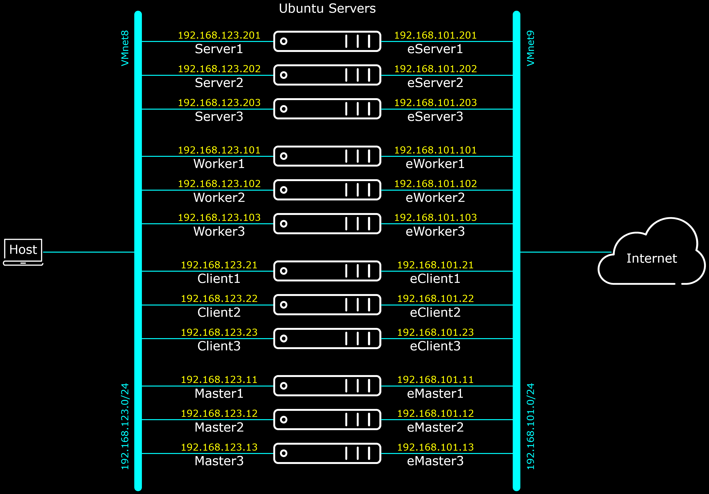
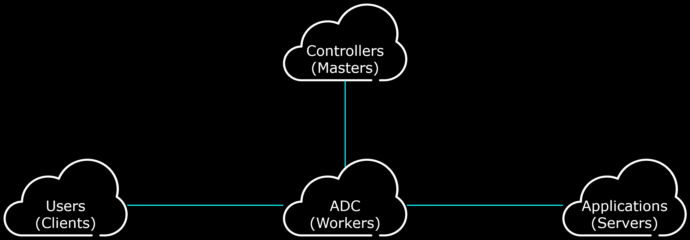

# NGINX Management Suite - Instance Manager

On this section of repository, we are creating a step by step NGINX demo environment which also can be used as learning material to learn NGINX Unit, NGINX+ and NMS Instance Manager.
The sub sections are built in the following order (therefore it is suggested to "follow" them in the same order) :
- [ ] [Unit-Install](Unit-Install)
- [ ] [Unit-Sample](Unit-Sample)
- [ ] [N+Install](N%2BInstall)
- [ ] [N+LB](N%2BLB)
- [ ] [N+HA](N%2BHA)
- [ ] [NIM2-Manager](NIM2-Manager)
- [ ] [NIM2-Agent](NIM2-Agent)
- [ ] [NIM2-N+HA](NIM2-N%2BHA)

The scripts on the above sub sections are intended to run on VM machines running Ubuntu Server version 20.04.
The VM needs outgoing traffic to Internet to fetch the software packages from the public repositories, however it is expected that incoming traffic is NOT allowed (i.e. connections initiated from outside the VM environment is blocked).
Up to five Ubuntu Server 20.04 VMs are required for the complete set up.

[EnvironmentVariable.sh](EnvironmentVariable.sh) and [EditVariable.sh](EditVariable.sh) are used by most scripts in this repository to enable other users to adjust the IP Addresses of the nodes on their own network.
The scripts on this repository are prepared on VM nodes, which have network configuration as depicted on the following diagram:


The idea of host-names of the VMs are following the below generic concept areas in the network.


There may be question such as: why the VLAN diagram above does not match to the high-level generic concept area diagram?
Because this is a Demo Lab environment, not commercial environment.
The ability for the "Client" to access/attack the "Server" directly, and/or access/attack the "Server" through the ADC just by changing the access destination, is really convenient for the purpose of demo/testing/learning.

Note that NOT all pre-prepared VM nodes are used simultaneously in all section of the repository.

The sub sections not mentioned above are:
- [ ] [NOS-Install](NOS-Install), contains simple scripts and sample configurations of NGINX OpenSource version, which may be used to implement NGINX OpenSource version to be monitored by the NMS Instance Manager.
- [ ] [CF](CF) sub section is planned for implementation the same environment on AWS CloudFormation. This sub section is still "under construction" and will take some times to finish.


<br><br><br>

***

<br><br><br>
```
╔═╦═════════════════╦═╗
╠═╬═════════════════╬═╣
║ ║ End of Document ║ ║
╠═╬═════════════════╬═╣
╚═╩═════════════════╩═╝
```
<br><br><br>


