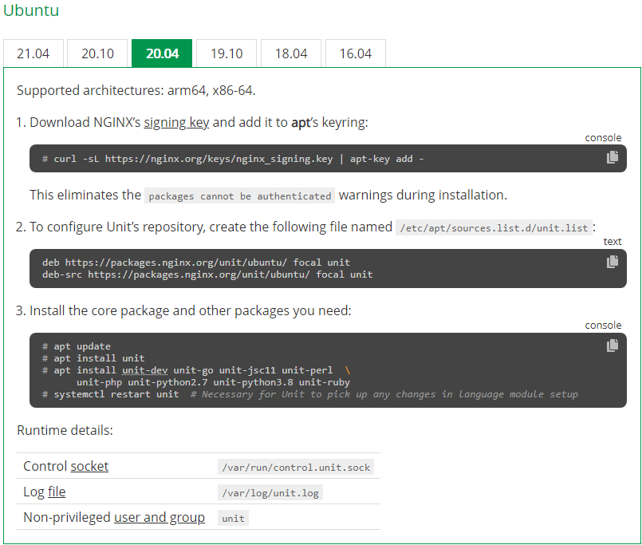

# Install NGINX Unit with Local Configuration Access

Refer the installation procedure to [NGINX Unit Installation for Ubuntu](https://unit.nginx.org/installation/#ubuntu-2004).



The [LocalConfigure.sh](LocalConfigure.sh) script install the NGINX Unit with local configuration access.
Which means you need to have SSH access to the machine where the NGINX Unit is installed, in order to configure the NGINX Unit.
This is the default procedure.

To configure the NGINX Unit, you access the "control socket" API, and send or retrieve a JSON over HTTP based command/configuration.
On the default local configuration access, the control socket is `/var/run/control.unit.sock` and accessed with option/parameter such as `--unix-socket` on `curl`.

Sample command to retrieve the current configuration information: `curl -X GET --unix-socket /var/run/control.unit.sock http://localhost/` (may need `sudo` depending on your access rights on the machine).
Sample respond may be something like below (when the NGINX Unit has not been configured):

```
{
  "certificates": {},
  "config": {
    "listeners": {},
    "applications": {}
  }
}
```

Several other commands which may give you some more information in regards to the NGINX Unit's installation and/or configuration:
- [ ] `journalctl -u unit.service -b`
- [ ] `sudo cat /var/log/unit.log`

Refer to [Configuration Example Section](../Unit-Sample) for more details on how to configure NGINX Unit.

<br><br>

For practicality, [LocalAll.sh](LocalAll.sh) collects the installation script and sample configuration script and execute them in one go.
You can copy paste the following command to execute [LocalAll.sh](LocalAll.sh) on your local machine:

`cd $HOME;sudo curl -k -L -O --retry 333 https://raw.githubusercontent.com/gjwdyk/NGINX-Notes/main/NMS-Instance-Manager/Unit-Install/LocalAll.sh;sudo chmod 777 $HOME/LocalAll.sh;/bin/bash $HOME/LocalAll.sh`

<br><br><br>

# Install NGINX Unit with Remote Configuration Access

[RemoteConfigure.sh](RemoteConfigure.sh) installs the NGINX Unit with remote configuration access.
Remote configuration access enables you to send/retrieve the JSON over HTTP based command/configuration through IP:Port instead of through unix socket.

For each service served by NGINX Unit, a process is allocated to that service (with a few exception).
`ps -ef | grep unit` also gives information regarding the parameter/option which the `/usr/sbin/unitd` (NGINX Unit's Daemon) were lauched with.
Below example shows the "control socket" as "Any IP Address on the Machine" on Port "43210" (`--control *:43210`), as well as all the "applications" served by NGINX Unit.

```
ubuntu@ubuntu:~$ ps -ef | grep unit
root       17505       1  0 11:47 ?        00:00:00 unit: main v1.25.0 [/usr/sbin/unitd --control *:43210]
unit       17529   17505  0 11:47 ?        00:00:00 unit: controller
unit       17530   17505  0 11:47 ?        00:00:00 unit: router
unit       17578   17505  0 11:47 ?        00:00:20 unit: "example_java11" application
unit       17596   17505  0 11:47 ?        00:00:00 unit: "example_perl" application
unit       17597   17505  0 11:47 ?        00:00:00 unit: "example_php" application
unit       17598   17505  0 11:47 ?        00:00:00 unit: "example_php" application
unit       17599   17505  0 11:47 ?        00:00:00 unit: "example_python2" application
unit       17600   17505  0 11:47 ?        00:00:00 unit: "example_python2" application
unit       17601   17505  0 11:47 ?        00:00:00 unit: "example_python3" application
unit       17602   17505  0 11:47 ?        00:00:00 unit: "example_python3" application
unit       17603   17505  0 11:47 ?        00:00:00 unit: "example_ruby" application
unit       17604   17505  0 11:47 ?        00:00:00 unit: "example_ruby" application
unit       19239   17505  0 11:47 ?        00:00:00 unit: "python" application
unit       19278   17505  0 11:47 ?        00:00:18 unit: "javahelloworld1" application
unit       19308   17505  0 11:47 ?        00:00:20 unit: "javahelloworld2" application
ubuntu     91471    1157  0 14:44 pts/0    00:00:00 grep --color=auto unit
ubuntu@ubuntu:~$
```

Review the `systemd` configuration for NGINX Unit:

```
ubuntu@ubuntu:~$ cat /lib/systemd/system/unit.service
[Unit]
Description=NGINX Unit
Wants=network-online.target
After=network-online.target

[Service]
Type=forking
PIDFile=/var/run/unit.pid
EnvironmentFile=-/etc/default/unit
ExecStart=/usr/sbin/unitd $DAEMON_ARGS
ExecReload=

[Install]
WantedBy=multi-user.target
ubuntu@ubuntu:~$
```

From the `/lib/systemd/system/unit.service` file we learn that:
- [ ] `/usr/sbin/unitd` takes `$DAEMON_ARGS` as optional parameter(s)
- [ ] File `/etc/default/unit` is specifically intended to "load" the environment variables, including `$DAEMON_ARGS`. Note: the `-` character in the line `EnvironmentFile=-/etc/default/unit` makes the system ignores the error when the file `/etc/default/unit` does NOT exist.

The optional parameters which `unitd` can take:

```
ubuntu@ubuntu:~$ unitd -h

unit options:

  --version            print unit version and configure options

  --no-daemon          run unit in non-daemon mode

  --control ADDRESS    set address of control API socket
                       default: "unix:/var/run/control.unit.sock"

  --pid FILE           set pid filename
                       default: "/var/run/unit.pid"

  --log FILE           set log filename
                       default: "/var/log/unit.log"

  --modules DIRECTORY  set modules directory name
                       default: "/usr/lib/unit/modules"

  --state DIRECTORY    set state directory name
                       default: "/var/lib/unit"

  --tmp DIRECTORY      set tmp directory name
                       default: "/var/tmp"

  --user USER          set non-privileged processes to run as specified user
                       default: "unit"

  --group GROUP        set non-privileged processes to run as specified group
                       default: "unit"

ubuntu@ubuntu:~$
```

From the `unitd` help information, we learn that `--control` parameter/option defines the "control socket".
Example syntax `/usr/sbin/unitd --control 192.168.123.201:43210` or `/usr/sbin/unitd --control *:43210`, whereby:
- [ ] `192.168.123.201` is the IP Address where external node can send/retrieve the JSON over HTTP based command/configuration
- [ ] Using `127.0.0.1` kinda defeating the purpose of remote configuration access, since the scope of `127.0.0.1` is only local
- [ ] Wildcard `*` character can be used to indicate "Any IP Address" which the system has
- [ ] Port number (from the example: `43210`) must be defined

[RemoteConfigure.sh](RemoteConfigure.sh) configure the "control socket" using the EnvironmentFile `/etc/default/unit`, by `printf "DAEMON_ARGS=--control *:43210\n" | sudo tee /etc/default/unit`.

Reload the System's Daemon after the changes:

```
ubuntu@ubuntu:~$ sudo systemctl daemon-reload
ubuntu@ubuntu:~$ sudo systemctl restart unit
ubuntu@ubuntu:~$ sudo systemctl enable unit
ubuntu@ubuntu:~$
```

<br><br>

For practicality, [RemoteAll.sh](RemoteAll.sh) collects the installation script and sample configuration script and execute them in one go.
You can copy paste the following command to execute [RemoteAll.sh](RemoteAll.sh) on your local machine:

`cd $HOME;sudo curl -k -L -O --retry 333 https://raw.githubusercontent.com/gjwdyk/NGINX-Notes/main/NMS-Instance-Manager/Unit-Install/RemoteAll.sh;sudo chmod 777 $HOME/RemoteAll.sh;/bin/bash $HOME/RemoteAll.sh`

<br><br><br>

***

<br><br><br>
```
╔═╦═════════════════╦═╗
╠═╬═════════════════╬═╣
║ ║ End of Document ║ ║
╠═╬═════════════════╬═╣
╚═╩═════════════════╩═╝
```
<br><br><br>


