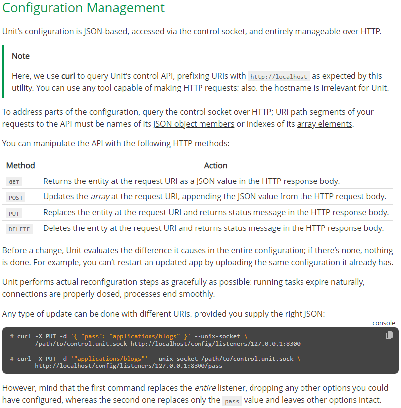
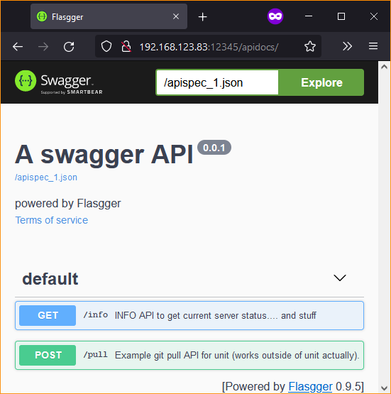
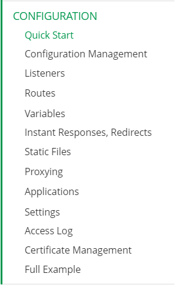
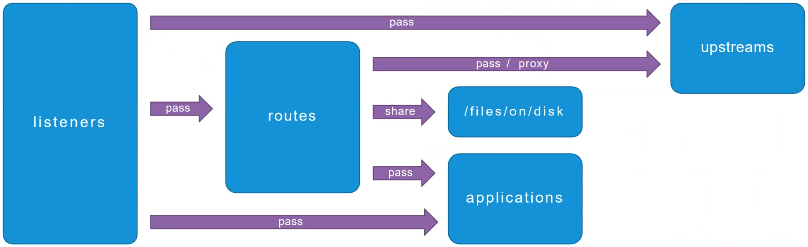

# NGINX Unit's Built-In Samples Configuration

During installation of NGINX Language Modules (i.e. `sudo apt install -y unit-dev unit-go unit-jsc11 unit-perl unit-php unit-python2.7 unit-python3.8 unit-ruby` in [LocalConfigure.sh](../Unit-Install/LocalConfigure.sh) or [RemoteConfigure.sh](../Unit-Install/RemoteConfigure.sh)), there are information snippets of built-in samples which the Language Modules include.

```
----------------------------------------------------------------------

The Go module for NGINX Unit has been installed.

To check out the sample app, run these commands:

 GOPATH=/usr/share/gocode go build -o /tmp/go-app /usr/share/doc/unit-go/examples/go-app/let-my-people.go
 sudo service unit restart
 cd /usr/share/doc/unit-go/examples
 sudo curl -X PUT --data-binary @unit.config --unix-socket /var/run/control.unit.sock http://localhost/config
 curl http://localhost:8500/

Online documentation is available at https://unit.nginx.org

----------------------------------------------------------------------
```
```
----------------------------------------------------------------------

The Java 11 module for NGINX Unit has been installed.

To check out the sample app, run these commands:

 sudo service unit restart
 cd /usr/share/doc/unit-jsc11/examples
 sudo curl -X PUT --data-binary @unit.config --unix-socket /var/run/control.unit.sock http://localhost/config
 curl http://localhost:8800/

Online documentation is available at https://unit.nginx.org

----------------------------------------------------------------------
```
```
----------------------------------------------------------------------

The Perl module for NGINX Unit has been installed.

To check out the sample app, run these commands:

 sudo service unit restart
 cd /usr/share/doc/unit-perl/examples
 sudo curl -X PUT --data-binary @unit.config --unix-socket /var/run/control.unit.sock http://localhost/config
 curl http://localhost:8600/

Online documentation is available at https://unit.nginx.org

----------------------------------------------------------------------
```
```
----------------------------------------------------------------------

The PHP module for NGINX Unit has been installed.

To check out the sample app, run these commands:

 sudo service unit restart
 cd /usr/share/doc/unit-php/examples
 sudo curl -X PUT --data-binary @unit.config --unix-socket /var/run/control.unit.sock http://localhost/config
 curl http://localhost:8300/

Online documentation is available at https://unit.nginx.org

----------------------------------------------------------------------
```
```
----------------------------------------------------------------------

The Python 2.7 module for NGINX Unit has been installed.

To check out the sample app, run these commands:

 sudo service unit restart
 cd /usr/share/doc/unit-python2.7/examples
 sudo curl -X PUT --data-binary @unit.config --unix-socket /var/run/control.unit.sock http://localhost/config
 curl http://localhost:8400/

Online documentation is available at https://unit.nginx.org

----------------------------------------------------------------------
```
```
----------------------------------------------------------------------

The Python 3.8 module for NGINX Unit has been installed.

To check out the sample app, run these commands:

 sudo service unit restart
 cd /usr/share/doc/unit-python3.8/examples
 sudo curl -X PUT --data-binary @unit.config --unix-socket /var/run/control.unit.sock http://localhost/config
 curl http://localhost:8400/

Online documentation is available at https://unit.nginx.org

----------------------------------------------------------------------
```
```
----------------------------------------------------------------------

The Ruby module for NGINX Unit has been installed.

To check out the sample app, run these commands:

 sudo service unit restart
 cd /usr/share/doc/unit-ruby/examples
 sudo curl -X PUT --data-binary @unit.config --unix-socket /var/run/control.unit.sock http://localhost/config
 curl http://localhost:8700/

Online documentation is available at https://unit.nginx.org

----------------------------------------------------------------------
```

From the information snippets you can trace to get the NGINX Unit's configuration for each sample, as well as investigate whether the samples are actually exist.

```
ubuntu@ubuntu:~$ cat /usr/share/doc/unit-go/examples/unit.config
{
  "applications": {
    "example_go": {
      "type": "external",
      "executable": "/tmp/go-app"
    }
  },
  "listeners": {
    "*:8500": {
      "pass": "applications/example_go"
    }
  }
}
ubuntu@ubuntu:~$ cat /usr/share/doc/unit-jsc11/examples/unit.config
{
  "applications": {
    "example_java11": {
      "processes": 1,
      "type": "java 11",
      "webapp": "/usr/share/doc/unit-jsc11/examples/jsc-app"
    }
  },
  "listeners": {
    "*:8800": {
      "pass": "applications/example_java11"
    }
  }
}
ubuntu@ubuntu:~$ cat /usr/share/doc/unit-perl/examples/unit.config
{
  "applications": {
    "example_perl": {
      "type": "perl",
      "processes": 1,
      "working_directory": "/usr/share/doc/unit-perl/examples/perl-app",
      "script": "/usr/share/doc/unit-perl/examples/perl-app/index.pl"
    }
  },
  "listeners": {
    "*:8600": {
      "pass": "applications/example_perl"
    }
  }
}
ubuntu@ubuntu:~$ cat /usr/share/doc/unit-php/examples/unit.config
{
  "applications": {
    "example_php": {
      "type": "php",
      "processes": 2,
      "root": "/usr/share/doc/unit-php/examples/phpinfo-app",
      "index": "index.php"
    }
  },
  "listeners": {
    "*:8300": {
      "pass": "applications/example_php"
    }
  }
}
ubuntu@ubuntu:~$ cat /usr/share/doc/unit-python2.7/examples/unit.config
{
  "applications": {
    "example_python": {
      "type": "python 2.7",
      "processes": 2,
      "path": "/usr/share/doc/unit-python2.7/examples/python-app",
      "module": "wsgi"
    }
  },
  "listeners": {
    "*:8400": {
      "pass": "applications/example_python"
    }
  }
}
ubuntu@ubuntu:~$ cat /usr/share/doc/unit-python3.8/examples/unit.config
{
  "applications": {
    "example_python": {
      "type": "python 3.8",
      "processes": 2,
      "path": "/usr/share/doc/unit-python3.8/examples/python-app",
      "module": "wsgi"
    }
  },
  "listeners": {
    "*:8400": {
      "pass": "applications/example_python"
    }
  }
}
ubuntu@ubuntu:~$ cat /usr/share/doc/unit-ruby/examples/unit.config
{
  "applications": {
    "example_ruby": {
      "type": "ruby",
      "processes": 2,
      "script": "/usr/share/doc/unit-ruby/examples/ruby-app.ru"
    }
  },
  "listeners": {
    "*:8700": {
      "pass": "applications/example_ruby"
    }
  }
}
ubuntu@ubuntu:~$
```

As of the time of writing this document; based on the tracing below, aside of the "Go" sample (which needs more works to be done, or does not exist yet), the other samples are fine.

```
ubuntu@ubuntu:~$ ls -lap /tmp/go-app
ls: cannot access '/tmp/go-app': No such file or directory
ubuntu@ubuntu:~$ ls -lap /usr/share/doc/unit-jsc11/examples/jsc-app
total 12
drwxr-xr-x 2 root root 4096 Nov 11 23:13 ./
drwxr-xr-x 3 root root 4096 Nov 11 23:13 ../
-rw-r--r-- 1 root root  517 Aug 19 15:00 index.jsp
ubuntu@ubuntu:~$ ls -lap /usr/share/doc/unit-perl/examples/perl-app/index.pl
-rw-r--r-- 1 root root 244 Aug 19 15:00 /usr/share/doc/unit-perl/examples/perl-app/index.pl
ubuntu@ubuntu:~$ ls -lap /usr/share/doc/unit-php/examples/phpinfo-app/index.php
-rw-r--r-- 1 root root 20 Aug 19 15:00 /usr/share/doc/unit-php/examples/phpinfo-app/index.php
ubuntu@ubuntu:~$ ls -lap /usr/share/doc/unit-python2.7/examples/python-app
total 12
drwxr-xr-x 2 root root 4096 Nov 11 23:13 ./
drwxr-xr-x 3 root root 4096 Nov 11 23:13 ../
-rw-r--r-- 1 root root  499 Aug 19 15:00 wsgi.py
ubuntu@ubuntu:~$ ls -lap /usr/share/doc/unit-python3.8/examples/python-app
total 12
drwxr-xr-x 2 root root 4096 Nov 11 23:13 ./
drwxr-xr-x 3 root root 4096 Nov 11 23:13 ../
-rw-r--r-- 1 root root  499 Aug 19 15:00 wsgi.py
ubuntu@ubuntu:~$ ls -lap /usr/share/doc/unit-ruby/examples/ruby-app.ru
-rw-r--r-- 1 root root 158 Aug 19 15:00 /usr/share/doc/unit-ruby/examples/ruby-app.ru
ubuntu@ubuntu:~$
```

Removing the "Go" sample; and merging other samples' NGINX Unit configurations, we come up with [DefaultUnitSample.Configuration](DefaultUnitSample.Configuration) (listener port numbers have been changed to make it easier to remember).

You can download and push [DefaultUnitSample.Configuration](DefaultUnitSample.Configuration) into your NGINX Unit implementation with:
- [ ] `cd $HOME;sudo curl -k -L -O --retry 333 https://raw.githubusercontent.com/gjwdyk/NGINX-Notes/main/NMS-Instance-Manager/Unit-Sample/DefaultUnitSample.Configuration;sudo curl -X PUT --data-binary @DefaultUnitSample.Configuration --unix-socket /var/run/control.unit.sock http://localhost/config;sudo curl -X GET --unix-socket /var/run/control.unit.sock http://localhost/` for implementation with unix socket as "control socket" (Local Configuration Access mode).
- [ ] `cd $HOME;sudo curl -k -L -O --retry 333 https://raw.githubusercontent.com/gjwdyk/NGINX-Notes/main/NMS-Instance-Manager/Unit-Sample/DefaultUnitSample.Configuration;sudo curl -X PUT --data-binary @DefaultUnitSample.Configuration http://localhost:43210/config;sudo curl -X GET http://localhost:43210/` for implementation with IP:Port as "control socket" (Remote Configuration Access mode). The sample command assume access port number `43210`. You can change, instead of `localhost` into the IP Address of your NGINX Unit implementation.


<br><br><br>

# Additional Sample with Local Configuration Access

As the default/built-in samples are mostly boring, [UnitSampleLocal.sh](UnitSampleLocal.sh) add more examples as well as introduce other ways to configure the NGINX Unit.

Below section install `git-pull-api` service, which has dependencies to [Flasgger](http://brunorocha.org/python/flask/flasgger-api-playground-with-flask-and-swagger-ui.html) ([Flasgger's GitHub](https://github.com/flasgger/flasgger)), so the dependencies must be installed on the NGINX Unit's machine, also download the `git-pull-api` repository.

```
sudo apt-get install -y python3-pip
sudo pip install flask
sudo pip install flasgger
sudo pip install gitpython

sudo mkdir /www
sudo git clone -b main https://github.com/gjwdyk/git-pull-api /www/git-pull-api
# sudo git clone -b main https://github.com/codecowboydotio/git-pull-api /www/git-pull-api
```

Note that the `https://github.com/gjwdyk/git-pull-api` was forked from `https://github.com/codecowboydotio/git-pull-api` so you have options to `git clone` from the source or the copy.

Once the codes are installed, we just need to ***ADD*** the `git-pull-api` configuration into the existing NGINX Unit configuration. The original `git-pull-api` configuration is as below:

```
{
 "listeners": {
  "*:12345": { "pass": "applications/python" }
 },
 "applications": {
  "python": {
   "type": "python",
   "path": "/www/git-pull-api/",
   "module": "wsgi",
   "callable": "app",
   "environment": {
    "version": "2.0",
    "git_repo": "https://github.com/gjwdyk/git-pull-api"
   }
  }
 }
}
```

However, if we push it just like that, it will delete the entire existing configuration and replace the NGINX Unit configuration with itself.
While we want to maintain the existing services which NGINX Unit has been serving, and just ***ADD*** this one more service to the NGINX Unit.

Therefore the configuration needs to be "modified" and split into the components, as below.
The original configuration has two main components: `listeners/*:12345` and `applications/python`, which become the base of the modified configuration.

```
sudo curl -X PUT --data '{ "type": "python", "path": "/www/git-pull-api/", "module": "wsgi", "callable": "app", "environment": { "version": "2.0", "git_repo": "https://github.com/gjwdyk/git-pull-api" } }' --unix-socket /var/run/control.unit.sock http://localhost/config/applications/python/
sudo curl -X PUT --data '{ "pass": "applications/python" }' --unix-socket /var/run/control.unit.sock http://localhost/config/listeners/*:12345/
```

A few notes on adding configuration:
- [ ] Refer to [NGINX Unit Configuration Management](https://unit.nginx.org/configuration/#configuration-management) for more details on the subject. The ***Examples*** section (not shown on the screen capture) describes well on the "how to".<br>
- [ ] From the sample code above, the `http://localhost/config/applications/python/` contains only one ***new*** object, which is `python`, with value as described by the `--data` parameter. The value on `--data` parameter have dependencies to the installed codes (done previously).
- [ ] `http://localhost/config/listeners/*:12345/` also contains only one ***new*** object, which is `*:12345`, with value refers to `applications/python` object which just created on the previous command. Due to this dependency, you need to know which command needs to be executed first.
- [ ] This method of configuration only supports ***one*** new object per command (also refer to the points above)
- [ ] In the case that you have two levels of new objects, you need to create the first level of new object (perhaps with empty `{}` value), then afterwards create the second level of new object.

The `git-pull-api` service is unique whereby you can use it (after properly installed and configured) to help you `git pull` other services remotely (i.e. without having SSH access to the NGINX Unit system).
Which is used by the following `pacman-unit` sample service:

```
sudo chmod 777 /www
sudo curl -X POST http://localhost:12345/pull -d '{"repo": "https://github.com/gjwdyk/pacman-unit", "dest": "/www/pacman-unit", "branch": "main"}'
# sudo git clone -b main https://github.com/gjwdyk/pacman-unit /www/pacman-unit
# sudo git clone -b main https://github.com/codecowboydotio/pacman-unit /www/pacman-unit
```

From the code snippet above, we can see that the `pacman-unit` repository is downloaded not using `git clone`, but with an API call to port `12345` (which is where `git-pull-api` is serving).
You can view the available `git-pull-api` end-points by browsing to NGINX Unit IP Address on the Port where `git-pull-api` is serving. Following the above example:


Below is the original `pacman-unit` NGINX Unit Configuration.

```
{
 "listeners": {
  "*:8080": { "pass": "routes/pacman" }
 },
 "routes": {
  "pacman": [ { "action": { "share": "/www/pacman-unit/$uri" } } ]
 }
}
```

The `pacman-unit` configuration is a good example of two levels of new objects, which both `routes` and `pacman` do not exist yet within the configuration.

Below is default NGINX Unit Configuration, when NGINX Unit has just been freshly installed.

```
{
 "certificates": {},
 "config": {
  "listeners": {},
  "applications": {}
 }
}
```

Note that at the time of writing this document, `routes` is not a default object which comes preconfigured with the NGINX Unit Installation.

```
sudo curl -X PUT --data '{}' --unix-socket /var/run/control.unit.sock http://localhost/config/routes/
sudo curl -X PUT --data '[ { "action": {"share": "/www/pacman-unit/$uri" } } ]' --unix-socket /var/run/control.unit.sock http://localhost/config/routes/pacman/
sudo curl -X PUT --data '{ "pass": "routes/pacman" }' --unix-socket /var/run/control.unit.sock http://localhost/config/listeners/*:8080/
```

Notice that the first level of new object `routes` is added first, with value `{}`.
Then afterwards the second level of new object `pacman` is added within the newly created object `routes`.
Later, the new `listeners` object `*:8080` is added, with value referring to the newly created objects `routes/pacman`.


The [Java](Java) section contains Java service samples (in form on `.war` files).

```
sudo mkdir /www/Java
sudo chmod 777 /www/Java

sudo curl -k -L --retry 333 https://raw.githubusercontent.com/gjwdyk/NGINX-Notes/main/NMS-Instance-Manager/Unit-Sample/Java/sample.war --output /www/Java/sample.war
sudo curl -X PUT --data '{ "type": "java", "webapp": "/www/Java/sample.war", "environment": { "version": "3.0", "git_repo": "https://github.com/gjwdyk/NGINX-Notes/tree/main/NMS-Instance-Manager/Unit-Sample/Java" } }' --unix-socket /var/run/control.unit.sock http://localhost/config/applications/javahelloworld1/
sudo curl -X PUT --data '{ "pass": "applications/javahelloworld1" }' --unix-socket /var/run/control.unit.sock http://localhost/config/listeners/*:8101/

sudo curl -k -L --retry 333 https://raw.githubusercontent.com/gjwdyk/NGINX-Notes/main/NMS-Instance-Manager/Unit-Sample/Java/SampleWebApp.war --output /www/Java/SampleWebApp.war
sudo curl -X PUT --data '{ "type": "java", "webapp": "/www/Java/SampleWebApp.war", "environment": { "version": "3.0", "git_repo": "https://github.com/gjwdyk/NGINX-Notes/tree/main/NMS-Instance-Manager/Unit-Sample/Java" } }' --unix-socket /var/run/control.unit.sock http://localhost/config/applications/javahelloworld2/
sudo curl -X PUT --data '{ "pass": "applications/javahelloworld2" }' --unix-socket /var/run/control.unit.sock http://localhost/config/listeners/*:8102/

sudo curl -k -L --retry 333 https://raw.githubusercontent.com/gjwdyk/NGINX-Notes/main/NMS-Instance-Manager/Unit-Sample/Java/helloworld.war --output /www/Java/helloworld.war
sudo curl -X PUT --data '{ "type": "java", "webapp": "/www/Java/helloworld.war", "environment": { "version": "3.0", "git_repo": "https://github.com/gjwdyk/NGINX-Notes/tree/main/NMS-Instance-Manager/Unit-Sample/Java" } }' --unix-socket /var/run/control.unit.sock http://localhost/config/applications/javahelloworld3/
sudo curl -X PUT --data '{ "pass": "applications/javahelloworld3" }' --unix-socket /var/run/control.unit.sock http://localhost/config/listeners/*:8103/
```

Since the `.war` files are not git repository, they can not be downloaded neither with `git clone` nor with `git-pull-api`; therefore `curl` is used in this case.
The NGINX Unit configuration for the Java `.war` files are straightforward.

Similarly to the "Go" service sample from the built-in within the NGINX Unit Go Language Module, which only need to be `go build` first, the rest are straightforward as explained above.

```
sudo chmod 777 /usr/share/doc/unit-go/examples/go-app/
GOPATH=/usr/share/gocode go build -o /usr/share/doc/unit-go/examples/go-app/go-app /usr/share/doc/unit-go/examples/go-app/let-my-people.go
sudo curl -X PUT --data '{ "type": "external", "executable": "/usr/share/doc/unit-go/examples/go-app/go-app" }' --unix-socket /var/run/control.unit.sock http://localhost/config/applications/example_go/
sudo curl -X PUT --data '{ "pass": "applications/example_go" }' --unix-socket /var/run/control.unit.sock http://localhost/config/listeners/*:8600/
```


<br><br><br>

# Additional Sample with Remote Configuration Access

[UnitSampleRemote.sh](UnitSampleRemote.sh) is basically identical to [UnitSampleLocal.sh](UnitSampleLocal.sh), with difference only on the "control socket".
[UnitSampleRemote.sh](UnitSampleRemote.sh) is using IP:Port as the control socket, while [UnitSampleLocal.sh](UnitSampleLocal.sh) is using unix socket as the control socket.

Kindly refer to the descriptions and/or explanations above on [Local Configuration Access](#additional-sample-with-local-configuration-access) section for details of the samples, and how to configure them.


<br><br><br>

# Sample Service Accesses

Once the NGINX Unit and its Language Modules are properly installed, and configured with all the samples on this section, you can access those samples using the NGINX Unit IP Address and the sample's Service Port.
Below is a list of such services. You need to change the IP Address into your own NGINX Unit Implementation's IP Address.

Sample Service from [DefaultUnitSample.Configuration](DefaultUnitSample.Configuration):
- [ ] `http://192.168.123.201:8100/` , default/built-in Java sample service.
- [ ] `http://192.168.123.201:8200/` , default/built-in Perl sample service.
- [ ] `http://192.168.123.201:8300/` , default/built-in PHP sample service.
- [ ] `http://192.168.123.201:8400/` , default/built-in Python3 sample service.
- [ ] `http://192.168.123.201:8401/` , default/built-in Python2 sample service.
- [ ] `http://192.168.123.201:8500/` , default/built-in Ruby sample service.

Sample Service from either [UnitSampleRemote.sh](UnitSampleRemote.sh) or [UnitSampleLocal.sh](UnitSampleLocal.sh):
- [ ] `http://192.168.123.201:12345/` , `git-pull-api` sample service.
- [ ] `http://192.168.123.201:8080/` , `pacman-unit` sample service.
- [ ] `http://192.168.123.201:8101/` , Java Hello World sample service from Apache TomCat.
- [ ] `http://192.168.123.201:8102/` , Java HTTP Headers sample service (click the "SnoopServlet" link).
- [ ] `http://192.168.123.201:8103/` , Java Hello World sample service.
- [ ] `http://192.168.123.201:8600/` , default/built-in Go sample service.

Below is a URL opened only when you configure with Remote Configuration Access:
- [ ] `http://192.168.123.201:43210/` , when opened with browser (i.e. accessed with HTTP GET Method) will return the existing NGINX Unit Configuration.


<br><br><br>

***

Further configuration documentation can be referred : [NGINX Unit Configuration](https://unit.nginx.org/configuration/).



At the moment of this document writing, there are more than just ***Listener***, ***Routes*** and ***Applications*** directives, which makes NGINX Unit a flexible and powerful solution for an Application Server.
Below diagram depicts the "service flow" or "relations" between ***Listener***, ***Routes*** and ***Applications*** directives.




<br><br><br>

***

<br><br><br>
```
╔═╦═════════════════╦═╗
╠═╬═════════════════╬═╣
║ ║ End of Document ║ ║
╠═╬═════════════════╬═╣
╚═╩═════════════════╩═╝
```
<br><br><br>


