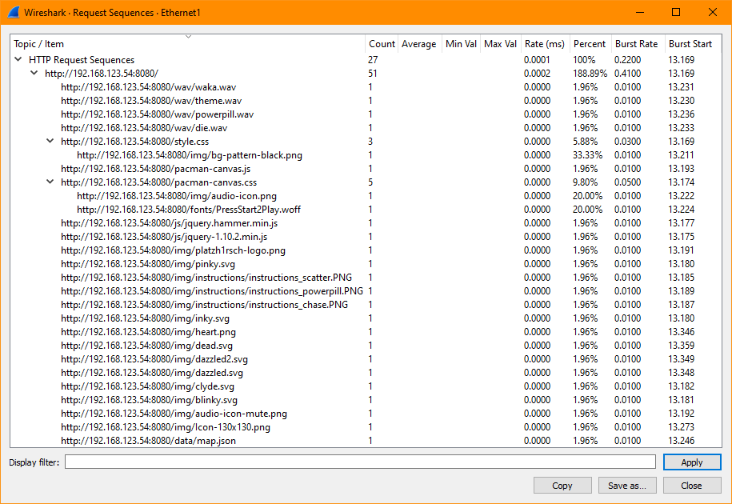
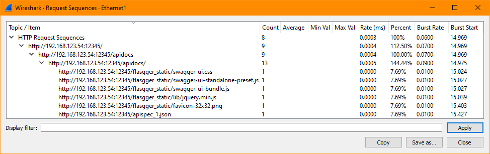

# Sample TCPDump from the Sample Services

Below are TCPDump on HTTP Level taken at the Client connected directly to the NGINX Unit server.
So the TCPDump describe the direct communication between Client and Server.

The TCPDump ***may be*** helpful to know; how the Server expects the HTTP Request looks like.
For example, if you're to insert a Proxy or Load Balancer between Client and Server; by knowing what the Server expects, you can build the configuration of the Proxy or Load Balancer accordingly.

- [ ] [Listener *:8100](#listener-8100)
- [ ] [Listener *:8101](#listener-8101)
- [ ] [Listener *:8102](#listener-8102)
- [ ] [Listener *:8103](#listener-8103)
- [ ] [Listener *:8200](#listener-8200)
- [ ] [Listener *:8300](#listener-8300)
- [ ] [Listener *:8400](#listener-8400)
- [ ] [Listener *:8401](#listener-8401)
- [ ] [Listener *:8500](#listener-8500)
- [ ] [Listener *:8600](#listener-8600)
- [ ] [Listener *:8080](#listener-8080)
- [ ] [Listener *:12345](#listener-12345)
- [ ] [Listener *:43210](#listener-43210)


<br><br><br>

## Listener *:8100

```
GET / HTTP/1.1
Host: 192.168.123.201:8100
User-Agent: Mozilla/5.0 (Windows NT 10.0; Win64; x64; rv:94.0) Gecko/20100101 Firefox/94.0
Accept: text/html,application/xhtml+xml,application/xml;q=0.9,image/avif,image/webp,*/*;q=0.8
Accept-Language: en-US,en;q=0.5
Accept-Encoding: gzip, deflate
DNT: 1
Connection: keep-alive
Upgrade-Insecure-Requests: 1
```

```
HTTP/1.1 200 OK
Content-Type: text/plain;charset=iso-8859-1
Set-Cookie: JSESSIONID=a7badd1f-5ef8-4d13-b3b2-b0984f7d7046;Path=/;HttpOnly
Expires: Thu, 01 Jan 1970 00:00:00 GMT
X-Unit-JSP: ok
Server: Unit/1.26.0
Date: Wed, 01 Dec 2021 11:04:53 GMT
Transfer-Encoding: chunked

This is plain text response for "GET /".
Here is the list of all system properties:
  awt.toolkit : sun.awt.X11.XToolkit
  java.specification.version : 11
  sun.cpu.isalist : 
  sun.jnu.encoding : UTF-8
  java.class.path : 
  java.vm.vendor : Ubuntu
  sun.arch.data.model : 64
  java.vendor.url : https://ubuntu.com/
  user.timezone : Etc/UTC
  os.name : Linux
  java.vm.specification.version : 11
  user.country : US
  sun.boot.library.path : /usr/lib/jvm/java-11-openjdk-amd64/lib
  jdk.debug : release
  sun.cpu.endian : little
  user.home : /nonexistent
  user.language : en
  java.specification.vendor : Oracle Corporation
  java.version.date : 2021-04-20
  java.home : /usr/lib/jvm/java-11-openjdk-amd64
  file.separator : /
  java.vm.compressedOopsMode : 32-bit
  line.separator : 

  java.specification.name : Java Platform API Specification
  java.vm.specification.vendor : Oracle Corporation
  java.awt.graphicsenv : sun.awt.X11GraphicsEnvironment
  sun.management.compiler : HotSpot 64-Bit Tiered Compilers
  java.runtime.version : 11.0.11+9-Ubuntu-0ubuntu2.20.04
  user.name : unit
  path.separator : :
  os.version : 5.4.0-91-generic
  java.runtime.name : OpenJDK Runtime Environment
  file.encoding : UTF-8
  java.vm.name : OpenJDK 64-Bit Server VM
  java.vendor.url.bug : https://bugs.launchpad.net/ubuntu/+source/openjdk-lts
  java.io.tmpdir : /tmp
  java.version : 11.0.11
  user.dir : /
  os.arch : amd64
  java.vm.specification.name : Java Virtual Machine Specification
  java.awt.printerjob : sun.print.PSPrinterJob
  sun.os.patch.level : unknown
  java.library.path : /usr/java/packages/lib:/usr/lib/x86_64-linux-gnu/jni:/lib/x86_64-linux-gnu:/usr/lib/x86_64-linux-gnu:/usr/lib/jni:/lib:/usr/lib
  java.vm.info : mixed mode, sharing
  java.vendor : Ubuntu
  java.vm.version : 11.0.11+9-Ubuntu-0ubuntu2.20.04
  sun.io.unicode.encoding : UnicodeLittle
  java.class.version : 55.0
```

```
GET /favicon.ico HTTP/1.1
Host: 192.168.123.201:8100
User-Agent: Mozilla/5.0 (Windows NT 10.0; Win64; x64; rv:94.0) Gecko/20100101 Firefox/94.0
Accept: image/avif,image/webp,*/*
Accept-Language: en-US,en;q=0.5
Accept-Encoding: gzip, deflate
DNT: 1
Connection: keep-alive
Referer: http://192.168.123.201:8100/
Cookie: JSESSIONID=a7badd1f-5ef8-4d13-b3b2-b0984f7d7046
```

```
HTTP/1.1 404 Not Found
Server: Unit/1.26.0
Date: Wed, 01 Dec 2021 11:04:53 GMT
Transfer-Encoding: chunked
```

<br><br><br>

## Listener *:8101

```
GET / HTTP/1.1
Host: 192.168.123.201:8101
User-Agent: Mozilla/5.0 (Windows NT 10.0; Win64; x64; rv:94.0) Gecko/20100101 Firefox/94.0
Accept: text/html,application/xhtml+xml,application/xml;q=0.9,image/avif,image/webp,*/*;q=0.8
Accept-Language: en-US,en;q=0.5
Accept-Encoding: gzip, deflate
DNT: 1
Connection: keep-alive
Upgrade-Insecure-Requests: 1
```

```
HTTP/1.1 200 OK
Last-Modified: Mon, 30 Jul 2007 16:26:28 GMT
Content-Type: text/html;charset=iso-8859-1
Server: Unit/1.26.0
Date: Wed, 01 Dec 2021 11:08:44 GMT
Transfer-Encoding: chunked

<html>
<head>
<title>Sample "Hello, World" Application</title>
</head>
<body bgcolor=white>

<table border="0">
<tr>
<td>

</td>
<td>
<h1>Sample "Hello, World" Application</h1>
<p>This is the home page for a sample application used to illustrate the
source directory organization of a web application utilizing the principles
outlined in the Application Developer's Guide.
</td>
</tr>
</table>

<p>To prove that they work, you can execute either of the following links:
<ul>
<li>To a <a href="hello.jsp">JSP page</a>.
<li>To a <a href="hello">servlet</a>.
</ul>

</body>
</html>
```

```
GET /images/tomcat.gif HTTP/1.1
Host: 192.168.123.201:8101
User-Agent: Mozilla/5.0 (Windows NT 10.0; Win64; x64; rv:94.0) Gecko/20100101 Firefox/94.0
Accept: image/avif,image/webp,*/*
Accept-Language: en-US,en;q=0.5
Accept-Encoding: gzip, deflate
DNT: 1
Connection: keep-alive
Referer: http://192.168.123.201:8101/
```

```
HTTP/1.1 200 OK
Last-Modified: Mon, 30 Jul 2007 16:26:28 GMT
Content-Type: image/gif;charset=iso-8859-1
Server: Unit/1.26.0
Date: Wed, 01 Dec 2021 11:08:44 GMT
Transfer-Encoding: chunked

GIF89ad.G . . . <<< Redacted for Readability >>> . . . $.^.....;
```

```
GET /favicon.ico HTTP/1.1
Host: 192.168.123.201:8101
User-Agent: Mozilla/5.0 (Windows NT 10.0; Win64; x64; rv:94.0) Gecko/20100101 Firefox/94.0
Accept: image/avif,image/webp,*/*
Accept-Language: en-US,en;q=0.5
Accept-Encoding: gzip, deflate
DNT: 1
Connection: keep-alive
Referer: http://192.168.123.201:8101/
```

```
HTTP/1.1 404 Not Found
Server: Unit/1.26.0
Date: Wed, 01 Dec 2021 11:08:44 GMT
Transfer-Encoding: chunked
```

```
GET /hello.jsp HTTP/1.1
Host: 192.168.123.201:8101
User-Agent: Mozilla/5.0 (Windows NT 10.0; Win64; x64; rv:94.0) Gecko/20100101 Firefox/94.0
Accept: text/html,application/xhtml+xml,application/xml;q=0.9,image/avif,image/webp,*/*;q=0.8
Accept-Language: en-US,en;q=0.5
Accept-Encoding: gzip, deflate
DNT: 1
Connection: keep-alive
Referer: http://192.168.123.201:8101/
Upgrade-Insecure-Requests: 1
```

```
HTTP/1.1 200 OK
Content-Type: text/html;charset=iso-8859-1
Set-Cookie: JSESSIONID=ae86f3b7-6b7b-4555-b9c8-35e1e563425f;Path=/;HttpOnly
Expires: Thu, 01 Jan 1970 00:00:00 GMT
Server: Unit/1.26.0
Date: Wed, 01 Dec 2021 11:08:47 GMT
Transfer-Encoding: chunked

<html>
<head>
<title>Sample Application JSP Page</title>
</head>
<body bgcolor=white>
<table border="0">
<tr>
<td align=center>

</td>
<td>
<h1>Sample Application JSP Page</h1>
This is the output of a JSP page that is part of the Hello, World
application.
</td>
</tr>
</table>
Hello!
</body>
</html>
```

```
GET /hello HTTP/1.1
Host: 192.168.123.201:8101
User-Agent: Mozilla/5.0 (Windows NT 10.0; Win64; x64; rv:94.0) Gecko/20100101 Firefox/94.0
Accept: text/html,application/xhtml+xml,application/xml;q=0.9,image/avif,image/webp,*/*;q=0.8
Accept-Language: en-US,en;q=0.5
Accept-Encoding: gzip, deflate
DNT: 1
Connection: keep-alive
Referer: http://192.168.123.201:8101/
Cookie: JSESSIONID=ae86f3b7-6b7b-4555-b9c8-35e1e563425f
Upgrade-Insecure-Requests: 1
```

```
HTTP/1.1 200 OK
Content-Type: text/html;charset=iso-8859-1
Server: Unit/1.26.0
Date: Wed, 01 Dec 2021 11:08:50 GMT
Transfer-Encoding: chunked

<html>
<head>
<title>Sample Application Servlet Page</title>
</head>
<body bgcolor=white>
<table border="0">
<tr>
<td>

</td>
<td>
<h1>Sample Application Servlet</h1>
This is the output of a servlet that is part of
the Hello, World application.
</td>
</tr>
</table>
</body>
</html>
```

<br><br><br>

## Listener *:8102

```
GET / HTTP/1.1
Host: 192.168.123.201:8102
User-Agent: Mozilla/5.0 (Windows NT 10.0; Win64; x64; rv:94.0) Gecko/20100101 Firefox/94.0
Accept: text/html,application/xhtml+xml,application/xml;q=0.9,image/avif,image/webp,*/*;q=0.8
Accept-Language: en-US,en;q=0.5
Accept-Encoding: gzip, deflate
DNT: 1
Connection: keep-alive
Upgrade-Insecure-Requests: 1
```

```
HTTP/1.1 200 OK
Last-Modified: Sun, 17 Feb 2019 21:18:46 GMT
Content-Type: text/html;charset=iso-8859-1
Server: Unit/1.26.0
Date: Wed, 01 Dec 2021 11:18:03 GMT
Transfer-Encoding: chunked

<!DOCTYPE html>
<!--
To change this license header, choose License Headers in Project Properties.
To change this template file, choose Tools | Templates
and open the template in the editor.
-->
<html>
    <head>
        <title>SampleWebApp</title>
        <meta charset="UTF-8">
        <meta name="viewport" content="width=device-width, initial-scale=1.0">
    </head>
    <body>
        <h2>Sample Web Application To Deploy and Test</h2>
        <br>
    <div> click <a href="SnoopServlet">Click to Invoke a SnoopServlet</a></div>
    <br>
    <br>
    </body>
</html>
```

```
GET /favicon.ico HTTP/1.1
Host: 192.168.123.201:8102
User-Agent: Mozilla/5.0 (Windows NT 10.0; Win64; x64; rv:94.0) Gecko/20100101 Firefox/94.0
Accept: image/avif,image/webp,*/*
Accept-Language: en-US,en;q=0.5
Accept-Encoding: gzip, deflate
DNT: 1
Connection: keep-alive
Referer: http://192.168.123.201:8102/
```

```
HTTP/1.1 404 Not Found
Server: Unit/1.26.0
Date: Wed, 01 Dec 2021 11:18:03 GMT
Transfer-Encoding: chunked
```

```
GET /SnoopServlet HTTP/1.1
Host: 192.168.123.201:8102
User-Agent: Mozilla/5.0 (Windows NT 10.0; Win64; x64; rv:94.0) Gecko/20100101 Firefox/94.0
Accept: text/html,application/xhtml+xml,application/xml;q=0.9,image/avif,image/webp,*/*;q=0.8
Accept-Language: en-US,en;q=0.5
Accept-Encoding: gzip, deflate
Referer: http://192.168.123.201:8102/
DNT: 1
Connection: keep-alive
Cookie: JSESSIONID=8291bafd-cd6a-4f1b-8607-bac38bb76b35
Upgrade-Insecure-Requests: 1
Cache-Control: max-age=0
```

```
HTTP/1.1 200 OK
Content-Type: text/html;charset=UTF-8
Server: Unit/1.26.0
Date: Wed, 01 Dec 2021 11:18:16 GMT
Transfer-Encoding: chunked


<!DOCTYPE html>
<html>
    <head>
        <meta http-equiv="Content-Type" content="text/html; charset=UTF-8">
        <link href="https://fonts.googleapis.com/css?family=Open+Sans" rel="stylesheet"> 
        <title>Sample Web Application  - SnoopServlet</title>
        <style>
            body{
                font-family: 'Open Sans', sans-serif;
            }
            table,td,tr{
                border: 1px solid;
                border-collapse: collapse;
            }
            span{
                font-weight: normal;
                font-size: 16px;
                color: black;
            }
            </style>
    </head>
    <body>
        <h2> This is a Sample Web Application - Snoop Servlet  </h2>
        <hr>
         <div>
            <h4>Host Name & IP Address: <span>K8sNode1.Ubuntu with IP=127.0.1.1 </span></h4>
            <h4>JVM Name: <span>null</span></h4>
            <h4> Date & Time: <span> Wed Dec 01 11:18:16 UTC 2021 </h4>
        </div>
        <h4>HTTP Request URL : <span>http://192.168.123.201:8102/welcome.jsp</span></h4>
        <h4>HTTP Request Method : <span>GET</span></h4>
        <h4>HTTP Request Headers Received</h4>
        <table>
                <tr>
                    <td>
                        Host
                    </td>
                    <td>
                        192.168.123.201:8102
                    </td>
                </tr>
                <tr>
                    <td>
                        User-Agent
                    </td>
                    <td>
                        Mozilla/5.0 (Windows NT 10.0; Win64; x64; rv:94.0) Gecko/20100101 Firefox/94.0
                    </td>
                </tr>
                <tr>
                    <td>
                        Accept
                    </td>
                    <td>
                        text/html,application/xhtml+xml,application/xml;q=0.9,image/avif,image/webp,*/*;q=0.8
                    </td>
                </tr>
                <tr>
                    <td>
                        Accept-Language
                    </td>
                    <td>
                        en-US,en;q=0.5
                    </td>
                </tr>
                <tr>
                    <td>
                        Accept-Encoding
                    </td>
                    <td>
                        gzip, deflate
                    </td>
                </tr>
                <tr>
                    <td>
                        Referer
                    </td>
                    <td>
                        http://192.168.123.201:8102/
                    </td>
                </tr>
                <tr>
                    <td>
                        DNT
                    </td>
                    <td>
                        1
                    </td>
                </tr>
                <tr>
                    <td>
                        Connection
                    </td>
                    <td>
                        keep-alive
                    </td>
                </tr>
                <tr>
                    <td>
                        Cookie
                    </td>
                    <td>
                        JSESSIONID=8291bafd-cd6a-4f1b-8607-bac38bb76b35
                    </td>
                </tr>
                <tr>
                    <td>
                        Upgrade-Insecure-Requests
                    </td>
                    <td>
                        1
                    </td>
                </tr>
                <tr>
                    <td>
                        Cache-Control
                    </td>
                    <td>
                        max-age=0
                    </td>
                </tr>
        </table>
        <h4>HTTP Cookies Received</h4>
          <table>
                <tr>
                    <td>
                        JSESSIONID
                    </td>
                    <td>
                        8291bafd-cd6a-4f1b-8607-bac38bb76b35
                    </td>
                </tr>
        </table>  
</body>
</html>
```

<br><br><br>

## Listener *:8103

```
GET / HTTP/1.1
Host: 192.168.123.201:8103
User-Agent: Mozilla/5.0 (Windows NT 10.0; Win64; x64; rv:94.0) Gecko/20100101 Firefox/94.0
Accept: text/html,application/xhtml+xml,application/xml;q=0.9,image/avif,image/webp,*/*;q=0.8
Accept-Language: en-US,en;q=0.5
Accept-Encoding: gzip, deflate
DNT: 1
Connection: keep-alive
Upgrade-Insecure-Requests: 1
```

```
HTTP/1.1 200 OK
Content-Type: text/html;charset=iso-8859-1
Set-Cookie: JSESSIONID=c83c347c-e17a-4528-965b-2bd0b77f53d7;Path=/;HttpOnly
Expires: Thu, 01 Jan 1970 00:00:00 GMT
Server: Unit/1.26.0
Date: Wed, 01 Dec 2021 13:05:50 GMT
Transfer-Encoding: chunked

<!doctype html>
<html>
	<head>
		<title>JSP Test</title>
	</head>
	<body>
		<h2>Hello World</h2>
		<p>
			If you see this, the example war-file was correctly deployed! Congrats!
		</p>
		<p>
			Wed Dec 01 13:05:50 UTC 2021
		</p>
		<p>
			You are from 192.168.123.245
		</p>
		<div id="conrgrats"></div>
		<style>
			#conrgrats {
				width: 440px;
				height: 302px;
				background: no-repeat left center	url('data:image/gif;base64,R0lGODlhu . . . <<< Redacted for Readability >>> . . . vFRAAADs=');
			}
		</style>
	</body>
</html>
```

```
GET /favicon.ico HTTP/1.1
Host: 192.168.123.201:8103
User-Agent: Mozilla/5.0 (Windows NT 10.0; Win64; x64; rv:94.0) Gecko/20100101 Firefox/94.0
Accept: image/avif,image/webp,*/*
Accept-Language: en-US,en;q=0.5
Accept-Encoding: gzip, deflate
DNT: 1
Connection: keep-alive
Referer: http://192.168.123.201:8103/
Cookie: JSESSIONID=c83c347c-e17a-4528-965b-2bd0b77f53d7
```

```
HTTP/1.1 404 Not Found
Server: Unit/1.26.0
Date: Wed, 01 Dec 2021 13:05:50 GMT
Transfer-Encoding: chunked
```

<br><br><br>

## Listener *:8200

```
GET / HTTP/1.1
Host: 192.168.123.201:8200
User-Agent: Mozilla/5.0 (Windows NT 10.0; Win64; x64; rv:94.0) Gecko/20100101 Firefox/94.0
Accept: text/html,application/xhtml+xml,application/xml;q=0.9,image/avif,image/webp,*/*;q=0.8
Accept-Language: en-US,en;q=0.5
Accept-Encoding: gzip, deflate
DNT: 1
Connection: keep-alive
Upgrade-Insecure-Requests: 1
```

```
HTTP/1.1 200 OK
Content-Type: text/plain
Server: Unit/1.26.0
Date: Wed, 01 Dec 2021 13:17:06 GMT
Transfer-Encoding: chunked

Hello from Unit, Perl v5.30.0, environment:

$VAR1 = {
          'psgi.input' => bless( , 'IO::File' ),
          'SERVER_SOFTWARE' => 'Unit/1.26.0',
          'REQUEST_METHOD' => 'GET',
          'psgi.version' => [
                              1,
                              1
                            ],
          'REQUEST_URI' => '/',
          'psgi.run_once' => '',
          'psgi.nonblocking' => ${\$VAR1->{'psgi.run_once'}},
          'PATH_INFO' => '/',
          'HTTP_USER_AGENT' => 'Mozilla/5.0 (Windows NT 10.0; Win64; x64; rv:94.0) Gecko/20100101 Firefox/94.0',
          'REMOTE_ADDR' => '192.168.123.245',
          'HTTP_ACCEPT_ENCODING' => 'gzip, deflate',
          'SERVER_PORT' => '80',
          'psgi.url_scheme' => 'http',
          'psgi.errors' => bless( , 'IO::File' ),
          'HTTP_CONNECTION' => 'keep-alive',
          'SERVER_PROTOCOL' => 'HTTP/1.1',
          'psgi.streaming' => 1,
          'HTTP_ACCEPT' => 'text/html,application/xhtml+xml,application/xml;q=0.9,image/avif,image/webp,*/*;q=0.8',
          'QUERY_STRING' => '',
          'psgi.multiprocess' => ${\$VAR1->{'psgi.streaming'}},
          'HTTP_DNT' => '1',
          'HTTP_HOST' => '192.168.123.201:8200',
          'SERVER_NAME' => '192.168.123.201',
          'psgi.multithread' => ${\$VAR1->{'psgi.run_once'}},
          'HTTP_UPGRADE_INSECURE_REQUESTS' => '1',
          'SERVER_ADDR' => '192.168.123.201',
          'HTTP_ACCEPT_LANGUAGE' => 'en-US,en;q=0.5'
        };
```

```
GET /favicon.ico HTTP/1.1
Host: 192.168.123.201:8200
User-Agent: Mozilla/5.0 (Windows NT 10.0; Win64; x64; rv:94.0) Gecko/20100101 Firefox/94.0
Accept: image/avif,image/webp,*/*
Accept-Language: en-US,en;q=0.5
Accept-Encoding: gzip, deflate
DNT: 1
Connection: keep-alive
Referer: http://192.168.123.201:8200/
```

```
HTTP/1.1 200 OK
Content-Type: text/plain
Server: Unit/1.26.0
Date: Wed, 01 Dec 2021 13:17:06 GMT
Transfer-Encoding: chunked

Hello from Unit, Perl v5.30.0, environment:

$VAR1 = {
          'psgi.version' => [
                              1,
                              1
                            ],
          'REQUEST_URI' => '/favicon.ico',
          'psgi.run_once' => '',
          'psgi.input' => bless( , 'IO::File' ),
          'SERVER_SOFTWARE' => 'Unit/1.26.0',
          'REQUEST_METHOD' => 'GET',
          'REMOTE_ADDR' => '192.168.123.245',
          'HTTP_USER_AGENT' => 'Mozilla/5.0 (Windows NT 10.0; Win64; x64; rv:94.0) Gecko/20100101 Firefox/94.0',
          'PATH_INFO' => '/favicon.ico',
          'SERVER_PORT' => '80',
          'HTTP_ACCEPT_ENCODING' => 'gzip, deflate',
          'psgi.errors' => bless( , 'IO::File' ),
          'psgi.url_scheme' => 'http',
          'SERVER_PROTOCOL' => 'HTTP/1.1',
          'HTTP_CONNECTION' => 'keep-alive',
          'psgi.nonblocking' => ${\$VAR1->{'psgi.run_once'}},
          'psgi.streaming' => 1,
          'QUERY_STRING' => '',
          'HTTP_ACCEPT' => 'image/avif,image/webp,*/*',
          'psgi.multithread' => ${\$VAR1->{'psgi.run_once'}},
          'SERVER_ADDR' => '192.168.123.201',
          'HTTP_ACCEPT_LANGUAGE' => 'en-US,en;q=0.5',
          'psgi.multiprocess' => ${\$VAR1->{'psgi.streaming'}},
          'HTTP_REFERER' => 'http://192.168.123.201:8200/',
          'HTTP_DNT' => '1',
          'HTTP_HOST' => '192.168.123.201:8200',
          'SERVER_NAME' => '192.168.123.201'
        };
```

<br><br><br>

## Listener *:8300

```
GET / HTTP/1.1
Host: 192.168.123.201:8300
User-Agent: Mozilla/5.0 (Windows NT 10.0; Win64; x64; rv:94.0) Gecko/20100101 Firefox/94.0
Accept: text/html,application/xhtml+xml,application/xml;q=0.9,image/avif,image/webp,*/*;q=0.8
Accept-Language: en-US,en;q=0.5
Accept-Encoding: gzip, deflate
DNT: 1
Connection: keep-alive
Upgrade-Insecure-Requests: 1
```

```
HTTP/1.1 200 OK
Content-type: text/html; charset=UTF-8
Server: Unit/1.26.0
Date: Wed, 01 Dec 2021 13:20:27 GMT
Transfer-Encoding: chunked

. . . <<< Content Redacted for Readability >>> . . .
```

```
GET /favicon.ico HTTP/1.1
Host: 192.168.123.201:8300
User-Agent: Mozilla/5.0 (Windows NT 10.0; Win64; x64; rv:94.0) Gecko/20100101 Firefox/94.0
Accept: image/avif,image/webp,*/*
Accept-Language: en-US,en;q=0.5
Accept-Encoding: gzip, deflate
DNT: 1
Connection: keep-alive
Referer: http://192.168.123.201:8300/
```

```
HTTP/1.1 503 Service Unavailable
Content-Type: text/html
Server: Unit/1.26.0
Date: Wed, 01 Dec 2021 13:20:27 GMT
Content-Length: 54

<!DOCTYPE html><title>Error 503</title><p>Error 503.
```

<br><br><br>

## Listener *:8400

```
GET / HTTP/1.1
Host: 192.168.123.201:8400
User-Agent: Mozilla/5.0 (Windows NT 10.0; Win64; x64; rv:94.0) Gecko/20100101 Firefox/94.0
Accept: text/html,application/xhtml+xml,application/xml;q=0.9,image/avif,image/webp,*/*;q=0.8
Accept-Language: en-US,en;q=0.5
Accept-Encoding: gzip, deflate
DNT: 1
Connection: keep-alive
Upgrade-Insecure-Requests: 1
```

```
HTTP/1.1 200 OK
Content-type: text/plain
Server: Unit/1.26.0
Date: Wed, 01 Dec 2021 14:32:17 GMT
Transfer-Encoding: chunked

2021-12-01 02:32:17 PM

Python: 3.8.10 (default, Sep 28 2021, 16:10:42) 
[GCC 9.3.0]

ENV Variables:

LANG	en_US.UTF-8
PATH	/usr/local/sbin:/usr/local/bin:/usr/sbin:/usr/bin:/sbin:/bin:/snap/bin
PIDFILE	/run/unit.pid
INVOCATION_ID	88c0925b3e0d4be4b796ba087c05211b
JOURNAL_STREAM	9:35466
DAEMON_ARGS	--control *:43210
```

```
GET /favicon.ico HTTP/1.1
Host: 192.168.123.201:8400
User-Agent: Mozilla/5.0 (Windows NT 10.0; Win64; x64; rv:94.0) Gecko/20100101 Firefox/94.0
Accept: image/avif,image/webp,*/*
Accept-Language: en-US,en;q=0.5
Accept-Encoding: gzip, deflate
DNT: 1
Connection: keep-alive
Referer: http://192.168.123.201:8400/
```

```
HTTP/1.1 200 OK
Content-type: text/plain
Server: Unit/1.26.0
Date: Wed, 01 Dec 2021 14:32:17 GMT
Transfer-Encoding: chunked

2021-12-01 02:32:17 PM

Python: 3.8.10 (default, Sep 28 2021, 16:10:42) 
[GCC 9.3.0]

ENV Variables:

LANG	en_US.UTF-8
PATH	/usr/local/sbin:/usr/local/bin:/usr/sbin:/usr/bin:/sbin:/bin:/snap/bin
PIDFILE	/run/unit.pid
INVOCATION_ID	88c0925b3e0d4be4b796ba087c05211b
JOURNAL_STREAM	9:35466
DAEMON_ARGS	--control *:43210
```

<br><br><br>

## Listener *:8401

```
GET / HTTP/1.1
Host: 192.168.123.201:8401
User-Agent: Mozilla/5.0 (Windows NT 10.0; Win64; x64; rv:94.0) Gecko/20100101 Firefox/94.0
Accept: text/html,application/xhtml+xml,application/xml;q=0.9,image/avif,image/webp,*/*;q=0.8
Accept-Language: en-US,en;q=0.5
Accept-Encoding: gzip, deflate
DNT: 1
Connection: keep-alive
Upgrade-Insecure-Requests: 1
```

```
HTTP/1.1 200 OK
Content-type: text/plain
Server: Unit/1.26.0
Date: Wed, 01 Dec 2021 14:43:47 GMT
Transfer-Encoding: chunked

2021-12-01 02:43:47 PM

Python: 2.7.18 (default, Mar  8 2021, 13:02:45) 
[GCC 9.3.0]

ENV Variables:

LANG	en_US.UTF-8
DAEMON_ARGS	--control *:43210
JOURNAL_STREAM	9:35466
PATH	/usr/local/sbin:/usr/local/bin:/usr/sbin:/usr/bin:/sbin:/bin:/snap/bin
PIDFILE	/run/unit.pid
INVOCATION_ID	88c0925b3e0d4be4b796ba087c05211b
```

```
GET /favicon.ico HTTP/1.1
Host: 192.168.123.201:8401
User-Agent: Mozilla/5.0 (Windows NT 10.0; Win64; x64; rv:94.0) Gecko/20100101 Firefox/94.0
Accept: image/avif,image/webp,*/*
Accept-Language: en-US,en;q=0.5
Accept-Encoding: gzip, deflate
DNT: 1
Connection: keep-alive
Referer: http://192.168.123.201:8401/
```

```
HTTP/1.1 200 OK
Content-type: text/plain
Server: Unit/1.26.0
Date: Wed, 01 Dec 2021 14:43:47 GMT
Transfer-Encoding: chunked

2021-12-01 02:43:47 PM

Python: 2.7.18 (default, Mar  8 2021, 13:02:45) 
[GCC 9.3.0]

ENV Variables:

LANG	en_US.UTF-8
DAEMON_ARGS	--control *:43210
JOURNAL_STREAM	9:35466
PATH	/usr/local/sbin:/usr/local/bin:/usr/sbin:/usr/bin:/sbin:/bin:/snap/bin
PIDFILE	/run/unit.pid
INVOCATION_ID	88c0925b3e0d4be4b796ba087c05211b
```

<br><br><br>

## Listener *:8500

```
GET / HTTP/1.1
Host: 192.168.123.201:8500
User-Agent: Mozilla/5.0 (Windows NT 10.0; Win64; x64; rv:94.0) Gecko/20100101 Firefox/94.0
Accept: text/html,application/xhtml+xml,application/xml;q=0.9,image/avif,image/webp,*/*;q=0.8
Accept-Language: en-US,en;q=0.5
Accept-Encoding: gzip, deflate
DNT: 1
Connection: keep-alive
Upgrade-Insecure-Requests: 1
```

```
HTTP/1.1 200 OK
Content-Type: text/plain
Server: Unit/1.26.0
Date: Wed, 01 Dec 2021 14:58:50 GMT
Transfer-Encoding: chunked

Hello from Unit running with Ruby 2.7.0!
```

```
GET /favicon.ico HTTP/1.1
Host: 192.168.123.201:8500
User-Agent: Mozilla/5.0 (Windows NT 10.0; Win64; x64; rv:94.0) Gecko/20100101 Firefox/94.0
Accept: image/avif,image/webp,*/*
Accept-Language: en-US,en;q=0.5
Accept-Encoding: gzip, deflate
DNT: 1
Connection: keep-alive
Referer: http://192.168.123.201:8500/
```

```
HTTP/1.1 200 OK
Content-Type: text/plain
Server: Unit/1.26.0
Date: Wed, 01 Dec 2021 14:58:50 GMT
Transfer-Encoding: chunked

Hello from Unit running with Ruby 2.7.0!
```

<br><br><br>

## Listener *:8600

```
GET / HTTP/1.1
Host: 192.168.123.201:8600
User-Agent: Mozilla/5.0 (Windows NT 10.0; Win64; x64; rv:94.0) Gecko/20100101 Firefox/94.0
Accept: text/html,application/xhtml+xml,application/xml;q=0.9,image/avif,image/webp,*/*;q=0.8
Accept-Language: en-US,en;q=0.5
Accept-Encoding: gzip, deflate
DNT: 1
Connection: keep-alive
Upgrade-Insecure-Requests: 1
```

```
HTTP/1.1 200 OK
Content-Type: text/plain
Server: Unit/1.26.0
Date: Wed, 01 Dec 2021 15:01:01 GMT
Transfer-Encoding: chunked

Method : GET
URL    : /
Host   : 192.168.123.201
```

```
GET /favicon.ico HTTP/1.1
Host: 192.168.123.201:8600
User-Agent: Mozilla/5.0 (Windows NT 10.0; Win64; x64; rv:94.0) Gecko/20100101 Firefox/94.0
Accept: image/avif,image/webp,*/*
Accept-Language: en-US,en;q=0.5
Accept-Encoding: gzip, deflate
DNT: 1
Connection: keep-alive
Referer: http://192.168.123.201:8600/
```

```
HTTP/1.1 200 OK
Content-Type: text/plain
Server: Unit/1.26.0
Date: Wed, 01 Dec 2021 15:01:01 GMT
Transfer-Encoding: chunked

Method : GET
URL    : /favicon.ico
Host   : 192.168.123.201
```

<br><br><br>

## Listener *:8080

### Initial Page Loading



```
GET / HTTP/1.1
Host: 192.168.123.201:8080
User-Agent: Mozilla/5.0 (Windows NT 10.0; Win64; x64; rv:94.0) Gecko/20100101 Firefox/94.0
Accept: text/html,application/xhtml+xml,application/xml;q=0.9,image/avif,image/webp,*/*;q=0.8
Accept-Language: en-US,en;q=0.5
Accept-Encoding: gzip, deflate
DNT: 1
Connection: keep-alive
Upgrade-Insecure-Requests: 1
```

```
HTTP/1.1 200 OK
Last-Modified: Wed, 01 Dec 2021 04:25:11 GMT
ETag: "61a6f927-23df"
Content-Type: text/html
Server: Unit/1.26.0
Date: Thu, 02 Dec 2021 02:58:47 GMT
Content-Length: 9183

. . . <<< Content Redacted for Readability >>> . . .
```

```
GET /style.css HTTP/1.1
Host: 192.168.123.201:8080
User-Agent: Mozilla/5.0 (Windows NT 10.0; Win64; x64; rv:94.0) Gecko/20100101 Firefox/94.0
Accept: text/css,*/*;q=0.1
Accept-Language: en-US,en;q=0.5
Accept-Encoding: gzip, deflate
DNT: 1
Connection: keep-alive
Referer: http://192.168.123.201:8080/
```

```
HTTP/1.1 200 OK
Last-Modified: Wed, 01 Dec 2021 04:25:11 GMT
ETag: "61a6f927-270d"
Content-Type: text/css
Server: Unit/1.26.0
Date: Thu, 02 Dec 2021 02:58:47 GMT
Content-Length: 9997

. . . <<< Content Redacted for Readability >>> . . .
```

```
GET /js/jquery-1.10.2.min.js HTTP/1.1
Host: 192.168.123.201:8080
User-Agent: Mozilla/5.0 (Windows NT 10.0; Win64; x64; rv:94.0) Gecko/20100101 Firefox/94.0
Accept: */*
Accept-Language: en-US,en;q=0.5
Accept-Encoding: gzip, deflate
DNT: 1
Connection: keep-alive
Referer: http://192.168.123.201:8080/
```

```
HTTP/1.1 200 OK
Last-Modified: Wed, 01 Dec 2021 04:25:11 GMT
ETag: "61a6f927-16bb3"
Content-Type: application/javascript
Server: Unit/1.26.0
Date: Thu, 02 Dec 2021 02:58:47 GMT
Content-Length: 93107

. . . <<< Content Redacted for Readability >>> . . .
```

```
GET /img/pinky.svg HTTP/1.1
Host: 192.168.123.201:8080
User-Agent: Mozilla/5.0 (Windows NT 10.0; Win64; x64; rv:94.0) Gecko/20100101 Firefox/94.0
Accept: image/avif,image/webp,*/*
Accept-Language: en-US,en;q=0.5
Accept-Encoding: gzip, deflate
DNT: 1
Connection: keep-alive
Referer: http://192.168.123.201:8080/
```

```
HTTP/1.1 200 OK
Last-Modified: Wed, 01 Dec 2021 04:25:11 GMT
ETag: "61a6f927-528"
Content-Type: image/svg+xml
Server: Unit/1.26.0
Date: Thu, 02 Dec 2021 02:58:47 GMT
Content-Length: 1320

. . . <<< Content Redacted for Readability >>> . . .
```

```
GET /img/clyde.svg HTTP/1.1
Host: 192.168.123.201:8080
User-Agent: Mozilla/5.0 (Windows NT 10.0; Win64; x64; rv:94.0) Gecko/20100101 Firefox/94.0
Accept: image/avif,image/webp,*/*
Accept-Language: en-US,en;q=0.5
Accept-Encoding: gzip, deflate
DNT: 1
Connection: keep-alive
Referer: http://192.168.123.201:8080/
```

```
HTTP/1.1 200 OK
Last-Modified: Wed, 01 Dec 2021 04:25:11 GMT
ETag: "61a6f927-528"
Content-Type: image/svg+xml
Server: Unit/1.26.0
Date: Thu, 02 Dec 2021 02:58:47 GMT
Content-Length: 1320

. . . <<< Content Redacted for Readability >>> . . .
```

```
GET /img/instructions/instructions_chase.PNG HTTP/1.1
Host: 192.168.123.201:8080
User-Agent: Mozilla/5.0 (Windows NT 10.0; Win64; x64; rv:94.0) Gecko/20100101 Firefox/94.0
Accept: image/avif,image/webp,*/*
Accept-Language: en-US,en;q=0.5
Accept-Encoding: gzip, deflate
DNT: 1
Connection: keep-alive
Referer: http://192.168.123.201:8080/
```

```
HTTP/1.1 200 OK
Last-Modified: Wed, 01 Dec 2021 04:25:11 GMT
ETag: "61a6f927-3ee8"
Content-Type: image/png
Server: Unit/1.26.0
Date: Thu, 02 Dec 2021 02:58:47 GMT
Content-Length: 16104

. . . <<< Content Redacted for Readability >>> . . .
```

```
GET /img/platzh1rsch-logo.png HTTP/1.1
Host: 192.168.123.201:8080
User-Agent: Mozilla/5.0 (Windows NT 10.0; Win64; x64; rv:94.0) Gecko/20100101 Firefox/94.0
Accept: image/avif,image/webp,*/*
Accept-Language: en-US,en;q=0.5
Accept-Encoding: gzip, deflate
DNT: 1
Connection: keep-alive
Referer: http://192.168.123.201:8080/
```

```
HTTP/1.1 200 OK
Last-Modified: Wed, 01 Dec 2021 04:25:11 GMT
ETag: "61a6f927-52d"
Content-Type: image/png
Server: Unit/1.26.0
Date: Thu, 02 Dec 2021 02:58:47 GMT
Content-Length: 1325

. . . <<< Content Redacted for Readability >>> . . .
```

```
GET /img/audio-icon-mute.png HTTP/1.1
Host: 192.168.123.201:8080
User-Agent: Mozilla/5.0 (Windows NT 10.0; Win64; x64; rv:94.0) Gecko/20100101 Firefox/94.0
Accept: image/avif,image/webp,*/*
Accept-Language: en-US,en;q=0.5
Accept-Encoding: gzip, deflate
DNT: 1
Connection: keep-alive
Referer: http://192.168.123.201:8080/
```

```
HTTP/1.1 200 OK
Last-Modified: Wed, 01 Dec 2021 04:25:11 GMT
ETag: "61a6f927-4b1"
Content-Type: image/png
Server: Unit/1.26.0
Date: Thu, 02 Dec 2021 02:58:47 GMT
Content-Length: 1201

. . . <<< Content Redacted for Readability >>> . . .
```

```
GET /img/bg-pattern-black.png HTTP/1.1
Host: 192.168.123.201:8080
User-Agent: Mozilla/5.0 (Windows NT 10.0; Win64; x64; rv:94.0) Gecko/20100101 Firefox/94.0
Accept: image/avif,image/webp,*/*
Accept-Language: en-US,en;q=0.5
Accept-Encoding: gzip, deflate
DNT: 1
Connection: keep-alive
Referer: http://192.168.123.201:8080/style.css
```

```
HTTP/1.1 200 OK
Last-Modified: Wed, 01 Dec 2021 04:25:11 GMT
ETag: "61a6f927-5e1b"
Content-Type: image/png
Server: Unit/1.26.0
Date: Thu, 02 Dec 2021 02:58:47 GMT
Content-Length: 24091

. . . <<< Content Redacted for Readability >>> . . .
```

```
GET /img/audio-icon.png HTTP/1.1
Host: 192.168.123.201:8080
User-Agent: Mozilla/5.0 (Windows NT 10.0; Win64; x64; rv:94.0) Gecko/20100101 Firefox/94.0
Accept: image/avif,image/webp,*/*
Accept-Language: en-US,en;q=0.5
Accept-Encoding: gzip, deflate
DNT: 1
Connection: keep-alive
Referer: http://192.168.123.201:8080/pacman-canvas.css
```

```
HTTP/1.1 200 OK
Last-Modified: Wed, 01 Dec 2021 04:25:11 GMT
ETag: "61a6f927-395"
Content-Type: image/png
Server: Unit/1.26.0
Date: Thu, 02 Dec 2021 02:58:47 GMT
Content-Length: 917

. . . <<< Content Redacted for Readability >>> . . .
```

```
GET /fonts/PressStart2Play.woff HTTP/1.1
Host: 192.168.123.201:8080
User-Agent: Mozilla/5.0 (Windows NT 10.0; Win64; x64; rv:94.0) Gecko/20100101 Firefox/94.0
Accept: application/font-woff2;q=1.0,application/font-woff;q=0.9,*/*;q=0.8
Accept-Language: en-US,en;q=0.5
Accept-Encoding: identity
DNT: 1
Connection: keep-alive
Referer: http://192.168.123.201:8080/pacman-canvas.css
```

```
HTTP/1.1 200 OK
Last-Modified: Wed, 01 Dec 2021 04:25:11 GMT
ETag: "61a6f927-1a20"
Content-Type: font/woff
Server: Unit/1.26.0
Date: Thu, 02 Dec 2021 02:58:47 GMT
Content-Length: 6688

. . . <<< Content Redacted for Readability >>> . . .
```

```
GET /wav/theme.wav HTTP/1.1
Host: 192.168.123.201:8080
User-Agent: Mozilla/5.0 (Windows NT 10.0; Win64; x64; rv:94.0) Gecko/20100101 Firefox/94.0
Accept: audio/webm,audio/ogg,audio/wav,audio/*;q=0.9,application/ogg;q=0.7,video/*;q=0.6,*/*;q=0.5
Accept-Language: en-US,en;q=0.5
Range: bytes=0-
DNT: 1
Connection: keep-alive
Referer: http://192.168.123.201:8080/
```

```
HTTP/1.1 200 OK
Last-Modified: Wed, 01 Dec 2021 04:25:11 GMT
ETag: "61a6f927-5d62e"
Content-Type: audio/wav
Server: Unit/1.26.0
Date: Thu, 02 Dec 2021 02:58:47 GMT
Content-Length: 382510

. . . <<< Content Redacted for Readability >>> . . .
```

```
GET /img/Icon-130x130.png HTTP/1.1
Host: 192.168.123.201:8080
User-Agent: Mozilla/5.0 (Windows NT 10.0; Win64; x64; rv:94.0) Gecko/20100101 Firefox/94.0
Accept: image/avif,image/webp,*/*
Accept-Language: en-US,en;q=0.5
Accept-Encoding: gzip, deflate
DNT: 1
Connection: keep-alive
Referer: http://192.168.123.201:8080/
```

```
HTTP/1.1 200 OK
Last-Modified: Wed, 01 Dec 2021 04:25:11 GMT
ETag: "61a6f927-11c1"
Content-Type: image/png
Server: Unit/1.26.0
Date: Thu, 02 Dec 2021 02:58:47 GMT
Content-Length: 4545

. . . <<< Content Redacted for Readability >>> . . .
```

```
GET /img/heart.png HTTP/1.1
Host: 192.168.123.201:8080
User-Agent: Mozilla/5.0 (Windows NT 10.0; Win64; x64; rv:94.0) Gecko/20100101 Firefox/94.0
Accept: image/avif,image/webp,*/*
Accept-Language: en-US,en;q=0.5
Accept-Encoding: gzip, deflate
DNT: 1
Connection: keep-alive
Referer: http://192.168.123.201:8080/
```

```
HTTP/1.1 200 OK
Last-Modified: Wed, 01 Dec 2021 04:25:11 GMT
ETag: "61a6f927-b5"
Content-Type: image/png
Server: Unit/1.26.0
Date: Thu, 02 Dec 2021 02:58:48 GMT
Content-Length: 181

. . . <<< Content Redacted for Readability >>> . . .
```

```
GET /img/dazzled2.svg HTTP/1.1
Host: 192.168.123.201:8080
User-Agent: Mozilla/5.0 (Windows NT 10.0; Win64; x64; rv:94.0) Gecko/20100101 Firefox/94.0
Accept: image/avif,image/webp,*/*
Accept-Language: en-US,en;q=0.5
Accept-Encoding: gzip, deflate
DNT: 1
Connection: keep-alive
Referer: http://192.168.123.201:8080/
```

```
HTTP/1.1 200 OK
Last-Modified: Wed, 01 Dec 2021 04:25:11 GMT
ETag: "61a6f927-19bc"
Content-Type: image/svg+xml
Server: Unit/1.26.0
Date: Thu, 02 Dec 2021 02:58:48 GMT
Content-Length: 6588

. . . <<< Content Redacted for Readability >>> . . .
```

```
GET /img/dead.svg HTTP/1.1
Host: 192.168.123.201:8080
User-Agent: Mozilla/5.0 (Windows NT 10.0; Win64; x64; rv:94.0) Gecko/20100101 Firefox/94.0
Accept: image/avif,image/webp,*/*
Accept-Language: en-US,en;q=0.5
Accept-Encoding: gzip, deflate
DNT: 1
Connection: keep-alive
Referer: http://192.168.123.201:8080/
```

```
HTTP/1.1 200 OK
Last-Modified: Wed, 01 Dec 2021 04:25:11 GMT
ETag: "61a6f927-d35"
Content-Type: image/svg+xml
Server: Unit/1.26.0
Date: Thu, 02 Dec 2021 02:58:48 GMT
Content-Length: 3381

. . . <<< Content Redacted for Readability >>> . . .
```

```
GET /js/jquery.hammer.min.js HTTP/1.1
Host: 192.168.123.201:8080
User-Agent: Mozilla/5.0 (Windows NT 10.0; Win64; x64; rv:94.0) Gecko/20100101 Firefox/94.0
Accept: */*
Accept-Language: en-US,en;q=0.5
Accept-Encoding: gzip, deflate
DNT: 1
Connection: keep-alive
Referer: http://192.168.123.201:8080/
```

```
HTTP/1.1 200 OK
Last-Modified: Wed, 01 Dec 2021 04:25:11 GMT
ETag: "61a6f927-32cd"
Content-Type: application/javascript
Server: Unit/1.26.0
Date: Thu, 02 Dec 2021 02:58:47 GMT
Content-Length: 13005

. . . <<< Content Redacted for Readability >>> . . .
```

```
GET /img/inky.svg HTTP/1.1
Host: 192.168.123.201:8080
User-Agent: Mozilla/5.0 (Windows NT 10.0; Win64; x64; rv:94.0) Gecko/20100101 Firefox/94.0
Accept: image/avif,image/webp,*/*
Accept-Language: en-US,en;q=0.5
Accept-Encoding: gzip, deflate
DNT: 1
Connection: keep-alive
Referer: http://192.168.123.201:8080/
```

```
HTTP/1.1 200 OK
Last-Modified: Wed, 01 Dec 2021 04:25:11 GMT
ETag: "61a6f927-528"
Content-Type: image/svg+xml
Server: Unit/1.26.0
Date: Thu, 02 Dec 2021 02:58:47 GMT
Content-Length: 1320

. . . <<< Content Redacted for Readability >>> . . .
```

```
GET /img/blinky.svg HTTP/1.1
Host: 192.168.123.201:8080
User-Agent: Mozilla/5.0 (Windows NT 10.0; Win64; x64; rv:94.0) Gecko/20100101 Firefox/94.0
Accept: image/avif,image/webp,*/*
Accept-Language: en-US,en;q=0.5
Accept-Encoding: gzip, deflate
DNT: 1
Connection: keep-alive
Referer: http://192.168.123.201:8080/
```

```
HTTP/1.1 200 OK
Last-Modified: Wed, 01 Dec 2021 04:25:11 GMT
ETag: "61a6f927-528"
Content-Type: image/svg+xml
Server: Unit/1.26.0
Date: Thu, 02 Dec 2021 02:58:47 GMT
Content-Length: 1320

. . . <<< Content Redacted for Readability >>> . . .
```

```
GET /wav/die.wav HTTP/1.1
Host: 192.168.123.201:8080
User-Agent: Mozilla/5.0 (Windows NT 10.0; Win64; x64; rv:94.0) Gecko/20100101 Firefox/94.0
Accept: audio/webm,audio/ogg,audio/wav,audio/*;q=0.9,application/ogg;q=0.7,video/*;q=0.6,*/*;q=0.5
Accept-Language: en-US,en;q=0.5
Range: bytes=0-
DNT: 1
Connection: keep-alive
Referer: http://192.168.123.201:8080/
```

```
HTTP/1.1 200 OK
Last-Modified: Wed, 01 Dec 2021 04:25:11 GMT
ETag: "61a6f927-44a2e"
Content-Type: audio/wav
Server: Unit/1.26.0
Date: Thu, 02 Dec 2021 02:58:47 GMT
Content-Length: 281134

. . . <<< Content Redacted for Readability >>> . . .
```

```
GET /img/dazzled.svg HTTP/1.1
Host: 192.168.123.201:8080
User-Agent: Mozilla/5.0 (Windows NT 10.0; Win64; x64; rv:94.0) Gecko/20100101 Firefox/94.0
Accept: image/avif,image/webp,*/*
Accept-Language: en-US,en;q=0.5
Accept-Encoding: gzip, deflate
DNT: 1
Connection: keep-alive
Referer: http://192.168.123.201:8080/
```

```
HTTP/1.1 200 OK
Last-Modified: Wed, 01 Dec 2021 04:25:11 GMT
ETag: "61a6f927-19ba"
Content-Type: image/svg+xml
Server: Unit/1.26.0
Date: Thu, 02 Dec 2021 02:58:48 GMT
Content-Length: 6586

. . . <<< Content Redacted for Readability >>> . . .
```

```
GET /data/map.json HTTP/1.1
Host: 192.168.123.201:8080
User-Agent: Mozilla/5.0 (Windows NT 10.0; Win64; x64; rv:94.0) Gecko/20100101 Firefox/94.0
Accept: application/json, text/javascript, */*; q=0.01
Accept-Language: en-US,en;q=0.5
Accept-Encoding: gzip, deflate
X-Requested-With: XMLHttpRequest
DNT: 1
Connection: keep-alive
Referer: http://192.168.123.201:8080/
```

```
HTTP/1.1 200 OK
Last-Modified: Wed, 01 Dec 2021 04:25:11 GMT
ETag: "61a6f927-2a7a"
Content-Type: application/json
Server: Unit/1.26.0
Date: Thu, 02 Dec 2021 02:58:47 GMT
Content-Length: 10874

. . . <<< Content Redacted for Readability >>> . . .
```

```
GET /img/instructions/instructions_scatter.PNG HTTP/1.1
Host: 192.168.123.201:8080
User-Agent: Mozilla/5.0 (Windows NT 10.0; Win64; x64; rv:94.0) Gecko/20100101 Firefox/94.0
Accept: image/avif,image/webp,*/*
Accept-Language: en-US,en;q=0.5
Accept-Encoding: gzip, deflate
DNT: 1
Connection: keep-alive
Referer: http://192.168.123.201:8080/
```

```
HTTP/1.1 200 OK
Last-Modified: Wed, 01 Dec 2021 04:25:11 GMT
ETag: "61a6f927-3a7a"
Content-Type: image/png
Server: Unit/1.26.0
Date: Thu, 02 Dec 2021 02:58:47 GMT
Content-Length: 14970

. . . <<< Content Redacted for Readability >>> . . .
```

```
GET /img/instructions/instructions_powerpill.PNG HTTP/1.1
Host: 192.168.123.201:8080
User-Agent: Mozilla/5.0 (Windows NT 10.0; Win64; x64; rv:94.0) Gecko/20100101 Firefox/94.0
Accept: image/avif,image/webp,*/*
Accept-Language: en-US,en;q=0.5
Accept-Encoding: gzip, deflate
DNT: 1
Connection: keep-alive
Referer: http://192.168.123.201:8080/
```

```
HTTP/1.1 200 OK
Last-Modified: Wed, 01 Dec 2021 04:25:11 GMT
ETag: "61a6f927-3cc5"
Content-Type: image/png
Server: Unit/1.26.0
Date: Thu, 02 Dec 2021 02:58:47 GMT
Content-Length: 15557

. . . <<< Content Redacted for Readability >>> . . .
```

```
GET /pacman-canvas.js HTTP/1.1
Host: 192.168.123.201:8080
User-Agent: Mozilla/5.0 (Windows NT 10.0; Win64; x64; rv:94.0) Gecko/20100101 Firefox/94.0
Accept: */*
Accept-Language: en-US,en;q=0.5
Accept-Encoding: gzip, deflate
DNT: 1
Connection: keep-alive
Referer: http://192.168.123.201:8080/
```

```
HTTP/1.1 200 OK
Last-Modified: Wed, 01 Dec 2021 04:25:11 GMT
ETag: "61a6f927-b3df"
Content-Type: application/javascript
Server: Unit/1.26.0
Date: Thu, 02 Dec 2021 02:58:47 GMT
Content-Length: 46047

. . . <<< Content Redacted for Readability >>> . . .
```

```
GET /wav/waka.wav HTTP/1.1
Host: 192.168.123.201:8080
User-Agent: Mozilla/5.0 (Windows NT 10.0; Win64; x64; rv:94.0) Gecko/20100101 Firefox/94.0
Accept: audio/webm,audio/ogg,audio/wav,audio/*;q=0.9,application/ogg;q=0.7,video/*;q=0.6,*/*;q=0.5
Accept-Language: en-US,en;q=0.5
Range: bytes=0-
DNT: 1
Connection: keep-alive
Referer: http://192.168.123.201:8080/
```

```
HTTP/1.1 200 OK
Last-Modified: Wed, 01 Dec 2021 04:25:11 GMT
ETag: "61a6f927-872e"
Content-Type: audio/wav
Server: Unit/1.26.0
Date: Thu, 02 Dec 2021 02:58:47 GMT
Content-Length: 34606

. . . <<< Content Redacted for Readability >>> . . .
```

```
GET /wav/powerpill.wav HTTP/1.1
Host: 192.168.123.201:8080
User-Agent: Mozilla/5.0 (Windows NT 10.0; Win64; x64; rv:94.0) Gecko/20100101 Firefox/94.0
Accept: audio/webm,audio/ogg,audio/wav,audio/*;q=0.9,application/ogg;q=0.7,video/*;q=0.6,*/*;q=0.5
Accept-Language: en-US,en;q=0.5
Range: bytes=0-
DNT: 1
Connection: keep-alive
Referer: http://192.168.123.201:8080/
```

```
HTTP/1.1 200 OK
Last-Modified: Wed, 01 Dec 2021 04:25:11 GMT
ETag: "61a6f927-1b02e"
Content-Type: audio/wav
Server: Unit/1.26.0
Date: Thu, 02 Dec 2021 02:58:47 GMT
Content-Length: 110638

. . . <<< Content Redacted for Readability >>> . . .
```

### Interactions

```
POST /data/db-handler.php HTTP/1.1
Host: 192.168.123.201:8080
User-Agent: Mozilla/5.0 (Windows NT 10.0; Win64; x64; rv:94.0) Gecko/20100101 Firefox/94.0
Accept: application/json, text/javascript, */*; q=0.01
Accept-Language: en-US,en;q=0.5
Accept-Encoding: gzip, deflate
Content-Type: application/x-www-form-urlencoded; charset=UTF-8
X-Requested-With: XMLHttpRequest
Content-Length: 48
Origin: http://192.168.123.201:8080
DNT: 1
Connection: keep-alive
Referer: http://192.168.123.201:8080/

action=add&name=HighScoreUserName&score=333&level=9
```

```
HTTP/1.1 405 Method Not Allowed
Content-Type: text/html
Server: Unit/1.26.0
Date: Thu, 02 Dec 2021 04:43:55 GMT
Content-Length: 54

<!DOCTYPE html><title>Error 405</title><p>Error 405.
```

```
GET /data/db-handler.php?timestamp=1638418881397&action=get HTTP/1.1
Host: 192.168.123.201:8080
User-Agent: Mozilla/5.0 (Windows NT 10.0; Win64; x64; rv:94.0) Gecko/20100101 Firefox/94.0
Accept: */*
Accept-Language: en-US,en;q=0.5
Accept-Encoding: gzip, deflate
X-Requested-With: XMLHttpRequest
DNT: 1
Connection: keep-alive
Referer: http://192.168.123.201:8080/
```

```
HTTP/1.1 200 OK
Last-Modified: Wed, 01 Dec 2021 04:25:11 GMT
ETag: "61a6f927-e1d"
Content-Type: application/x-httpd-php
Server: Unit/1.26.0
Date: Thu, 02 Dec 2021 04:21:21 GMT
Content-Length: 3613

. . . <<< Content Redacted for Readability >>> . . .
```

<br><br><br>

## Listener *:12345

### Initial Page Loading



```
GET / HTTP/1.1
Host: 192.168.123.201:12345
User-Agent: Mozilla/5.0 (Windows NT 10.0; Win64; x64; rv:94.0) Gecko/20100101 Firefox/94.0
Accept: text/html,application/xhtml+xml,application/xml;q=0.9,image/avif,image/webp,*/*;q=0.8
Accept-Language: en-US,en;q=0.5
Accept-Encoding: gzip, deflate
DNT: 1
Connection: keep-alive
Upgrade-Insecure-Requests: 1
```

```
HTTP/1.1 302 Found
Content-Type: text/html; charset=utf-8
Content-Length: 222
Location: http://192.168.123.201:12345/apidocs
Server: Unit/1.26.0
Date: Thu, 02 Dec 2021 01:49:10 GMT

<!DOCTYPE HTML PUBLIC "-//W3C//DTD HTML 3.2 Final//EN">
<title>Redirecting...</title>
<h1>Redirecting...</h1>
<p>You should be redirected automatically to target URL: <a href="/apidocs">/apidocs</a>. If not click the link.
```

```
GET /apidocs HTTP/1.1
Host: 192.168.123.201:12345
User-Agent: Mozilla/5.0 (Windows NT 10.0; Win64; x64; rv:94.0) Gecko/20100101 Firefox/94.0
Accept: text/html,application/xhtml+xml,application/xml;q=0.9,image/avif,image/webp,*/*;q=0.8
Accept-Language: en-US,en;q=0.5
Accept-Encoding: gzip, deflate
DNT: 1
Connection: keep-alive
Upgrade-Insecure-Requests: 1
```

```
HTTP/1.1 308 
Content-Type: text/html; charset=utf-8
Content-Length: 278
Location: http://192.168.123.201:12345/apidocs/
Server: Unit/1.26.0
Date: Thu, 02 Dec 2021 01:49:10 GMT

<!DOCTYPE HTML PUBLIC "-//W3C//DTD HTML 3.2 Final//EN">
<title>Redirecting...</title>
<h1>Redirecting...</h1>
<p>You should be redirected automatically to target URL: <a href="http://192.168.123.201:12345/apidocs/">http://192.168.123.201:12345/apidocs/</a>. If not click the link.
```

```
GET /apidocs/ HTTP/1.1
Host: 192.168.123.201:12345
User-Agent: Mozilla/5.0 (Windows NT 10.0; Win64; x64; rv:94.0) Gecko/20100101 Firefox/94.0
Accept: text/html,application/xhtml+xml,application/xml;q=0.9,image/avif,image/webp,*/*;q=0.8
Accept-Language: en-US,en;q=0.5
Accept-Encoding: gzip, deflate
DNT: 1
Connection: keep-alive
Upgrade-Insecure-Requests: 1
```

```
HTTP/1.1 200 OK
Content-Type: text/html; charset=utf-8
Content-Length: 2985
Server: Unit/1.26.0
Date: Thu, 02 Dec 2021 01:49:10 GMT

<!-- HTML for static distribution bundle build -->
<!DOCTYPE html>
<html lang="en">
  <head>
    <meta charset="UTF-8">
<title>Flasgger</title>
<link href="https://fonts.googleapis.com/css?family=Open+Sans:400,700|Source+Code+Pro:300,600|Titillium+Web:400,600,700" rel="stylesheet">
<link rel="stylesheet" type="text/css" href="/flasgger_static/swagger-ui.css">
<!-- Customize the app.config['SWAGGER']['favicon'] -->
<link rel="icon" type="image/png" href="/flasgger_static/favicon-32x32.png" sizes="64x64 32x32 16x16" />
<style>
    html
    {
    box-sizing: border-box;
    overflow: -moz-scrollbars-vertical;
    overflow-y: scroll;
    }
    *,
    *:before,
    *:after
    {
    box-sizing: inherit;
    }
    body
    {
    margin:0;
    background: #fafafa;
    }
</style>
    <!-- To add custom code here override the template templates/flasgger/custom_head.html -->
    <!-- Include custom css and top js in templates/flasgger/head.html -->
  </head>
  <body>
      <div class='swagger-ui'>
    <div class="wrapper">
        <section class="clear">
        </section>
    </div>
</div>
      <div id="swagger-ui">
          <div data-reactroot="" class="swagger-ui">
              <div>
              <div class="information-container wrapper">
                  <section class="block col-12">
                      <!-- ADDS THE LOADER SPINNER -->
                      <div class="loading-container"><div class="loading"></div></div>
                  </section>
              </div>
          </div>
          </div>
      </div>
    <div id="swagger-ui"></div>
    <script src="/flasgger_static/swagger-ui-bundle.js"></script>
<script src="/flasgger_static/swagger-ui-standalone-preset.js"></script>
<script src="/flasgger_static/lib/jquery.min.js" type='text/javascript'></script>
  <!-- To customize the script that loads swagger, override templates/flasgger/swagger.html -->
  <script>
window.onload = function() {
    // Build a system
    const ui = SwaggerUIBundle(
    Object.assign(
    {
    url: "/apispec_1.json",
    dom_id: '#swagger-ui',
    validatorUrl: null,
    deepLinking: true,
    jsonEditor: true,
    apisSorter: "alpha",
    presets: [
        SwaggerUIBundle.presets.apis,
        SwaggerUIStandalonePreset
    ],
    plugins: [
        SwaggerUIBundle.plugins.DownloadUrl
    ],
    layout: "StandaloneLayout",
    },
    {}
    )
    )
    window.ui = ui
    $(".topbar-wrapper .link span").replaceWith("<span>Flasgger</span>");
}
</script>
  <!-- To customize the footer and include custom script on templates/flasgger/footer.html -->
  <div class='swagger-ui'>
    <div class="wrapper">
        <section class="clear">
            <span style="float: right;">
                [Powered by <a target="_blank" href="https://github.com/rochacbruno/flasgger">Flasgger</a> 0.9.5]
                <br>
            </span>
        </section>
    </div>
</div>
  </body>
</html>
```

```
GET /flasgger_static/swagger-ui.css HTTP/1.1
Host: 192.168.123.201:12345
User-Agent: Mozilla/5.0 (Windows NT 10.0; Win64; x64; rv:94.0) Gecko/20100101 Firefox/94.0
Accept: text/css,*/*;q=0.1
Accept-Language: en-US,en;q=0.5
Accept-Encoding: gzip, deflate
DNT: 1
Connection: keep-alive
Referer: http://192.168.123.201:12345/apidocs/
```

```
HTTP/1.1 200 OK
Content-Disposition: inline; filename=swagger-ui.css
Content-Type: text/css; charset=utf-8
Content-Length: 141676
Last-Modified: Wed, 01 Dec 2021 04:25:06 GMT
Cache-Control: no-cache
Date: Thu, 02 Dec 2021 01:49:10 GMT
Server: Unit/1.26.0

. . . <<< Content Redacted for Readability >>> . . .
```

```
GET /flasgger_static/swagger-ui-standalone-preset.js HTTP/1.1
Host: 192.168.123.201:12345
User-Agent: Mozilla/5.0 (Windows NT 10.0; Win64; x64; rv:94.0) Gecko/20100101 Firefox/94.0
Accept: */*
Accept-Language: en-US,en;q=0.5
Accept-Encoding: gzip, deflate
DNT: 1
Connection: keep-alive
Referer: http://192.168.123.201:12345/apidocs/
```

```
HTTP/1.1 200 OK
Content-Disposition: inline; filename=swagger-ui-standalone-preset.js
Content-Type: application/javascript; charset=utf-8
Content-Length: 291088
Last-Modified: Wed, 01 Dec 2021 04:25:06 GMT
Cache-Control: no-cache
Date: Thu, 02 Dec 2021 01:49:10 GMT
Server: Unit/1.26.0

. . . <<< Content Redacted for Readability >>> . . .
```

```
GET /flasgger_static/swagger-ui-bundle.js HTTP/1.1
Host: 192.168.123.201:12345
User-Agent: Mozilla/5.0 (Windows NT 10.0; Win64; x64; rv:94.0) Gecko/20100101 Firefox/94.0
Accept: */*
Accept-Language: en-US,en;q=0.5
Accept-Encoding: gzip, deflate
DNT: 1
Connection: keep-alive
Referer: http://192.168.123.201:12345/apidocs/
```

```
HTTP/1.1 200 OK
Content-Disposition: inline; filename=swagger-ui-bundle.js
Content-Type: application/javascript; charset=utf-8
Content-Length: 971256
Last-Modified: Wed, 01 Dec 2021 04:25:06 GMT
Cache-Control: no-cache
Date: Thu, 02 Dec 2021 01:49:10 GMT
Server: Unit/1.26.0

. . . <<< Content Redacted for Readability >>> . . .
```

```
GET /flasgger_static/lib/jquery.min.js HTTP/1.1
Host: 192.168.123.201:12345
User-Agent: Mozilla/5.0 (Windows NT 10.0; Win64; x64; rv:94.0) Gecko/20100101 Firefox/94.0
Accept: */*
Accept-Language: en-US,en;q=0.5
Accept-Encoding: gzip, deflate
DNT: 1
Connection: keep-alive
Referer: http://192.168.123.201:12345/apidocs/
```

```
HTTP/1.1 200 OK
Content-Disposition: inline; filename=jquery.min.js
Content-Type: application/javascript; charset=utf-8
Content-Length: 85578
Last-Modified: Wed, 01 Dec 2021 04:25:06 GMT
Cache-Control: no-cache
Date: Thu, 02 Dec 2021 01:49:10 GMT
Server: Unit/1.26.0

. . . <<< Content Redacted for Readability >>> . . .
```

```
GET /flasgger_static/favicon-32x32.png HTTP/1.1
Host: 192.168.123.201:12345
User-Agent: Mozilla/5.0 (Windows NT 10.0; Win64; x64; rv:94.0) Gecko/20100101 Firefox/94.0
Accept: image/avif,image/webp,*/*
Accept-Language: en-US,en;q=0.5
Accept-Encoding: gzip, deflate
DNT: 1
Connection: keep-alive
Referer: http://192.168.123.201:12345/apidocs/
```

```
HTTP/1.1 200 OK
Content-Disposition: inline; filename=favicon-32x32.png
Content-Type: image/png
Content-Length: 1643
Last-Modified: Wed, 01 Dec 2021 04:25:06 GMT
Cache-Control: no-cache
Date: Thu, 02 Dec 2021 01:49:11 GMT
Server: Unit/1.26.0

. . . <<< Content Redacted for Readability >>> . . .
```

```
GET /apispec_1.json HTTP/1.1
Host: 192.168.123.201:12345
User-Agent: Mozilla/5.0 (Windows NT 10.0; Win64; x64; rv:94.0) Gecko/20100101 Firefox/94.0
Accept: application/json,*/*
Accept-Language: en-US,en;q=0.5
Accept-Encoding: gzip, deflate
Referer: http://192.168.123.201:12345/apidocs/
DNT: 1
Connection: keep-alive
```

```
HTTP/1.1 200 OK
Content-Type: application/json
Content-Length: 1647
Server: Unit/1.26.0
Date: Thu, 02 Dec 2021 01:49:11 GMT

. . . <<< Content Redacted for Readability >>> . . .
```

### Interactions

```
GET /info HTTP/1.1
Host: 192.168.123.201:12345
User-Agent: Mozilla/5.0 (Windows NT 10.0; Win64; x64; rv:94.0) Gecko/20100101 Firefox/94.0
Accept: application/json
Accept-Language: en-US,en;q=0.5
Accept-Encoding: gzip, deflate
Referer: http://192.168.123.201:12345/apidocs/
DNT: 1
Connection: keep-alive
```

```
HTTP/1.1 200 OK
Content-Type: application/json
Content-Length: 58
Server: Unit/1.26.0
Date: Thu, 02 Dec 2021 02:46:07 GMT

{"status":"This is the API that you see","version":"1.0"}
```

```
POST /pull HTTP/1.1
Host: 192.168.123.201:12345
User-Agent: Mozilla/5.0 (Windows NT 10.0; Win64; x64; rv:94.0) Gecko/20100101 Firefox/94.0
Accept: application/json
Accept-Language: en-US,en;q=0.5
Accept-Encoding: gzip, deflate
Referer: http://192.168.123.201:12345/apidocs/
Content-Type: application/json
Origin: http://192.168.123.201:12345
DNT: 1
Connection: keep-alive
Content-Length: 0
```

```
HTTP/1.1 400 Bad Request
Content-Type: text/html; charset=utf-8
Content-Length: 192
Server: Unit/1.26.0
Date: Thu, 02 Dec 2021 02:46:22 GMT

<!DOCTYPE HTML PUBLIC "-//W3C//DTD HTML 3.2 Final//EN">
<title>400 Bad Request</title>
<h1>Bad Request</h1>
<p>The browser (or proxy) sent a request that this server could not understand.</p>
```

<br><br><br>

## Listener *:43210

```
GET / HTTP/1.1
Host: 192.168.123.201:43210
User-Agent: Mozilla/5.0 (Windows NT 10.0; Win64; x64; rv:94.0) Gecko/20100101 Firefox/94.0
Accept: text/html,application/xhtml+xml,application/xml;q=0.9,image/avif,image/webp,*/*;q=0.8
Accept-Language: en-US,en;q=0.5
Accept-Encoding: gzip, deflate
DNT: 1
Connection: keep-alive
Upgrade-Insecure-Requests: 1
```

```
HTTP/1.1 200 OK
Server: Unit/1.26.0
Date: Wed, 01 Dec 2021 15:04:22 GMT
Content-Type: application/json
Content-Length: 3130
Connection: close

{
	"certificates": {},
	"config": {
		"applications": {
			"python": {
				"type": "python",
				"path": "/www/git-pull-api/",
				"module": "wsgi",
				"callable": "app",
				"environment": {
					"version": "2.0",
					"git_repo": "https://github.com/gjwdyk/git-pull-api"
				}
			},
			"example_python2": {
				"type": "python 2.7",
				"processes": 2,
				"path": "/usr/share/doc/unit-python2.7/examples/python-app",
				"module": "wsgi"
			},
			"example_python3": {
				"type": "python 3.8",
				"processes": 2,
				"path": "/usr/share/doc/unit-python3.8/examples/python-app",
				"module": "wsgi"
			},
			"javahelloworld1": {
				"type": "java",
				"webapp": "/www/Java/sample.war",
				"environment": {
					"version": "3.0",
					"git_repo": "https://github.com/gjwdyk/NGINX-Notes/tree/main/NMS-Instance-Manager/Unit-Sample/Java"
				}
			},
			"example_perl": {
				"type": "perl",
				"processes": 1,
				"working_directory": "/usr/share/doc/unit-perl/examples/perl-app",
				"script": "/usr/share/doc/unit-perl/examples/perl-app/index.pl"
			},
			"example_php": {
				"type": "php",
				"processes": 2,
				"root": "/usr/share/doc/unit-php/examples/phpinfo-app",
				"index": "index.php"
			},
			"javahelloworld3": {
				"type": "java",
				"webapp": "/www/Java/helloworld.war",
				"environment": {
					"version": "3.0",
					"git_repo": "https://github.com/gjwdyk/NGINX-Notes/tree/main/NMS-Instance-Manager/Unit-Sample/Java"
				}
			},
			"example_go": {
				"type": "external",
				"executable": "/usr/share/doc/unit-go/examples/go-app/go-app"
			},
			"javahelloworld2": {
				"type": "java",
				"webapp": "/www/Java/SampleWebApp.war",
				"environment": {
					"version": "3.0",
					"git_repo": "https://github.com/gjwdyk/NGINX-Notes/tree/main/NMS-Instance-Manager/Unit-Sample/Java"
				}
			},
			"example_java11": {
				"processes": 1,
				"type": "java 11",
				"webapp": "/usr/share/doc/unit-jsc11/examples/jsc-app"
			},
			"example_ruby": {
				"type": "ruby",
				"processes": 2,
				"script": "/usr/share/doc/unit-ruby/examples/ruby-app.ru"
			}
		},
		"listeners": {
			"*:12345": {
				"pass": "applications/python"
			},
			"*:8080": {
				"pass": "routes/pacman"
			},
			"*:8401": {
				"pass": "applications/example_python2"
			},
			"*:8500": {
				"pass": "applications/example_ruby"
			},
			"*:8400": {
				"pass": "applications/example_python3"
			},
			"*:8600": {
				"pass": "applications/example_go"
			},
			"*:8100": {
				"pass": "applications/example_java11"
			},
			"*:8101": {
				"pass": "applications/javahelloworld1"
			},
			"*:8300": {
				"pass": "applications/example_php"
			},
			"*:8102": {
				"pass": "applications/javahelloworld2"
			},
			"*:8200": {
				"pass": "applications/example_perl"
			},
			"*:8103": {
				"pass": "applications/javahelloworld3"
			}
		},
		"routes": {
			"pacman": [
				{
					"action": {
						"share": "/www/pacman-unit/$uri"
					}
				}
			]
		}
	}
}
```

<br><br><br>

***

<br><br><br>
```
╔═╦═════════════════╦═╗
╠═╬═════════════════╬═╣
║ ║ End of Document ║ ║
╠═╬═════════════════╬═╣
╚═╩═════════════════╩═╝
```
<br><br><br>


